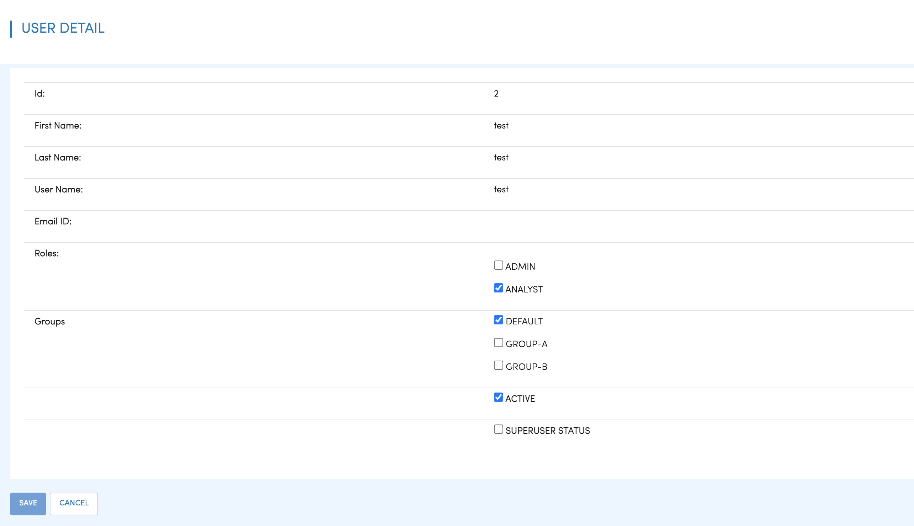

User Group Role Permission
==========================

Fire Insights supports Users, Groups, Roles, Permissions. A User can belong to multiple groups and have multiple roles.

Each role can have multiple permissions.

Groups
------

There can be multiple groups in Fire Insights. 

.. figure:: ..//_assets/security/group-list.png
   :alt: security
   :width: 60%

Users
-----

Fire Insights supports multiple users. Each user can belong to multiple groups, and also have multiple Roles.

Permissions
-----------

Fire Insights supports the following Permissions. Permissions are associated with Roles.

users.manage

Roles
-----

A user can have multiple Roles. The actions which a user can do depends on the Roles they belong to.

.. figure:: ..//_assets/security/user-role-list.png
   :alt: security
   :width: 60%

