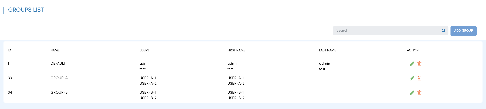
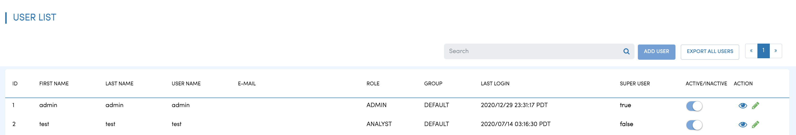
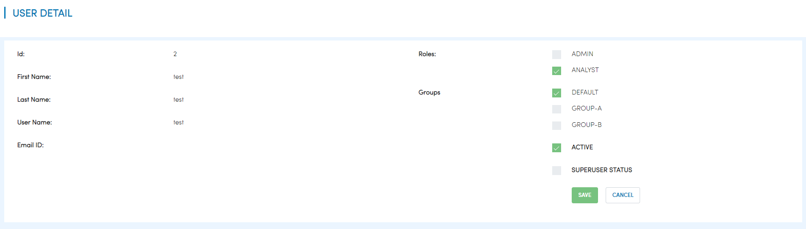
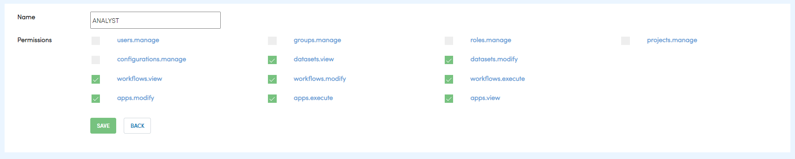
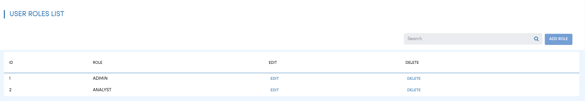

User Group Role Permission
==========================

Fire Insights supports Users, Groups, Roles, Permissions. A User can belong to multiple groups and have multiple roles.

Each role can have multiple permissions.

Groups
------

There can be multiple groups in Fire Insights. 

Users
-----

Fire Insights supports multiple users. Each user can belong to multiple groups, and also have multiple Roles.

Permissions
-----------

Fire Insights supports the following Permissions. Permissions are associated with Roles.

.. list-table:: 
   :widths: 10 20 
   :header-rows: 1

   * - Title
     - Description
   * - users.manage
     - create, modify & disable user
   * - groups.manage
     - Create, modify & delete the group
   * - roles.manage
     - Create, modify & delete the roles  
   * - projects.manage
     - Create, modify & delete the projects
   * - configurations.manage
     - modify diifferent configurations 
   * - datasets.view
     - view dataset in specified project
   * - datasets.modify
     - modify datasets in specified project
   * - workflows.view
     - view workflows in specified project
   * - workflows.modify
     - modify workflows in specified project
   * - workflows.execute
     - execute workflow in specified project
   * - apps.modify
     - modify analytics application 
   * - apps.execute
     - execute analytics application
   * - apps.view
     - view analytics application

Roles
-----

A user can have multiple Roles. The actions which a user can do depends on the Roles they belong to.

