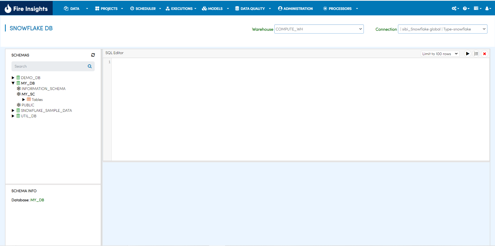
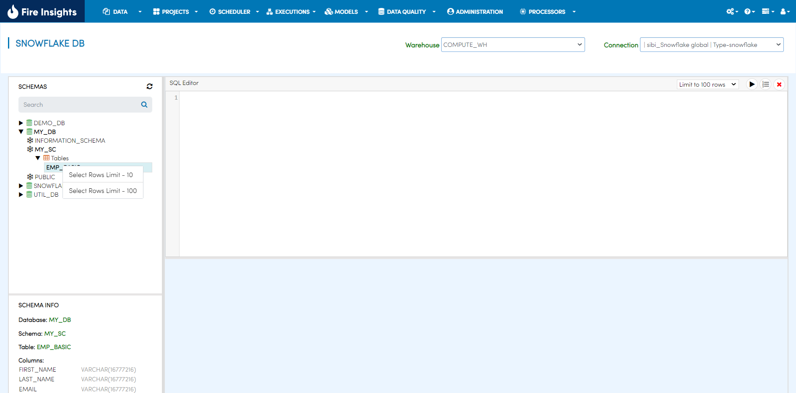
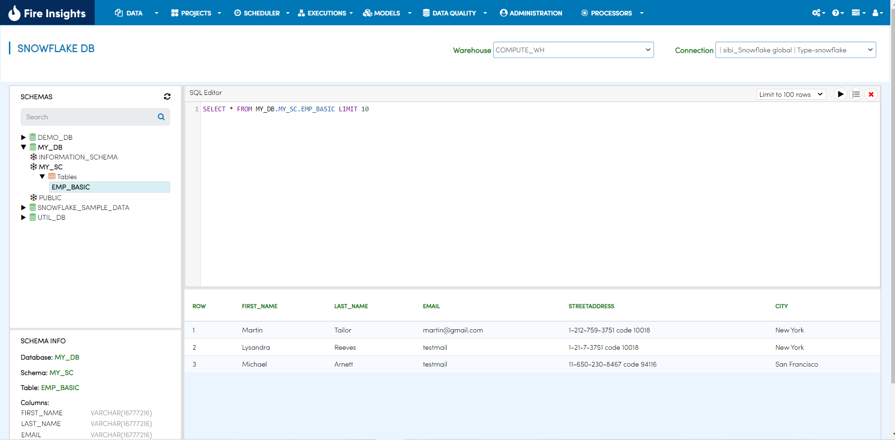

Explore Snowflake Tables
===========================

Fire Insights allows you to browse your Snowflake Databases, schemas and tables. In configuration `module.enableSnowflakeDb` set this value to true for browsing Snowflake DB page. 

Go to Data/Snowflake DB
----------------------

It will display the Snowflake DB page.

Select the Tables 
----------------------

Once you select a Table, right-click on it to get the query to view the first few records from the table.

   
Execute the SQL query to view records from the table selected.

