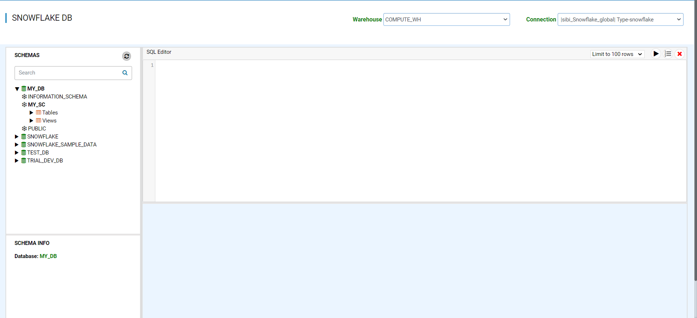

Explore Snowflake Tables/Views
===========================

Fire Insights allows you to browse your Snowflake Databases, schemas, tables and views. In configuration `module.enableSnowflakeDb` set this value to true for browsing Snowflake DB page. 

Go to Data/Snowflake DB
----------------------

It will display the Snowflake DB page.

Select the Table/View 
----------------------

Once you select a Table/View, right-click on it to get the query to display the first few records from the table.

.. figure:: ..//_assets/snowflake/browse-snowflake-2.PNG
   :alt: Snowflake
   :width: 70%
   
Execute the SQL query to display records based on the query condition.

.. figure:: ..//_assets/snowflake/browse-snowflake-3.PNG
   :alt: Snowflake
   :width: 70%
