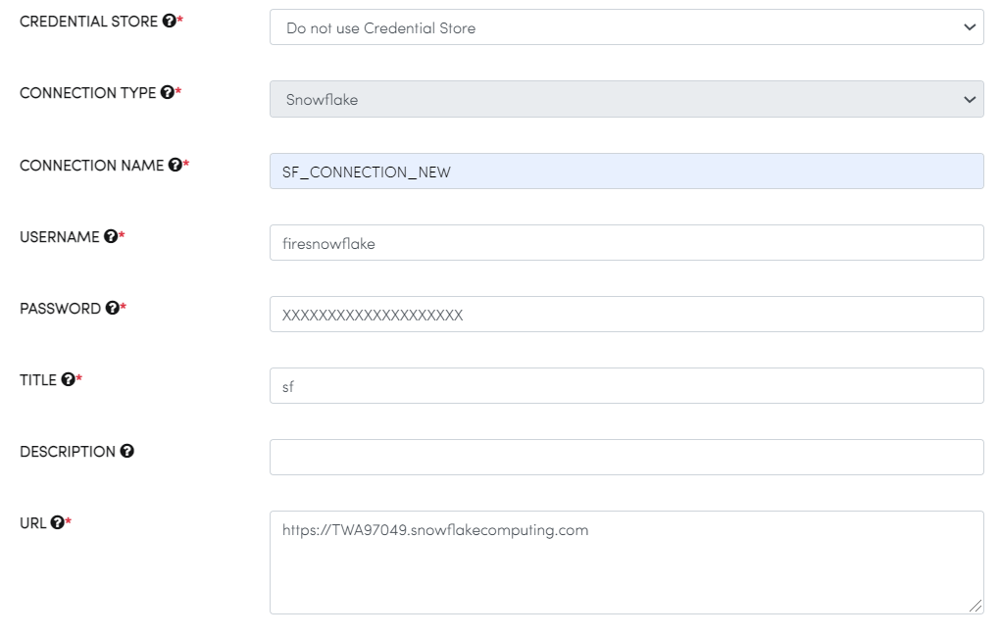
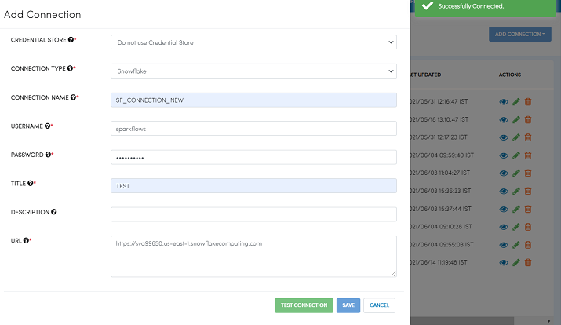

Creating Snowflake Connection
=============================

In order to read from or write to Snowflake, we need to first create a Snowflake Connection in Fire Insights.

Below are the steps for creating the Snowflake Connection.

Go to Administration/Global Connections
-------------

Login to Fire Insights application, Go to Administration and select Global Connections.

.. figure:: ..//_assets/credential_store/7.PNG
   :alt: Credential Store
   :width: 90%

Add Connection
-----------

Click on ADD CONNECTION, Select either of two ie Add Connection For All or Add Connection For Group, depending on need.

.. figure:: ..//_assets/credential_store/8.PNG
   :alt: Credential Store
   :width: 90%

Add Connection Parameter
--------------------------

.. list-table:: Connection Parameter
   :widths: 20 80
   :header-rows: 1

   * - Title
     - Description
   * - CREDENTIAL STORE
     - Select Credential Store Listed in dropdown or else choose Do not use Credential Store.
   * - CONNECTION TYPE
     - Select Connection type configured in KeyVault it can be `Databricks, MySql, MOngo DB, Sql Server, HIve, Redshift and Snowflake`
   * - CONNECTION NAME
     - Add a Connection Name.
   * - USERNAME
     - Username for the selected Connection and if username is added in KeyVault, add $USER-NAME
   * - PASSWORD
     - Password for selected Connection, and if password is added in KeyVault, add $PASSWORD
   * - TITLE
     - Add a unique title.
   * - DESCRIPTION
     - Add description.
   * - URL
     - URL for selected Connection, and if URL is added in KeyVault, add $URL
     
.. figure:: ..//_assets/credential_store/9.PNG
   :alt: Credential Store
   :width: 90%     

After Adding the above parameter, you can Click on TEST CONNECTION, It will shows Successfully Connected and after saving it will show in Connection LIst.

   

.. figure:: ..//_assets/credential_store/12.PNG
   :alt: Credential Store
   :width: 90%

