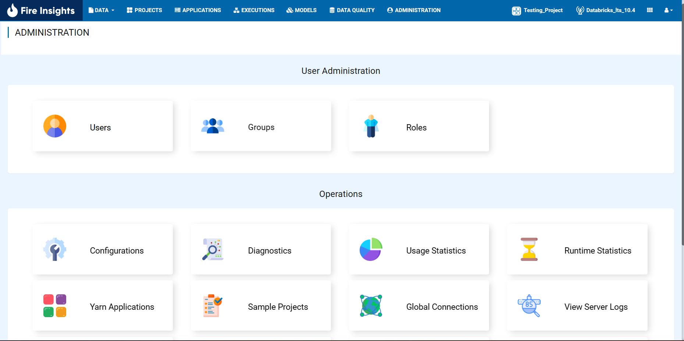
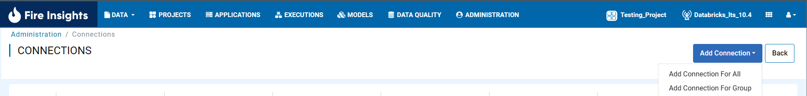
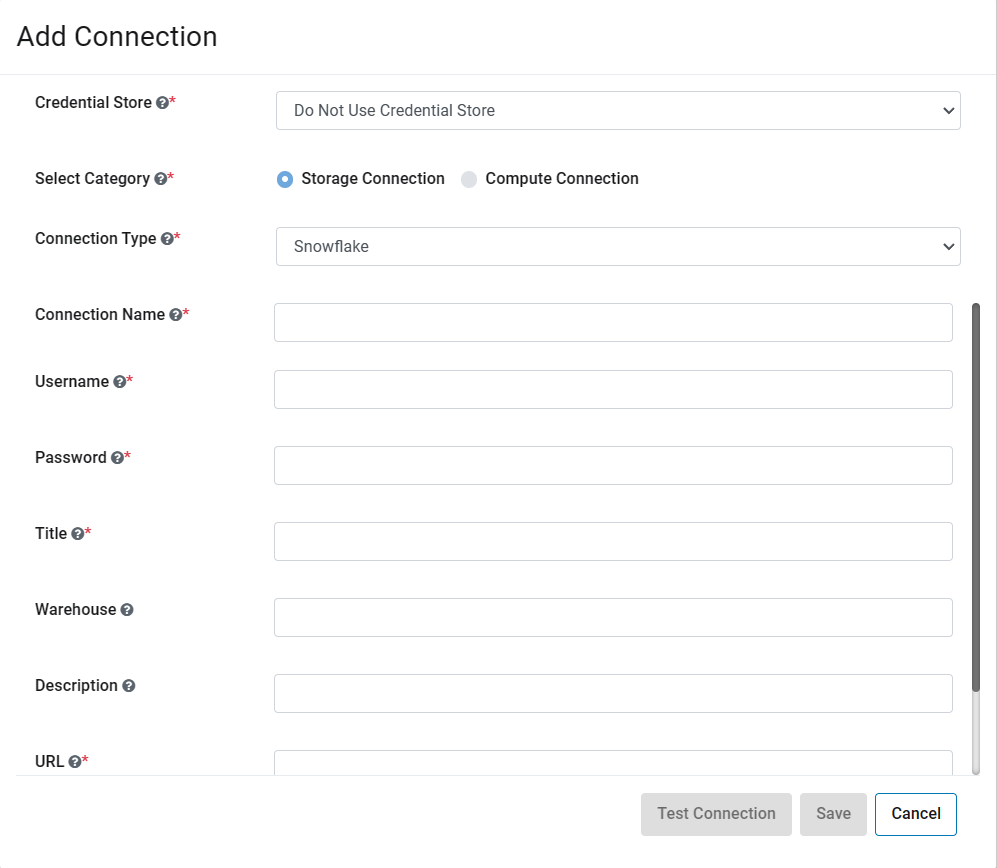
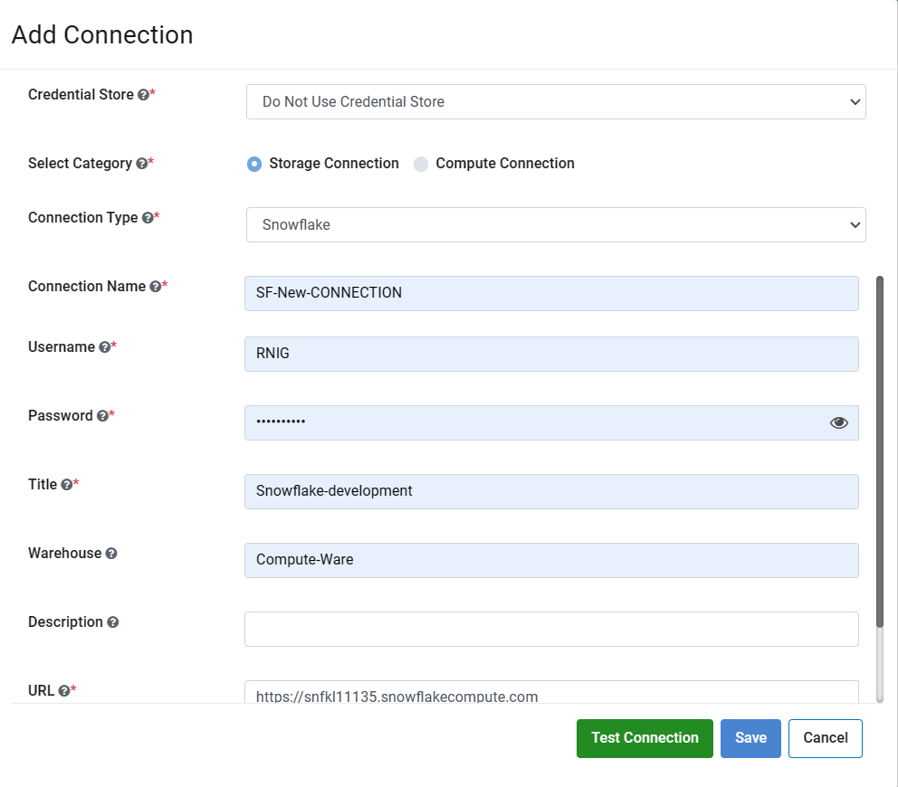
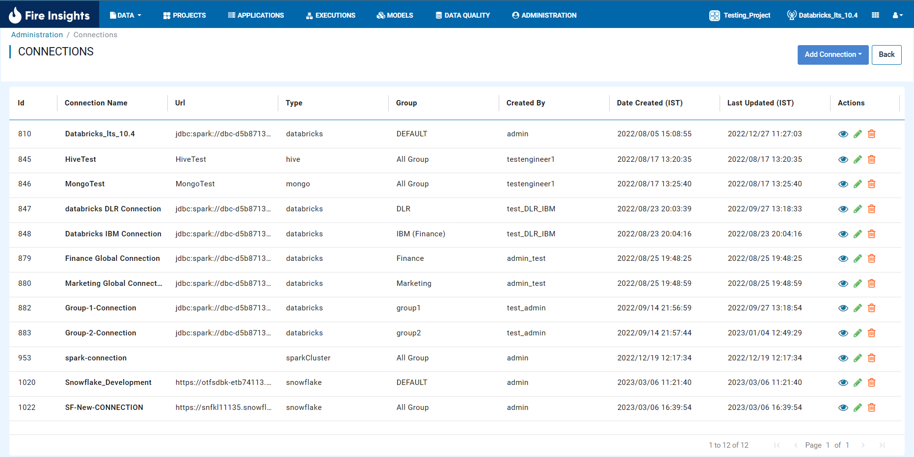

Create Snowflake Connection
=============================

In order to read from or write to Snowflake, we need to first create a Snowflake Connection in Fire Insights.

Below are the steps for creating the Snowflake Connection.

Go to Administration/Global Connections
-------------

Login to Fire Insights application. Go to Administration and select Global Connections.

Add Connection
-----------

Click on ``ADD CONNECTION`` and select either of two i.e. Add Connection For All or Add Connection For Group, depending on need.

Add Connection Parameter
--------------------------

.. list-table:: Connection Parameter
   :widths: 20 80
   :header-rows: 1

   * - Title
     - Description
   * - CREDENTIAL STORE
     - Select Credential Store Listed in dropdown or else choose Do not use Credential Store.
   * - CONNECTION TYPE
     - Select Connection type as Snowflake, it can be `Databricks, MySql, MOngo DB, Sql Server, HIve, Redshift and Snowflake.`
   * - CONNECTION NAME
     - Add a Connection Name.
   * - USERNAME
     - Username for the selected Snowflake Connection. 
   * - PASSWORD
     - Password for selected Snowflake Connection.
   * - TITLE
     - Add a unique title.
   * - DESCRIPTION
     - Add description.
   * - URL
     - URL for selected Snowflake Connection.
     

After Adding the above parameter, you can Click on ``TEST CONNECTION`` to test the connection. After you get the success message, click on ``Save`` Button.

After saving, the connection would display on the connections list page as shown below.

.. note::  Now, you can use above Snowflake connection in Read From SnowFlake, Write To SnowFlake & Execute Query In SnowFlake Processor in workflow editor.
