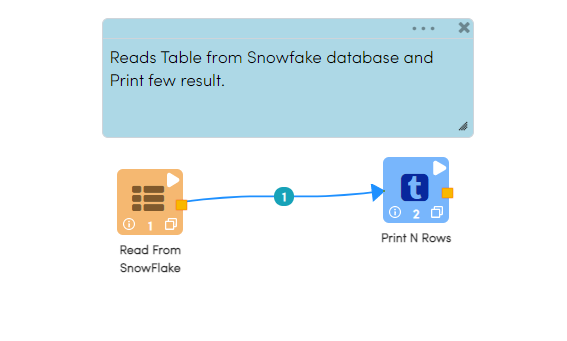
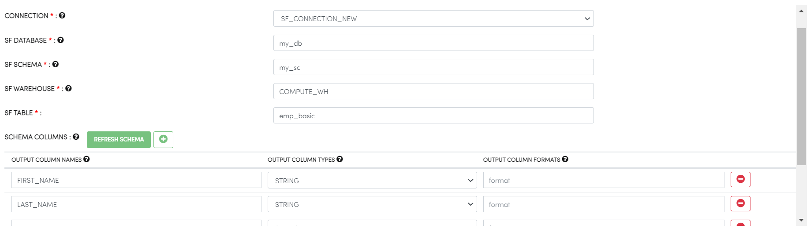
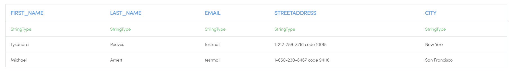

Reading from Snowflake
======================

Fire Insights has a processor for reading data from Snowflake.

Workflow
--------

The below workflow does the following:

* Reads Snowflake Table
* Prints a few records of the dataframe

Reading from Snowflake Table
-------------------

It reads the table using ``Read From Snowflake`` processor.

Processor Configuration
^^^^^^^^^^^^^^^^^^

Below are the configurations for the Read from Snowflake processor.

* CONNECTION  : Connection created for Snowflake
* SF DATABASE : Snowflake Database name
* SF SCHEMA : Snowflake Schema Name
* SF WAREHOUSE : Snowflake Warehouse Name
* SF TABLE : Snowflake Table Name

   
Processor Output
^^^^^^

Prints the Results
------------------

It prints the first few records of the dataframe
   
