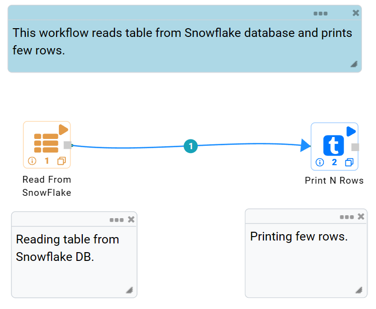

Read from Snowflake
======================

Fire Insights has a processor for reading data from Snowflake.

Processor Configuration
----------

.. figure:: ..//_assets/snowflake/2.PNG
   :alt: snowflake
   :width: 90%
   
* CONNECTION  : Connection created for Snowflake.
* SF DATABASE : Snowflake Database Name.
* SF SCHEMA : Snowflake Schema Name.
* SF WAREHOUSE : Snowflake Warehouse Name.
* SF TABLE : Snowflake Table Name.

Example Workflow
--------

The below workflow does the following:

* Reads Snowflake Table.
* Prints a few records of the DataFrame.

Reading from Snowflake Table
^^^^^^^^^^^^^^^^^^

It reads the table using ``Read From Snowflake`` processor.

Processor Configuration
++++++

Below are the configurations for the Read from Snowflake processor.

.. figure:: ..//_assets/snowflake/2.PNG
   :alt: snowflake
   :width: 90%
   
Processor Output
++++

.. figure:: ..//_assets/snowflake/3.PNG
   :alt: snowflake
   :width: 90%

