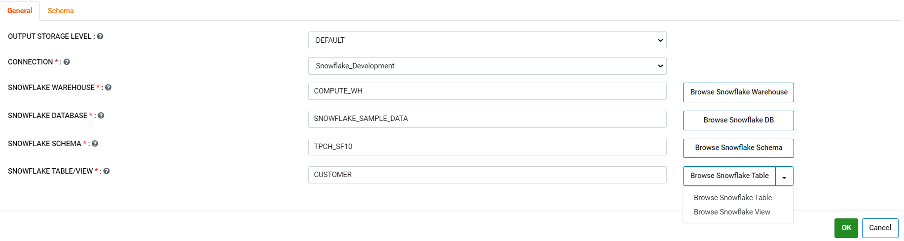
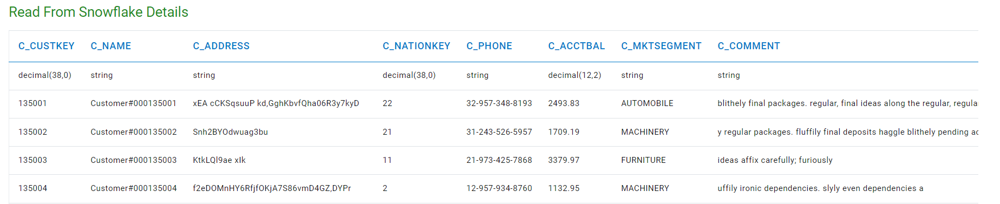
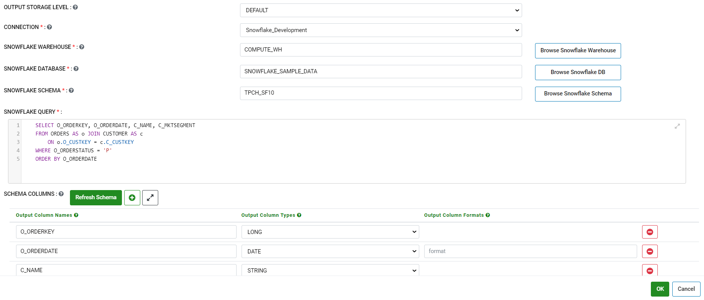
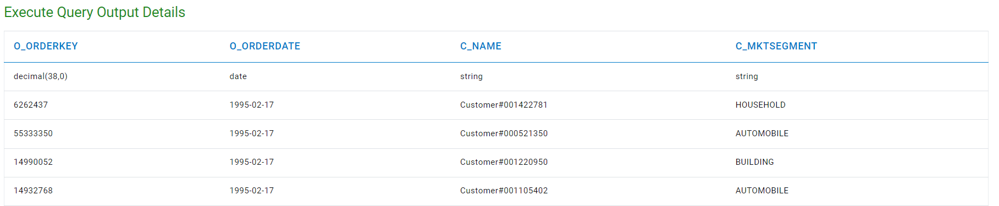

Read from Snowflake
======================

Fire Insights has provided two processors for reading data from Snowflake.

1. Read From SnowFlake
2. Execute Query In SnowFlake

1. Read From SnowFlake Workflow
--------

A user can use this processor to select a single table/view from the Snowflake schema.

Processor Configuration
+++++++++++++++

* CONNECTION  : Connection created for Snowflake.
* SF WAREHOUSE : Snowflake Warehouse Name.
* SF DATABASE : Snowflake Database Name.
* SF SCHEMA : Snowflake Schema Name.
* SF TABLE/VIEW : Snowflake Table/View Name. 

Example Workflow
+++++++++++

The below workflow does the following:

* Reads Snowflake Table/View.
* Prints a few records of the DataFrame.

  .. figure:: ..//_assets/snowflake/wf_read.png
     :alt: snowflake
     :width: 70%

Reading from Snowflake Table/View
+++++++++++++

It reads the table/view using **Read From Snowflake** processor.

Processor Configuration
++++++

Below are the configurations for the Read from Snowflake processor.

Processor Output
++++

2. Execute Query In SnowFlake
--------

A user can use this processor to select multiple tables/views across the Snowflake schema and write subqueries and perform aggregations and use Snowflake specific SQL functions.

Processor Configuration
+++++++

* CONNECTION  : Connection created for Snowflake.
* SF WAREHOUSE : Snowflake Warehouse Name.
* SF DATABASE : Snowflake Database Name.
* SF SCHEMA : Snowflake Schema Name.
* SF QUERY : Write SQL query. 

Example Workflow
++++++++++

The below workflow does the following:

* Reads data from Customers & Orders tables to find all pending orders.
* Prints a few records of the DataFrame.

  .. figure:: ..//_assets/snowflake/wf_execute.png
     :alt: snowflake
     :width: 70%

Execute Query in SnowFlake 
++++++++++++++++++

It executes a query on the Snowflake tables using **Execute Query In SnowFlake** processor.

Processor Configuration
++++++

Below are the configurations for the Read from Snowflake processor.

Processor Output
++++

