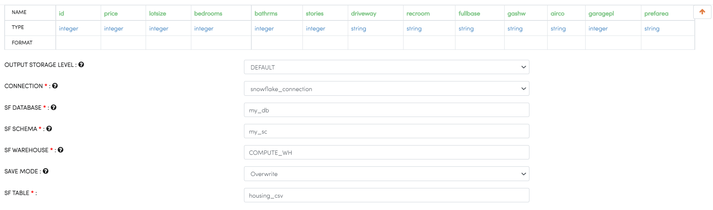
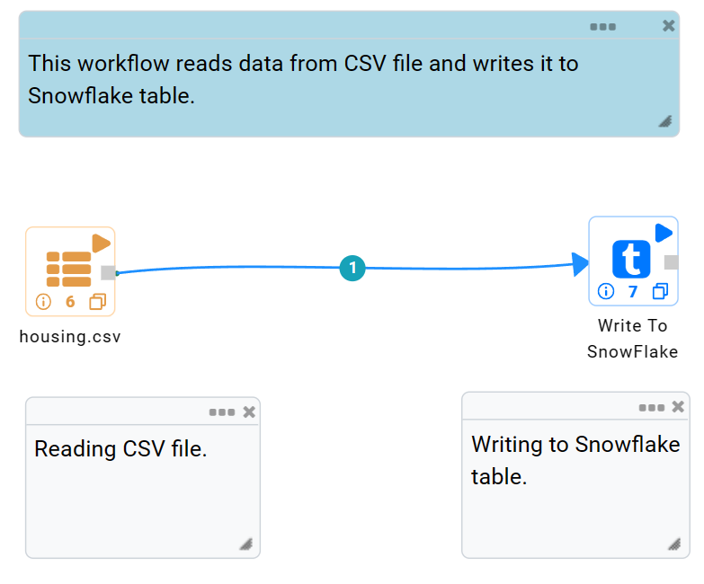
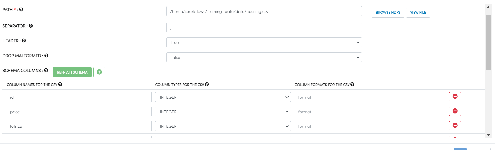
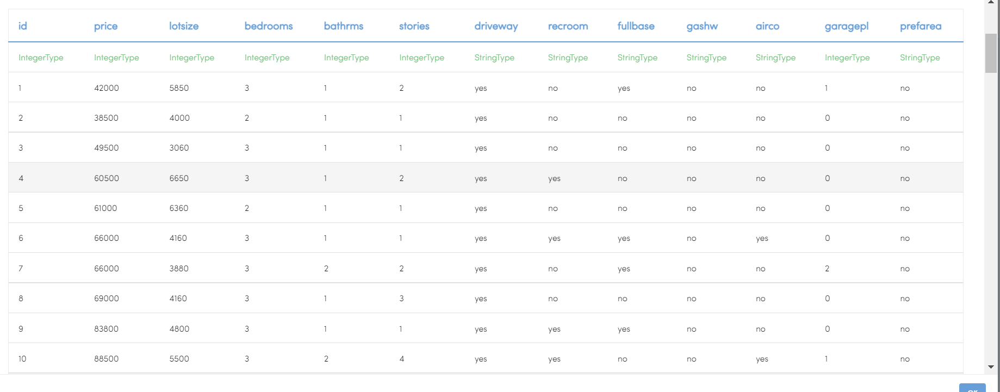
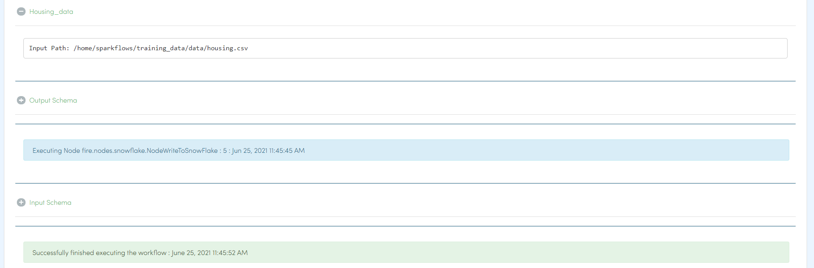

Write to Snowflake
=====================

Sparkflows has a processor for writing to Snowflake.

It would write the incoming DataFrame to Snowflake.

Processor Configuration
--------   
Enter the desired configuration values in the required fields, as shown below:

   
* ``CONNECTION`` : Connection created for Snowflake.
* ``SF DATABASE`` : Snowflake Database Name.
* ``SF SCHEMA`` : Snowflake Schema Name.
* ``SF WAREHOUSE`` : Snowflake Warehouse Name.
* ``SAVE MODE`` : Append, Overwrite, ErrorifExists and Ignore.
* ``SF TABLE`` : Snowflake Table Name.

Example Workflow
--------

The below workflow does the following:

* Reads Housing dataset.
* Write it to Snowflake Table.

   
**Reading from CSV File**
^^^^^^^^^^^^^^^^^^^^^^^^^^^

It reads Housing data from a CSV File using Read CSV Processor.

Processor Configuration
++++   

   
Processor Output
++++

**Write it to Snowflake**
^^^^^^^^^^^^^^^^^^^^^^^^^^^

It saves the DataFrame coming in from the previous processor into the specified Snowflake Table.

Processor Configuration
++++  

   
Once the workflow is executed successfully, the incoming DataFrame would be written to Snowflake Table.

.. note::  Make sure Snowflake connection is accessible from Fire Machine.
