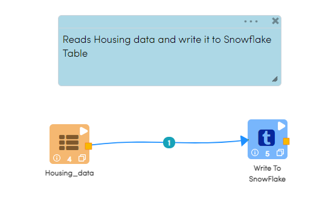

Write to Snowflake
=====================

Fire Insights has a processor for writing to Snowflake.

It would write the incoming Dataframe to Snowflake.

Processor Configuration
--------   

.. figure:: ..//_assets/snowflake/7.PNG
   :alt: snowflake
   :width: 90%
   
* CONNECTION  : Connection created for Snowflake
* SF DATABASE : Snowflake Database name
* SF SCHEMA : Snowflake Schema Name
* SF WAREHOUSE : Snowflake Warehouse Name
* SAVE MODE : Append, Overwrite, ErrorifExists & Ignore
* SF TABLE : Snowflake Table Name

Example Workflow
--------

The below workflow does the following:

* Reads Housing dataset.
* Write it to Snowflake Table.

   
Reading from CSV File
^^^^^^^^^^^^^^^^^^

It reads Housing data from a CSV File using Read CSV Processor.

Processor Configuration
++++   

.. figure:: ..//_assets/snowflake/5.PNG
   :alt: snowflake
   :width: 90%
   
Processor Output
++++

.. figure:: ..//_assets/snowflake/6.PNG
   :alt: snowflake
   :width: 90%

Write it to Snowflake
^^^^^^^^^^^^^^^^^^

It saves the dataframe coming in from the previous processor into the specified Snowflake Table.

Processor Configuration
++++  

.. figure:: ..//_assets/snowflake/7.PNG
   :alt: snowflake
   :width: 90%
   
Once the workflow is executed successfully, the incoming dataframe would be written to Snowflake Table

.. figure:: ..//_assets/snowflake/8.PNG
   :alt: snowflake
   :width: 90%

.. note::  Make sure Snowflake connection is accessible from Fire Machine
