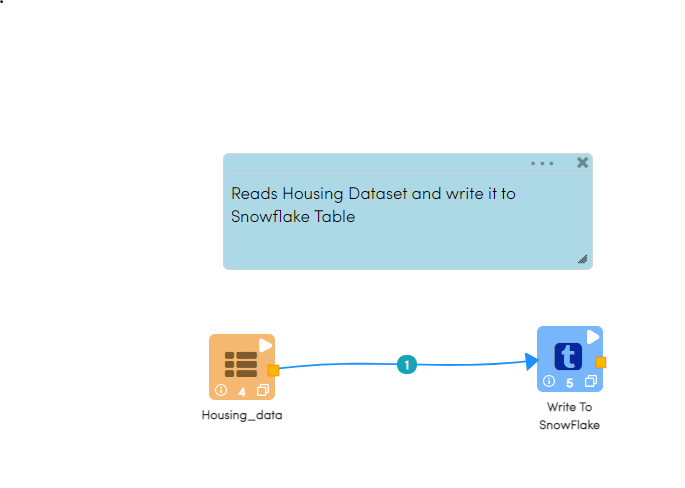

Writing to Snowflake
=====================

Fire Insights has a processor for writing to Snowflake.

It would write the incoming Dataframe to Snowflake.

Workflow
--------

The below workflow does the following:

* Reads Housing dataset.
* Write it to Snowflake Table.

