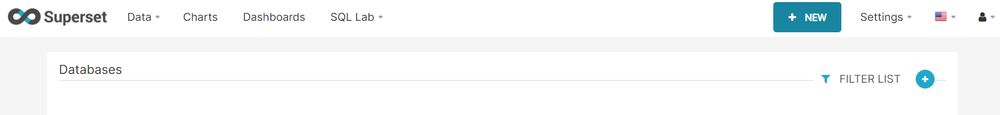
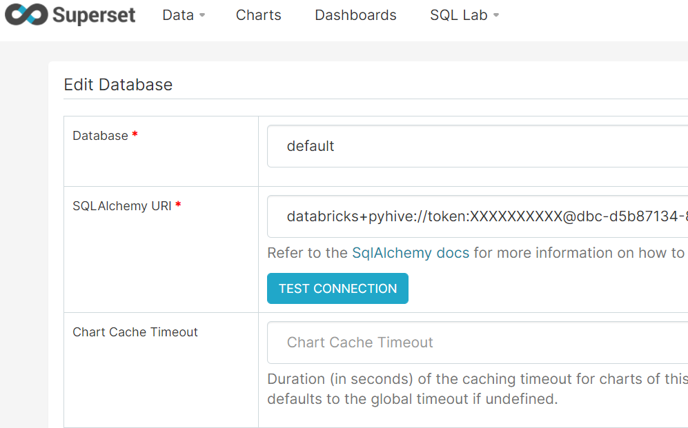
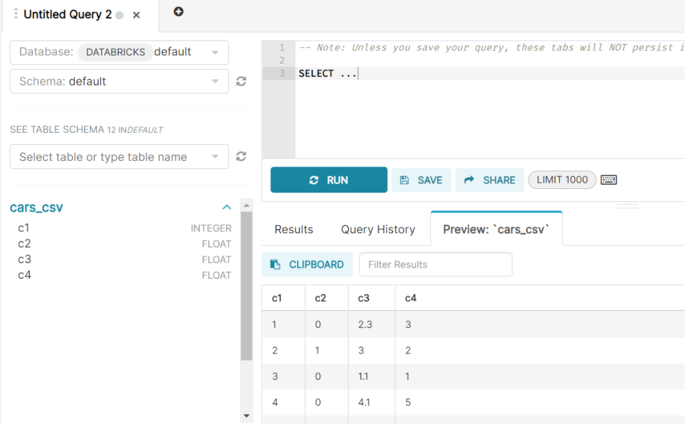

Connecting Superset with Databricks
================================

Once Superset is running, you can configure Databricks database.

.. note::  Make sure that the Databricks cluster is up.

Install the Python dependencies
----------------

Install Needed python dependency for Databricks on the Superset VM::

    pip install databricks-dbapi
    pip install databricks-dbapi[sqlalchemy]

Once the above two python databricks dependencies have been installed successfully, restart superset server & Login to Superset UI & Click on database

Now you can add databricks database by Clicking on NEW Tab & add Databricks `Database name & SQLAlchemy URI`::

    databricks+pyhive://token:<token>@<companyname>.cloud.databricks.com:443/<database>?cluster=<cluster_id>]

Click on TEST CONNECTION to test your connection. It should not throw any error and SAVE it, 
Once the database is saved successfully, it would be available in Superset database list page.

.. figure:: ..//_assets/configuration/super-databricks-database.PNG
   :alt: superset
   :align: center
   :width: 60%

Now You can start using databricks database tables for charts and visualizations

