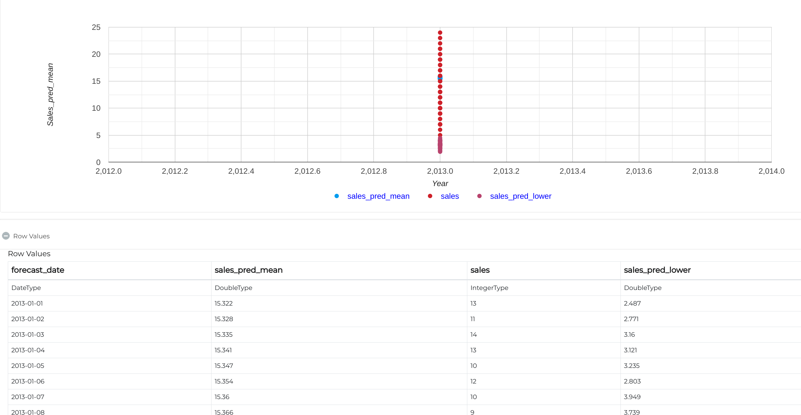

Time Series Visualizations
--------------------------

Fire Insights provides a number of Processors for the visualization of the time series data.

.. list-table:: Update New features where needed
   :widths: 10 40
   :header-rows: 1

   * - Charts
     - Description
   * - Line
     - Perfect for series of data points to form a continuous line. Example - Represent Daily sales data.
   * - Bar
     - Bar charts are a fundamental visualization for comparing values between groups of data. Best way to represent Categorical data.
   * - Scatter
     - Scatter plots are used to observe relationships between variables.
   * - Histogram
     - Histograms are a type of graph that shows the distribution of a dataset. They graph the percentage or the number of instances of different categories.
   * - Pie
     - Illustrate the percentage breakdown of a small number of data points, then they can be very effective.

Charts : LineChart
==================
Perfect for series of data points to form a continuous line.
Example - Represent Daily sales data

Below is the sample workflows which contains ``Time Series data`` and visualize using line chart in Fire Insights.

.. figure:: ../_assets/ml_userguide/visual.PNG
   :alt: ml_userguide
   :align: center
   :width: 60%

Configurations for visualization processors in Fire Insight:
* Set number of columns want to represent on y axis with respect to x axis
* Set chart type based on data type

.. figure:: ../_assets/ml_userguide/visualization_configurations.PNG
   :alt: ml_userguide
   :align: center
   :width: 60%

Output result of ``Visualization`` processor:

.. figure:: ../_assets/ml_userguide/visual_result.PNG
   :alt: ml_userguide
   :align: center
   :width: 60%

Charts : BarChart
==================

.. figure:: ../_assets/ml_userguide/barchart.png
   :alt: ml_userguide
   :align: center
   :width: 60%
   
Charts : Scatter
==================

