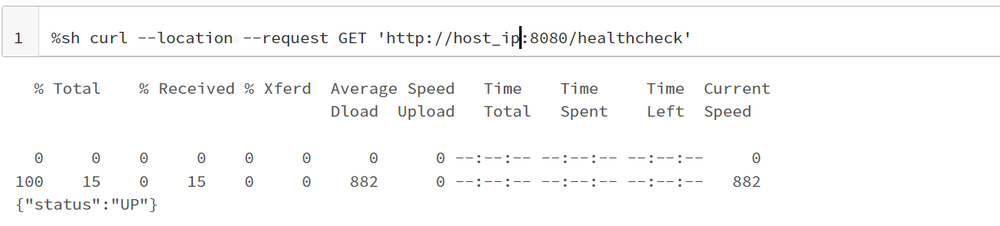
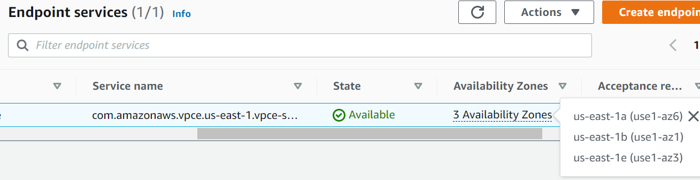
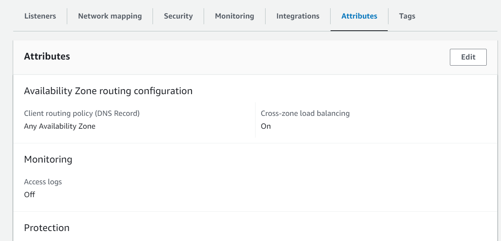

Databricks
===========

This page lists common errors when working with Databricks on Sparkflows.

Test connection with Databricks
-------------

**Problem**
++++++

When Clicking on Test Connection seeing http failure response for http://host_ip:8080/testConnection: 403 Forbidden 

Possible causes are:

* The JDBC Databricks Url configured in Fire Insights is configured wrongly.
* The Databricks Token configured in Fire Insights is configured wrongly.
* The Databricks REST API is accessble from the Fire Insights machine.

**Solution**
++++++++++

Sparkflows connects to Databricks to push jobs to it, Hence we have to make sure that Databricks REST API is accessble from the Fire Insights machine.

Use the command below to get the list of Databricks clusters. It would test whether the Databrics end point is accessible and if the token is good:

  * curl -i https://xxxxx.azuredatabricks.net/api/2.0/clusters/get -H "Authorization: Bearer Databricks_Token"

.. note::  Make sure to change the Databricks host URL to  your Databricks Workspace url Configuring.

Test healthcheck from Databricks Notebook
-----

**Problem**
++++++

When submitting the job on Databricks cluster from Sparkflows UI, not seeing response back to UI. 

Possible causes are:

* The Postback Url configured in Fire Insights is configured wrongly.
* The Postback Url configured in Fire Insights is not accessible from Databricks.

**Solution**
++++++++++

Jobs posted to Databricks from Sparkflows push events back to Fire Insights. Hence, it is important that the Sparkflows webserver endpoint is accessible from the Databricks cluster.

Use the command below to from Databricks notebook to check if the Fire Insights REST endpoint is accessible.

::

    %sh curl --location --request GET 'http://host_ip:8080/healthcheck'
    
    

.. note::  Make sure to change the host_ip to your domain name or your IP where Fire Insights is running.

Test Connection from Databricks Notebook to Endpoint service URL
----

**Problem**
++++++

When submitting the job on Databricks cluster from Sparkflows UI, not seeing response back to UI. 

**Solution**
++++++++++

We need to ensure that Fire Insights endpoint being used for postback url has the same availability zone as ec2 instance on which Fire Insights is running. Otherwise it will show empty response when running the healthcheck as above

   

We also need to ensure that that Endpoint services being used for postback url has cross-zone load balancing enabled for Fire Insight application. Otherwise it will show communication error.

