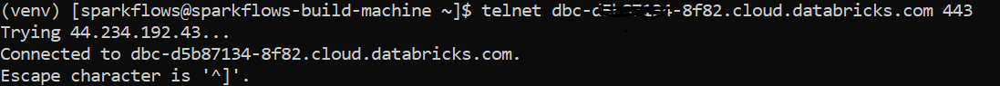
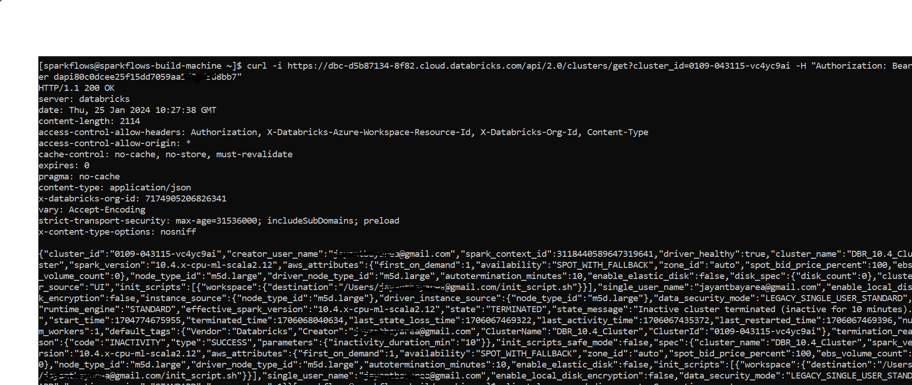
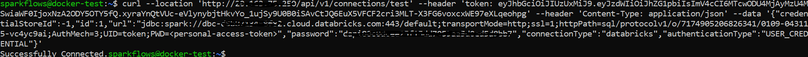
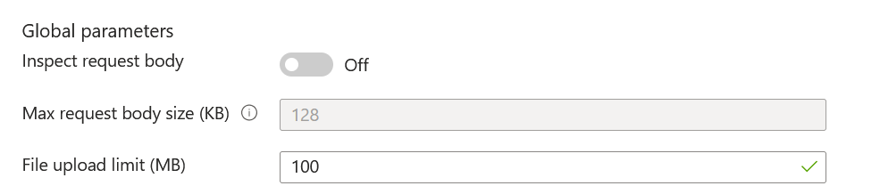

Databricks
===========

This page lists common errors when working with Databricks on Sparkflows.

Test connection with Databricks
-------------

**Problem**
++++++

When Clicking on Test Connection seeing:

``Not able to access the resource. Please check host url.``

``Invalid access token. Please check token.``

``http failure response for http://host_ip:8080/testConnection: 403 Forbidden`` 

Possible causes are:

* The JDBC Databricks Url configured in Sparkflows is configured wrongly.
* The Databricks Token configured in Sparkflows is configured wrongly.
* The Databricks REST API is not accessble from the Sparkflows machine.
* The Databricks Token configured in Sparkflows do not have sufficient permission.
* The Load Balancer restricting X-XSRF

**Solution**
++++++++++

Sparkflows connects to Databricks to push jobs to it, Hence we have to make sure that Databricks REST API is accessble from the Sparkflows machine.

Use the command below to check network connectivity:

::

    telnet xxxx.cloud.databricks.com 443

.. note::  Make sure to change the above Databricks Workspace URL to  your Databricks Workspace

Use the command below to get the list of Databricks clusters. It would test whether the Databrics end point is accessible and if the token is good:

::

      curl -i https://xxxxx.azuredatabricks.net/api/2.0/clusters/get?cluster_id=xxxxx -H "Authorization: Bearer Databricks_Token"

.. note::  Make sure to change the Databricks host URL to  your Databricks Workspace url Configuring and update cluster_id of that cluster.

Use the command below to Test Databricks connection. It would test whether the Databrics end point is accessible and post request is good:

::

      curl --location 'http://sparkflows_host/api/v1/connections/test' --header 'token: sparkflows_token' --header 'Content-Type: application/json' --data '{"credentialStoreId":-1,"id":1,"url":"JDBC Databricks URL","password":"Databricks_Token","connectionType":"databricks","authenticationType":"USER_CREDENTIAL"}'

.. note::  Make sure to change the **sparkflows_host**, **sparkflows_token**, **JDBC Databricks URL** and **Databricks_Token** with absolute value you are configuring.

Make sure to disable ``Inspect request body`` in Global Parameters, if you are using azure application gateway with WAF2

Test healthcheck from Databricks Notebook
-----

**Problem**
++++++

When submitting the job on Databricks cluster from Sparkflows UI, not seeing response back to UI. 

Possible causes are:

* The Postback Url configured in Sparkflows is configured wrongly.
* The Postback Url configured in Sparkflows is not accessible from Databricks.

**Solution**
++++++++++

Jobs posted to Databricks from Sparkflows push events back to Fire Insights. Hence, it is important that the Sparkflows webserver endpoint is accessible from the Databricks cluster.

Use the command below to from Databricks notebook to check if the Sparkflows REST endpoint is accessible.

::

    %sh curl --location --request GET 'http:/sparkflows_host:8080/healthcheck'
    
    
.. figure:: ../_assets/operating/operations/healthcheck.PNG
   :alt: operations
   :width: 80%

.. note::  Make sure to change the ``sparkflows_host`` to your domain name or your IP where Sparkflows is running.

**Problem**
++++++

When running curl command from Databricks notebook with https seeing ``Could resolve host: sparkflows.com`` . 

Possible causes are:

* The domain name you are trying to access could not be resolved to an IP address. This could be because the domain name is spelled incorrectly, or because the DNS server you are using is unable to resolve the domain name.

* There could be a network issue preventing curl from reaching the target server. This could be a problem with your network connection or with the server itself.

* There could be a problem with the SSL/TLS certificate on the server you are trying to access.

**Solution**
++++++++++

* Check that the domain name is spelled correctly and that you are using the correct URL.

* Check your network connection and try again later.

* If the problem persists, you could try using the ``--resolve`` option to specify the IP address of the target server manually.

* You could also try using the ``--insecure`` option to disable certificate validation. This is not recommended for production environments, but it can be useful for troubleshooting.

Test Connection from Databricks Notebook to Endpoint service URL
----

**Problem**
++++++

When submitting the job on Databricks cluster from Sparkflows UI, not seeing response back to UI. 

**Solution**
++++++++++

We need to ensure that Fire Insights endpoint being used for postback url has the same availability zone as ec2 instance on which Fire Insights is running. Otherwise it will show empty response when running the healthcheck as above

.. figure:: ../_assets/operating/operations/end_2.PNG
   :alt: operations
   :width: 60%
   
.. figure:: ../_assets/operating/operations/end_3.PNG
   :alt: operations
   :width: 60%   

We also need to ensure that that Endpoint services being used for postback url has cross-zone load balancing enabled for Fire Insight application. Otherwise it will show communication error.

.. figure:: ../_assets/operating/operations/cross_zone.PNG
   :alt: operations
   :width: 60% 
