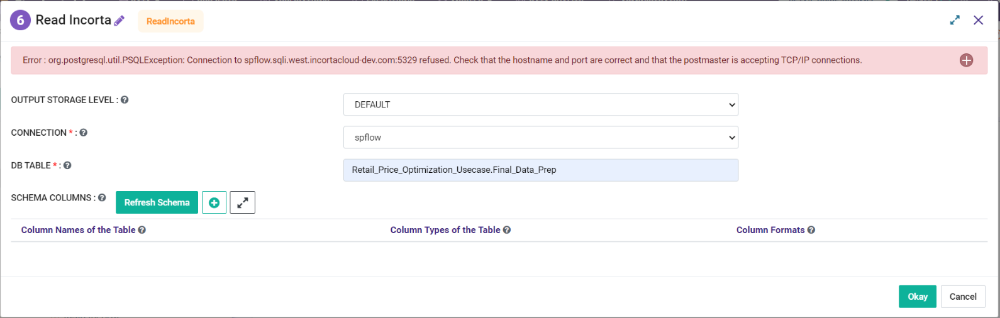
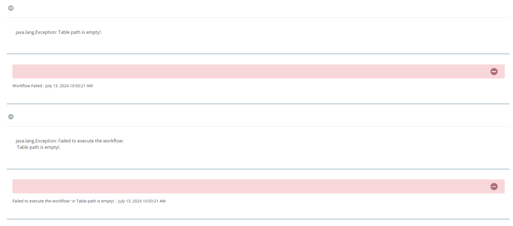

Incorta
============

This document segment goes over some of the common issues and their resolution that our users tend to run into:

1. PSQL Exception: Connection to spflow.sqli.west.incortacloud refused
---------------

**Problem**
++++++++

PSQL Exception: Connection to spflow.sqli.west.incortacloud refused

**Solution**
++++++++

Please take below steps as Remediation Step:

* Check whether Incorta Cluster is up by accessing below URL: https://spflow.uswest.cloudstaging.incortalabs.com/
* Ensure that Postgres URL is correct and not changed.

2. Table Path is Empty error on execution
--------------------------

**Problem**
++++++++

Table Path is Empty error on execution

**Solution**
++++++++

Please take below steps as Remediation Step:

* We need to take help of Engineering team for this. 
* It may be possible the token might have expired and need to be updated.
