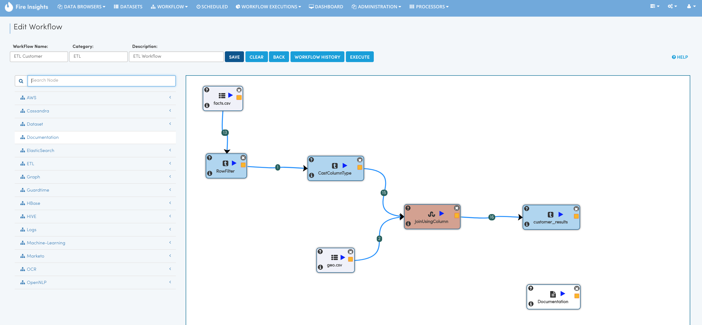

Creating ETL Workflow
------------

In this tutorial we would build an ETL Workflow.

We would take the transaction dataset, clean it and then join it with other dimensional datasets.

We would finally save the results into CSV files.

The steps involved in creating a workflow are:

- **Go to Workflow Listings Page**
- **Click on Create New Workflow to go to the Workflow Designer Page**
- **Click on the nodes on the LHS to create them in the Workflow Canvas**
- **Connect the nodes with Links**
- **Name and workflow and Save it**

Go to Workflow Listings Page
============================

.. figure:: ../_assets/tutorials/02/workflow-listings.png
   :scale: 100%
   :alt: Workflow Listings
   :align: center

Click on Create Workflow
========================

Click on ``Create Workflow`` for creating a new workflow. It would take you to the Workflow Designer Page.

In the Workflow Designer Page, give a Name, Category and Description to the Workflow.

Create the Workflow
===================

Click on the nodes in the LHS to create them. Connect them with Links. Links can be connected between 2 Nodes by clicking on the yellow box in the from node, dragging the mouse and connecting to the second Node.

Save the Workflow
=================

Finally Save the Workflow.

