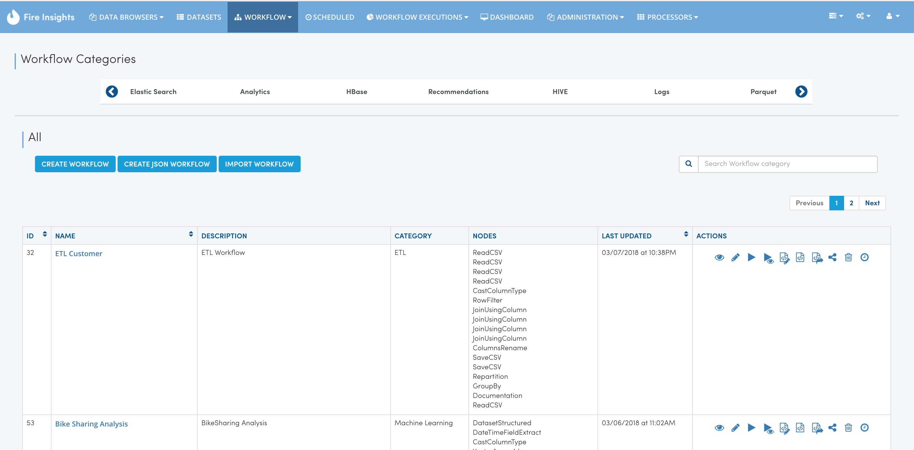
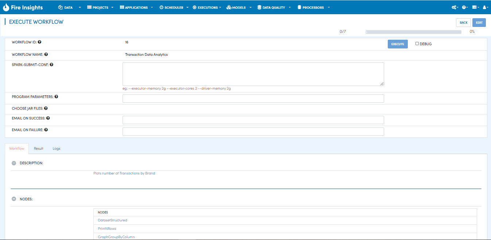

Executing the Workflow
----------------------

In this tutorial we would execute the workflow we built earlier.

The steps involved in executing a workflow are:

- Go to Workflow Listings page
- Click on the play button for executing the workflow
- This would bring up the Execute workflow page
- Click on Execute to execute the workflow

Go to Workflow Listings page
============================

Click on the Play Button
========================

Against each workflow there are a list of icons for performing various actions on the workflow.

Click on the play button for executing the workflow.

Execute workflow page
======================

The previous step brings you to the Execute Workflow Page. 

Click on Execute to execute the workflow
========================================

Now click on the Execute button for executing the workflow.

