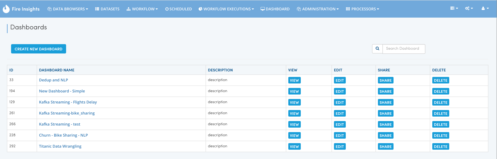

Creating Dashboard
------------------

In this tutorial we would create a Dashboard containing some charts and tables.

The steps involved in creating a dashboard are:

- *Go to Dashboards page*
- *Click on Create New Dashboard*
- *Drag and drop selected Nodes from the workflows into the Dashboard canvas*
- *Save the Dashboard*

Go to Dashboards page
=====================

Click on Create New Dashboard
=============================

This would open up the Dashboard Designer Page.

.. figure:: ../_assets/tutorials/04/dashboard-designer.png
   :scale: 100%
   :alt: Dashboard Designer
   :align: center
   
   
Name the Dashboard
==================

Give a ``name`` to your Dashboard. You can also add a description for the New Dashboard.

Drag and drop selected Nodes from the workflows into the Dashboard canvas
===================================

On the LHS of the Dashboard Designer, the list of workflows would show up. With each Workflow, the Nodes inside the Workflow would be displayed.

Nodes inside the workflow can be dragged and dropped onto the Dashboard to make them part of the Dashboard.

In the Dashboard below we have added 2 nodes to the Dashboard.

.. figure:: ../_assets/tutorials/04/dashboard-designer-1.png
   :scale: 100%
   :alt: Dashboard Designer
   :align: center

Save the Dashboard
==================

Finally ``Save`` the Dashboard.

In order to view the Dashboard, click on the 'View' button.
 
 
View the Dashboard
==================

Click on the ``View`` button to view the dashboard.

The Dashboard shows the content from the latest execution of the Workflow.

If the workflow has never been executed, the Dashboard would show empty content.

.. figure:: ../_assets/tutorials/04/dashboard-view-1.png
   :scale: 100%
   :alt: Dashboard Designer
   :align: center
   
 
 
 
 

