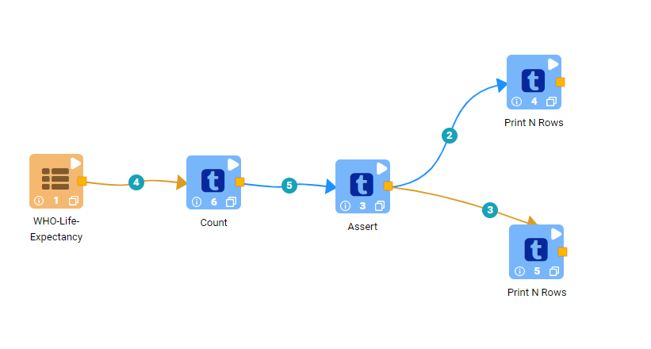
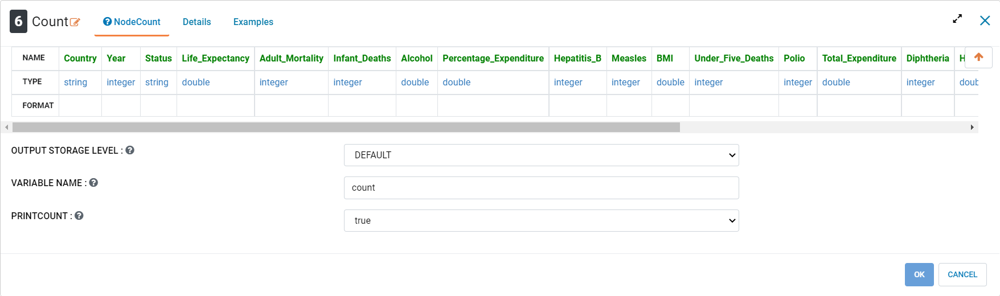
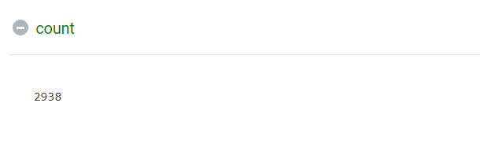
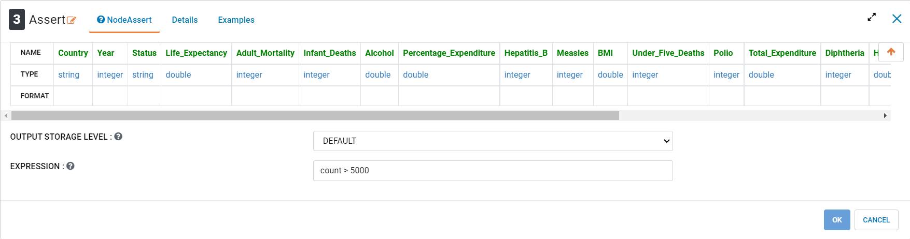
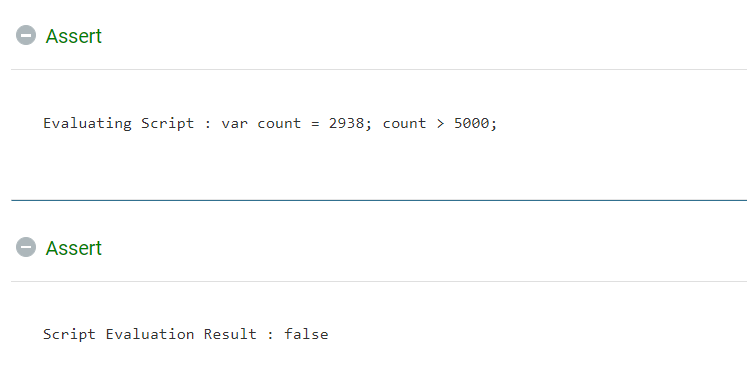
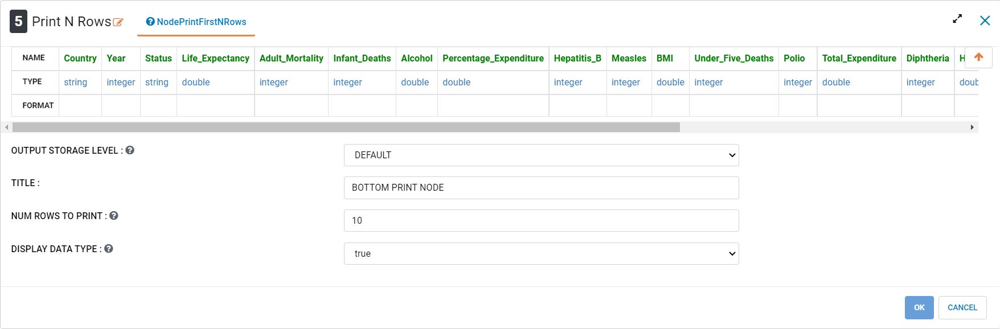
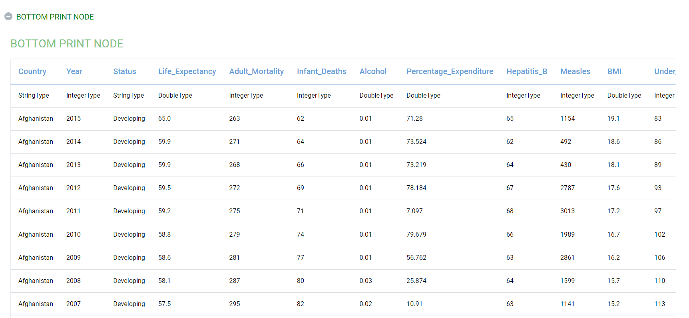

Assert
=============

This tutorial will cover how to use the ``Assert`` processor using aggregate health data. The ``Assert`` processor can be used to choose which section of a workflow gets executed based on a parameter created by another node. The data has been taken from Kaggle courtesy of the World Health Organization.  

.. contents::
   :depth: 2

Workflow Overview
-------------------
The below workflow: 

* Counts the number of records
* Creates a decision point in the workflow 
* Executes a selected portion of the workflow

   
   
   
Counting Records in Data
----------------------------
We use the ``Count`` processor to count the number of records in the incoming dataframe. This node prints the value of the count in addition to creating a new variable of the name given by the user that stores the value of the count. This variable can be used in subsequent nodes as a parameter. The ``Count`` processor can not only be used on raw data, but also in tandem with other nodes such as ``Distinct Values in Column`` or various regression nodes. 

Processor Configuration
^^^^^^^^^^^^^^^^^^^^^^^^

   

Processor Output
^^^^^^^^^^^^^^^^^^^^^^^^

   

Creating a Decision Point
-------------------------------
We use the ``Assert`` processor to create a decision point in the workflow. This node takes a conditional expression as an input, evaluates the expression to be a boolean value, and then exclusively executes a portion of the workflow depending on the result of the expression. If the expression is evaluated to be True, then the node will only execute the node on the upper edge and vice versa. 

Processor Configuration
^^^^^^^^^^^^^^^^^^^^^^^^

   
   
Processor Output
^^^^^^^^^^^^^^^^^^^^^^^^

   
   
   
Creating a Histogram
-------------------------------
We use the ``Print N Rows`` processor to create a chart of the distribution of a numeric variable. In this case we are using it to chart the proportion of "large" countries in our data.  

Processor Configuration
^^^^^^^^^^^^^^^^^^^^^^^^

   
   
Processor Output
^^^^^^^^^^^^^^^^^^^^^^^^

   
   
