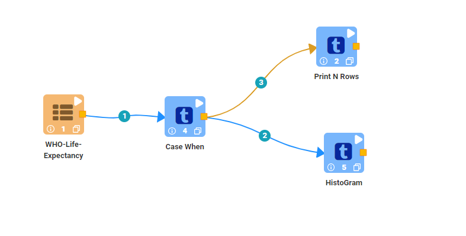
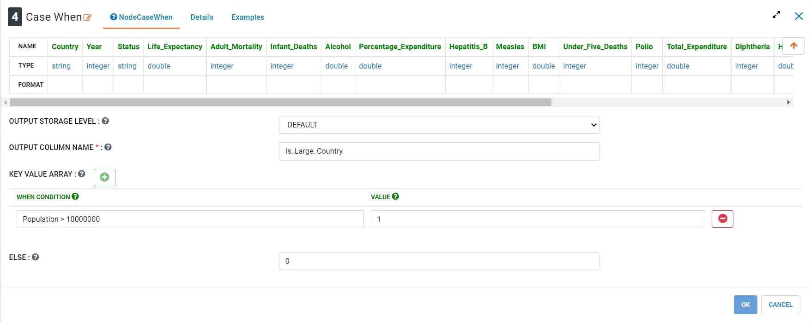
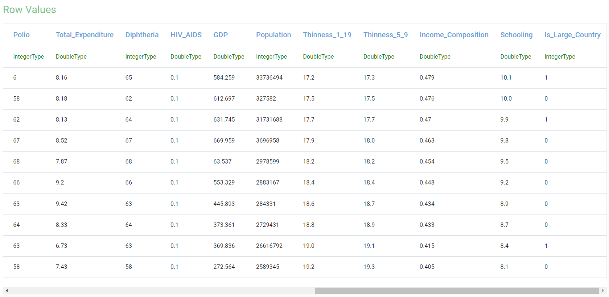
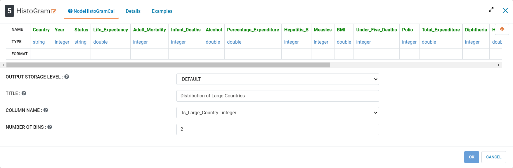
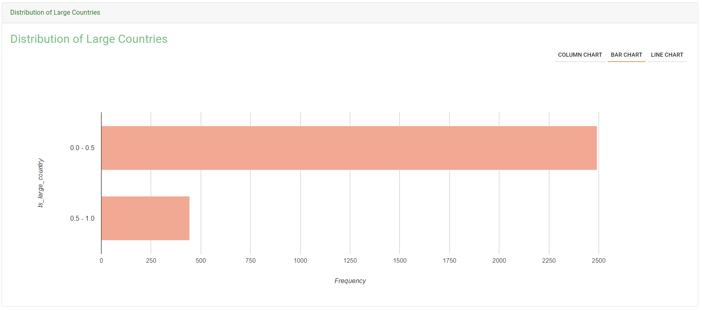

Case When
=============

This tutorial will cover how to use the Case When processor using aggregate health data. The data has been taken from Kaggle courtesy of the World Health Organization.  

.. contents::
   :depth: 2

Workflow Overview
-------------------
The below workflow: 

* Uses the Case When processor to create a new variable
* Creates a histogram to show the distribution of a variable

   
   
Using Case When
----------------------------
We use the ``Case When`` processor to create a new columns based on values from another column(or multiple other columns). In the Key Value Array option, we can add different conditions that need to be met to assign given values in the new columns created. In this case we are defining a "large" country as having a population greater than 10M people. The new column will be assigned a 1 value when to population exceeds the set threshold, and in all other cases when no conditions from the Key Value Array are met, will assign a 0 value. Multiple conditions can be set in the Key Value Array by adding new conditions using the (+) button. 

Processor Configuration
^^^^^^^^^^^^^^^^^^^^^^^^

   

Processor Output
^^^^^^^^^^^^^^^^^^^^^^^^

   

Creating a Histogram
-------------------------------
We use the ``Histogram`` processor to create a chart of the distribution of a numeric variable. In this case we are using it to chart the proportion of "large" countries in our data.  

Processor Configuration
^^^^^^^^^^^^^^^^^^^^^^^^

   
   
Processor Output
^^^^^^^^^^^^^^^^^^^^^^^^

   
   
