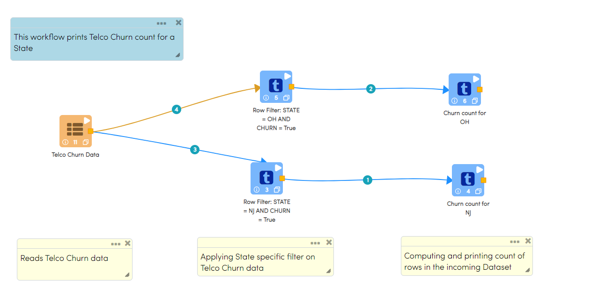
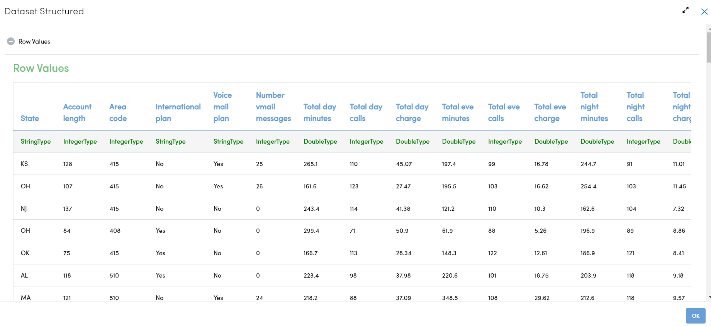
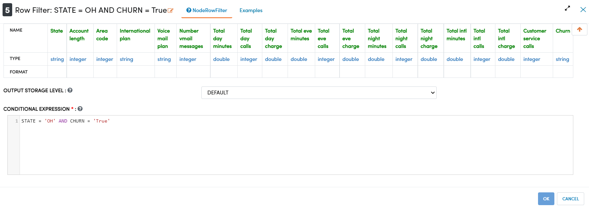
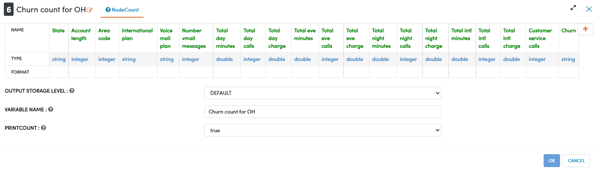
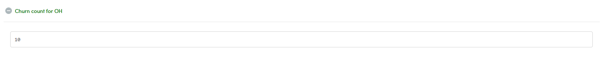

Count
=============

This workflow computes and prints the number of records present in the incoming Dataset.

Workflow
-------

Below Workflow performs following processing:

* Reads data from a Dataset (Telco Churn Data)
* Filters Churned data from incoming dataset for NJ and OH states
* Prints Churned count for each state using Count Nodes. Count Node computes and prints row count of the incoming Dataset. 

   

   
Reading from Dataset
---------------------

It reads the input Dataset File (Telco Churn Data).

Processor Configuration
^^^^^^^^^^^^^^^^^^
   
.. figure:: ../../_assets/tutorials/advanced-controls/count/Incoming_Dataset_File.png
   :alt: Count
   :width: 100%
   
Processor Output
^^^^^^

   
   
Row Filter Nodes
------------

* They filter incoming Telco Churn dataset based on following conditions provided in each node:

  * STATE = 'OH' AND CHURN = 'True'
  * STATE = 'NJ' AND CHURN = 'True'
  
* Each Node would create an outgoing Dataset comprising of Churned Data for respective state.

Processor Configuration
^^^^^^^^^^^^^^^^^^

Below is Processor configuration of Row Filter Node that filters Churn data for OH state. 

   
Processor Output
^^^^^^

.. figure:: ../../_assets/tutorials/advanced-controls/count/RowFilter_OH_Output.png
   :alt: Count
   :width: 100%
  
Count Nodes
------------

* These nodes compute and print row count of the incoming Dataset
* There are two nodes configured to print Churn Count data for two states

Processor Configuration
^^^^^^^^^^^^^^^^^^

Processor configuration of the Count node that prints Churn count for OH state

   
Processor Output
^^^^^^

