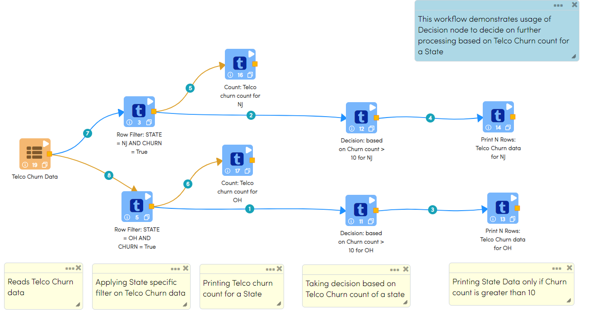
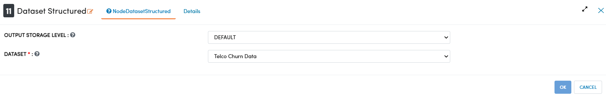
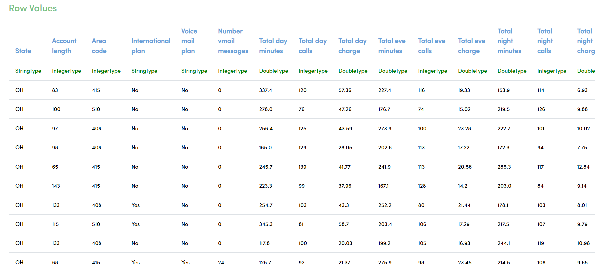
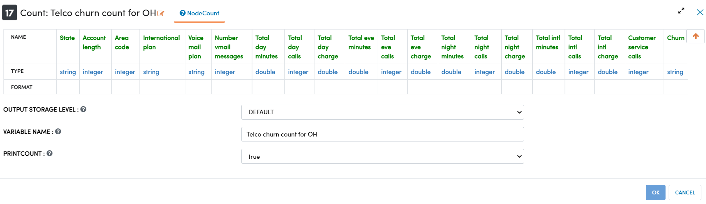
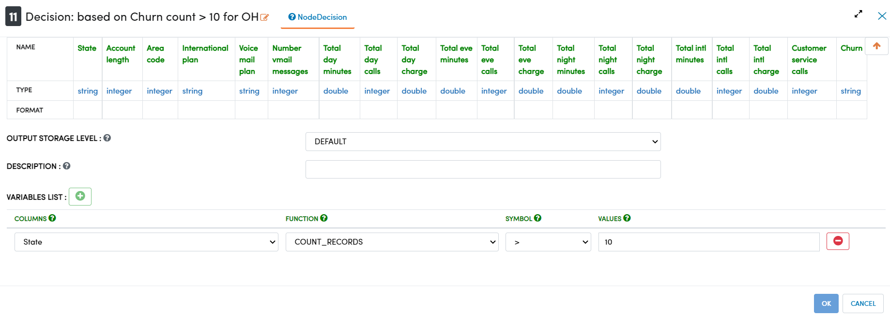
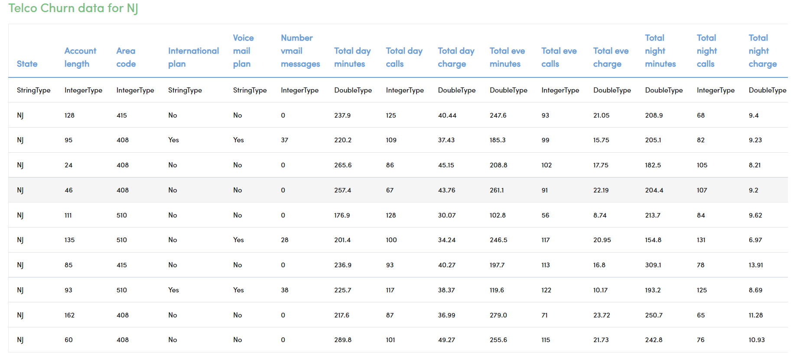

Decision
=============

This workflow demonstrates usage of Decision node to decide on further processing based on Telco Churn count for a State

Workflow
-------

Workflow performs following processing:

* Reads data from a Dataset (Telco Churn Data)
* Filters Churned data from incoming dataset for NJ and OH states
* Decision nodes check whether Churned count of a state is greater than 10 or not.
* If Churn Count is greater than 10 then only print the incoming dataset or else stop execution at the decision node.

   

   
Reading from Dataset
---------------------

It reads the input Dataset File (Telco Churn Data).

Processor Configuration
^^^^^^^^^^^^^^^^^^
   

   
Processor Output
^^^^^^

.. figure:: ../../_assets/tutorials/advanced-controls/decision/Dataset_Data.png
   :alt: Decision
   :width: 80%
   
   
Row Filter Nodes
------------

* They filter incoming Telco Churn dataset based on following conditions provided in each node:

  * STATE = 'OH' AND CHURN = 'True'
  * STATE = 'NJ' AND CHURN = 'True'
	
* Each Node would create an outgoing Dataset comprising of Churned Data for respective state.

Processor Configuration
^^^^^^^^^^^^^^^^^^

Below is Processor configuration of Row Filter Node that filters Churn data for OH state. 

.. figure:: ../../_assets/tutorials/advanced-controls/decision/RowFilter_OH.png
   :alt: Decision
   :width: 80%
   
Processor Output
^^^^^^

  
Count Nodes
------------

* These nodes compute and print row count of the incoming Dataset
* There are two nodes configured to print Churn Count data for two states

Processor Configuration
^^^^^^^^^^^^^^^^^^

Processor configuration of the Count node that prints Churn count for OH state

   
Processor Output
^^^^^^

.. figure:: ../../_assets/tutorials/advanced-controls/decision/Count_Node_OH_Output.png
   :alt: Decision
   :width: 80%

Decision Nodes
------------

* If condition specified in these nodes satisfy then only next node is executed else processing stops at Decision node itself.
* Condition specified in both Decicion Nodes is to check whether Count of records in the incoming Dataset is greater than 10 or not.
* Print Nodes would print incoming dataset only if condition in Decision Node satisfies.
* In this scenarion, Churn count for NJ is more than 10 whereas it is 10 for OH state. Hence, incoming Dataset for NJ would be printed whereas for OH won't be printed.

Processor Configuration
^^^^^^^^^^^^^^^^^^

Processor configuration of the Decision node for OH state

   
   
Print N Rows Nodes
------------

* These nodes print incoming dataset
* Condition mentioned in the NJ Decision Node satisfies i.e. Churn Count is greater than 10 hence NJ Print Node would be executed printing incoming dataset.
* Condition mentioned in the OH Decision Node doesn't satisfy i.e. Churn Count is 10 hence OH Print Node won't be executed and OH dataset won't be printed.

Processor Configuration
^^^^^^^^^^^^^^^^^^

Processor configuration of the Count node that prints Churn count for NJ state

.. figure:: ../../_assets/tutorials/advanced-controls/decision/Print_Node_NJ.png
   :alt: Decision
   :width: 80%
   
Processor Output
^^^^^^

