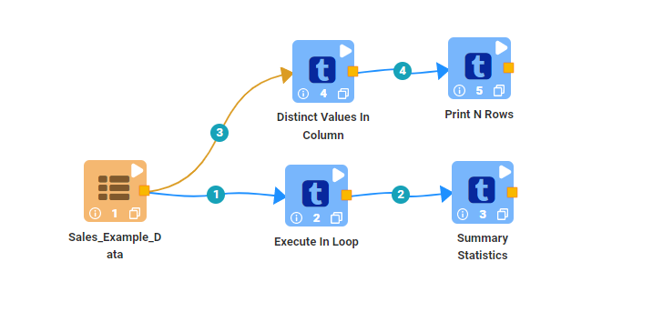
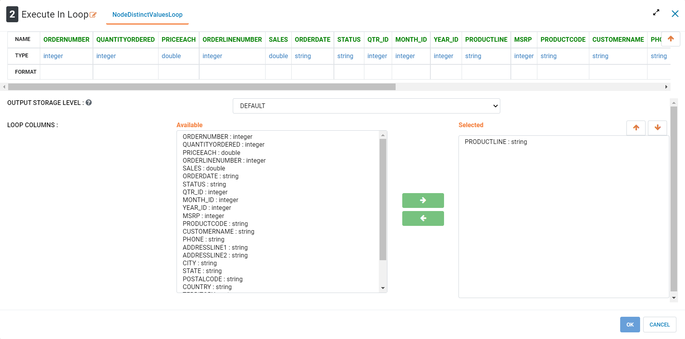
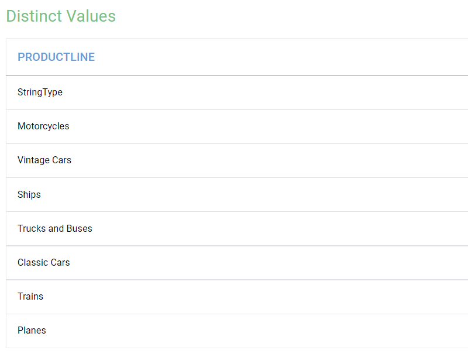
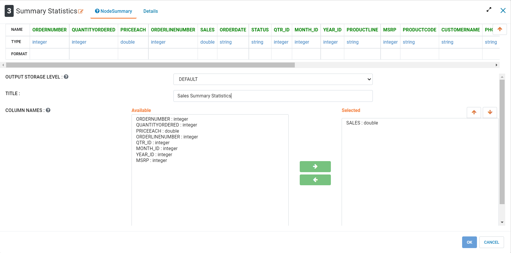
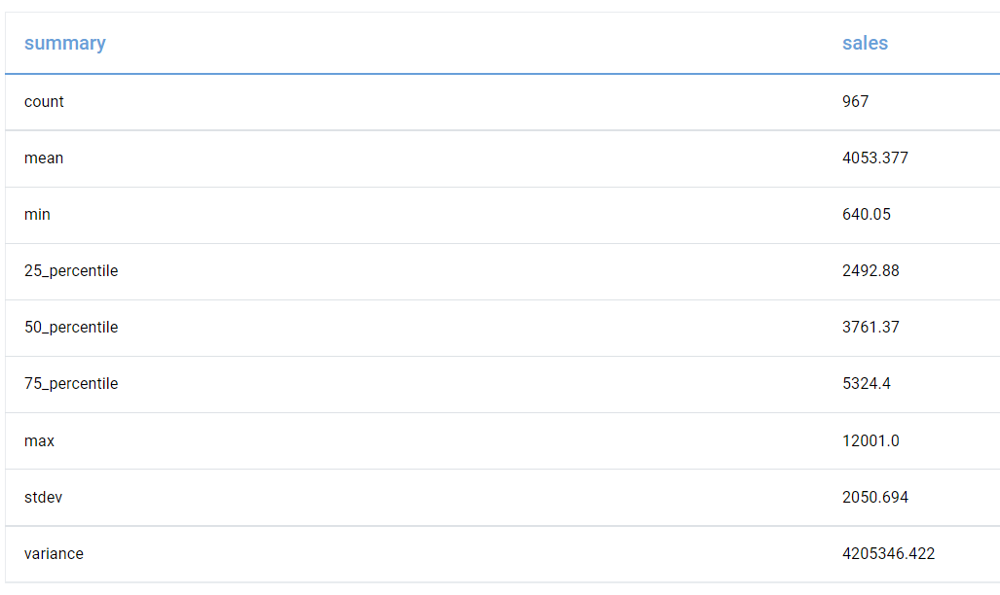
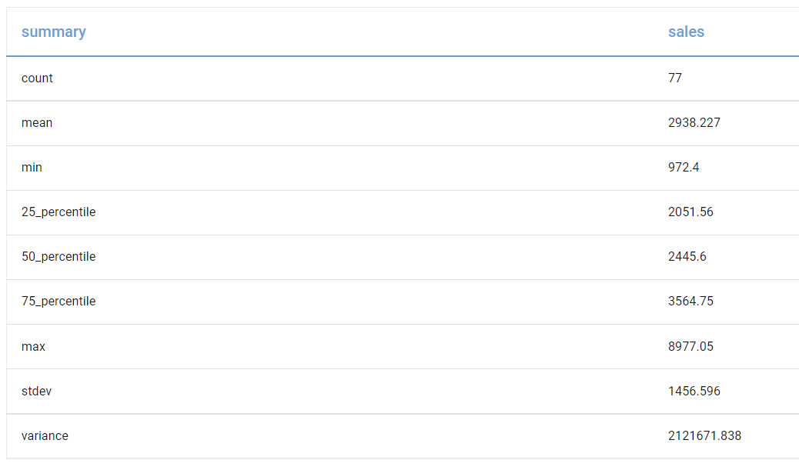
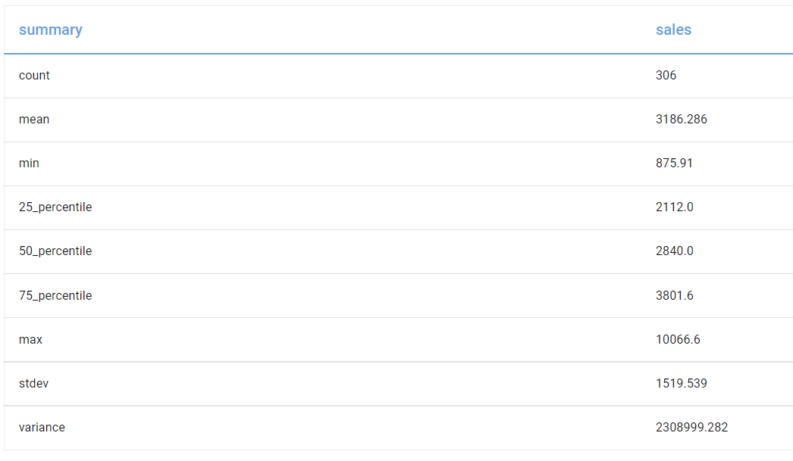

Loop
=============

This tutorial will cover how to use the loop processor using an example sales data. The data has been taken from Kaggle courtesy of Assert Solutions.  

.. contents::
   :depth: 2

Workflow Overview
-------------------
The below workflow: 

* Creates a loop to seperate the data by Product Line
* Calculates summary statistics of the sales values

   
   
Creating Loop
----------------------------
We use the ``Execute In Loop`` processor to have the nodes that follow execute repeatedly on data corresponding to different product. The ``Execute In Loop`` processor creates a list of all the unique values in the selected column and filters all values except for one at a time. This allows us to create a model for each product without editting the workflow or using a row filter. In this case we are using this processor to calculate seperate summary statistics for each Product Line without filtering the data for each seperately. For the purposes of this tutorial, distinct values that will be used to loop the workflow have also been displayed using the ``Execute In Loop`` processor. 

Processor Configuration
^^^^^^^^^^^^^^^^^^^^^^^^

   

Processor Output
^^^^^^^^^^^^^^^^^^^^^^^^

   

Calculating Summary Statistics
-------------------------------
We use the ``Summary Statistics`` processor to calculate basic summary statistics for numeric variables. In this case we are using it to calculate separate statistics for each Product Line. The output is showing a sample of the statistics that were generated, summary statistics were generated for every distinct Product Line. 

Processor Configuration
^^^^^^^^^^^^^^^^^^^^^^^^

   
   
Processor Output
^^^^^^^^^^^^^^^^^^^^^^^^

   
   
Processor Output
^^^^^^^^^^^^^^^^^^^^^^^^

   
   
Processor Output
^^^^^^^^^^^^^^^^^^^^^^^^

   
   
   
