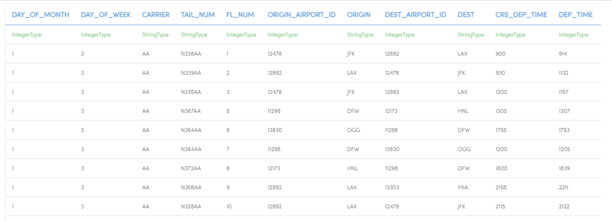

Analyze Flights Delays
=====================

This workflow reads in a dataset. It then analyze flights delay with sample datasets and prints the results.

Worklow
-------

Below is the workflow. It does the following:

* Reads data from a sample dataset.
* Print the sample datasets results.
* column to be cast for new datatype double.
* column to be cast for new datatype string.
* update the column name of datatype string.
* print the result of data updating after stringindexer Node.
* execute the SQL queries with the given conditions.
* prints the results.

.. figure:: ../../_assets/tutorials/analytics/analyze-flights-delays/1.PNG
   :alt: Analyze Flights Delays
   :align: center
   :width: 60%
   
Reading from Dataset
---------------------

It reads Dataset file.

Processor Configuration
^^^^^^^^^^^^^^^^^^

.. figure:: ../../_assets/tutorials/analytics/analyze-flights-delays/2.PNG
   :alt: Analyze Flights Delays
   :align: center
   :width: 60%
   
Processor Output
^^^^^^

