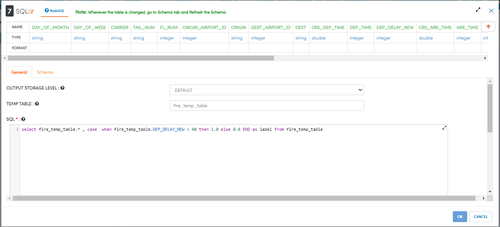
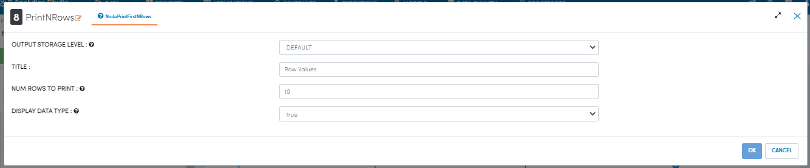
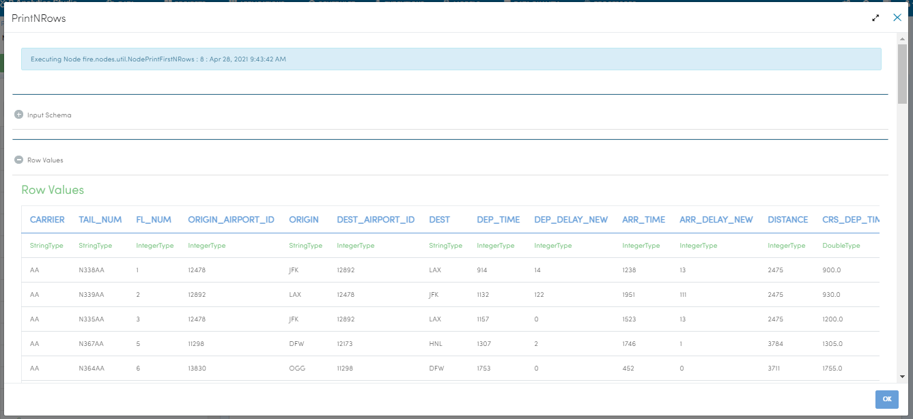

Analyze Flights Delays
=====================

This workflow reads in a dataset. It then analyzes flights delay with sample datasets and prints the results.

Workflow
-------

Below is the workflow. It does the following:

* Reads data from a sample dataset.
* Prints the sample datasets results.
* Column to be cast for new datatype double.
* Column to be cast for new datatype string.
* Updates the column name of datatype string.
* Prints the result of data updating after stringindexer Node.
* Executes the SQL queries with the given conditions.
* Prints the results.

.. figure:: ../../_assets/tutorials/analytics/analyze-flights-delays/1.PNG
   :alt: Analyze Flights Delays
   :align: left
   :width: 60%
   
Reading from Dataset
---------------------

It reads Dataset files.

Processor Configuration
^^^^^^^^^^^^^^^^^^

.. figure:: ../../_assets/tutorials/analytics/analyze-flights-delays/2.PNG
   :alt: Analyze Flights Delays
   :align: center
   :width: 60%
   
Processor Output
^^^^^^

.. figure:: ../../_assets/tutorials/analytics/analyze-flights-delays/3.PNG
   :alt: Analyze Flights Delays
   :align: left
   :width: 60%
   
Print the sample datasets results
---------------------------------

It prints the sample datasets results.

Processor Configuration
^^^^^^^^^^^^^^^^^^

.. figure:: ../../_assets/tutorials/analytics/analyze-flights-delays/3.PNG
   :alt: Analyze Flights Delays
   :align: left
   :width: 60%
   
Processor Output
^^^^^^

.. figure:: ../../_assets/tutorials/analytics/analyze-flights-delays/3a.PNG
   :alt: Analyze Flights Delays
   :align: left
   :width: 60% 

Column to be cast for new datatype double
---------------------------------

It casts for new datatype double using castcolumn type Node.

Processor Configuration
^^^^^^^^^^^^^^^^^^

.. figure:: ../../_assets/tutorials/analytics/analyze-flights-delays/4.PNG
   :alt: Analyze Flights Delays
   :align: left
   :width: 60%
   
Processor Output
^^^^^^

.. figure:: ../../_assets/tutorials/analytics/analyze-flights-delays/4a.PNG
   :alt: Analyze Flights Delays
   :align: left
   :width: 60%

Column to be cast for new datatype string
---------------------------------

It casts for new datatype string using castcolumn type Node.

Processor Configuration
^^^^^^^^^^^^^^^^^^

.. figure:: ../../_assets/tutorials/analytics/analyze-flights-delays/5.PNG
   :alt: Analyze Flights Delays
   :align: left
   :width: 60%
   
Processor Output
^^^^^^

.. figure:: ../../_assets/tutorials/analytics/analyze-flights-delays/5a.PNG
   :alt: Analyze Flights Delays
   :align: left
   :width: 60%

Updates the column name of datatype string
----------------------------------------

It updates the column name of datatype string using stringindexer type Node.

Processor Configuration
^^^^^^^^^^^^^^^^^^

.. figure:: ../../_assets/tutorials/analytics/analyze-flights-delays/6.PNG
   :alt: Analyze Flights Delays
   :align: left
   :width: 60%
   
Processor Output
^^^^^^

.. figure:: ../../_assets/tutorials/analytics/analyze-flights-delays/6a.PNG
   :alt: Analyze Flights Delays
   :align: left
   :width: 60%
 
Prints the Results
------------------

It prints the result of data updating after stringindexer Node.

Processor Configuration
^^^^^^^^^^^^^^^^^^

.. figure:: ../../_assets/tutorials/analytics/analyze-flights-delays/7.PNG
   :alt: Analyze Flights Delays
   :align: left
   :width: 60%
   
Processor Output
^^^^^^

.. figure:: ../../_assets/tutorials/analytics/analyze-flights-delays/7a.PNG
   :alt: Analyze Flights Delays
   :align: left
   :width: 60%
   
Executes the SQL queries   
-------------------------

It executes the SQL queries with the given conditions.

Processor Configuration
^^^^^^^^^^^^^^^^^^

   
Processor Output
^^^^^^

.. figure:: ../../_assets/tutorials/analytics/analyze-flights-delays/8a.PNG
   :alt: Analyze Flights Delays
   :align: left
   :width: 60%

Prints the Results
------------------

It prints the results after satisfied condition by   sql   queries.

Processor Configuration
^^^^^^^^^^^^^^^^^^

   
Processor Output
^^^^^^

