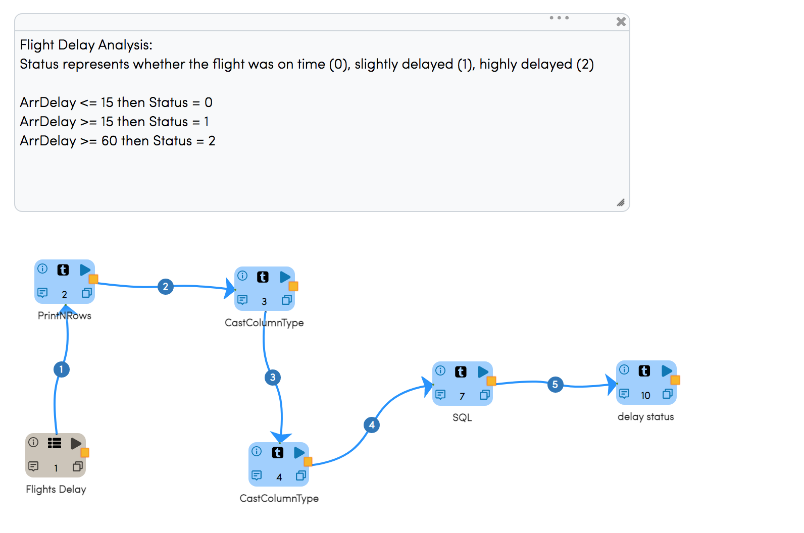
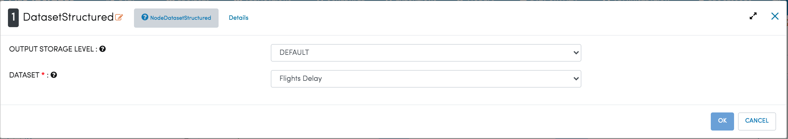
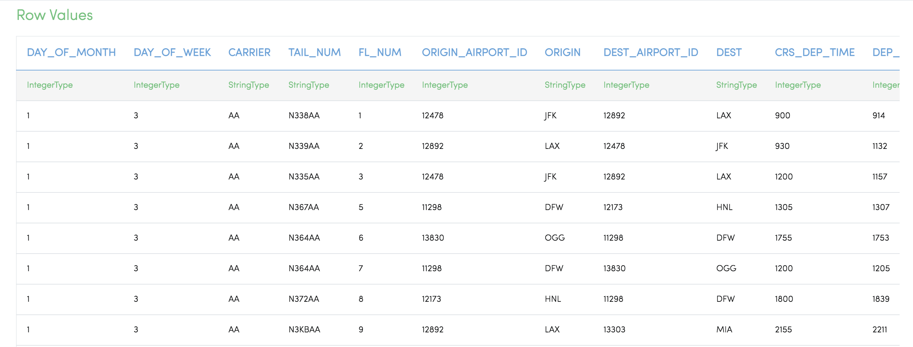
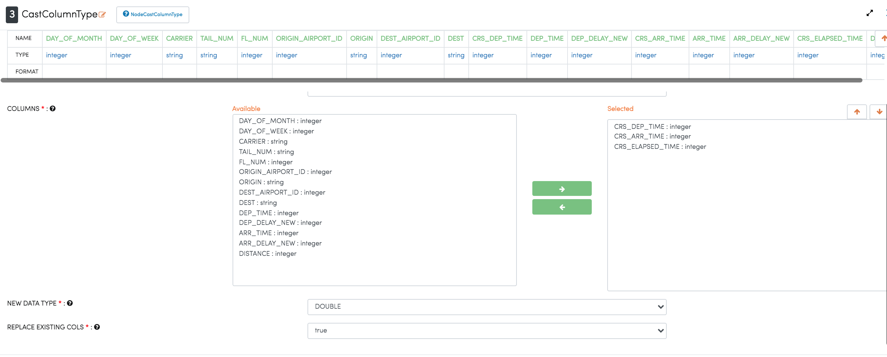
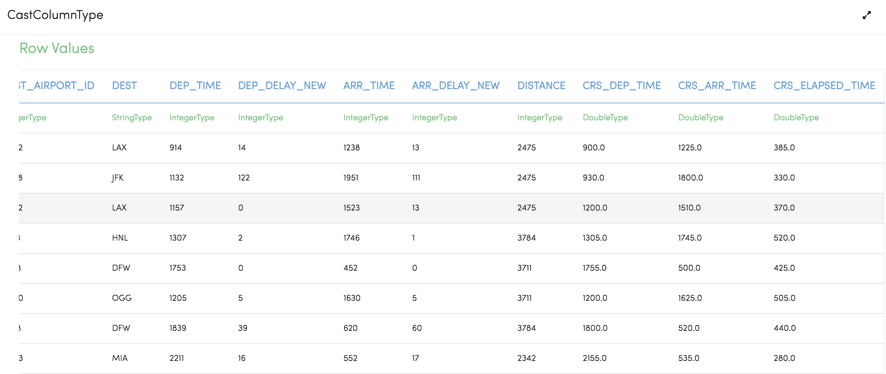
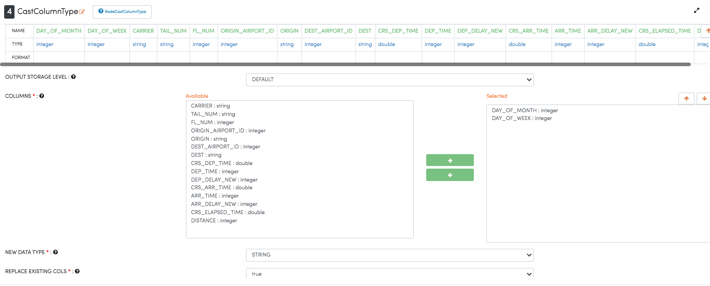
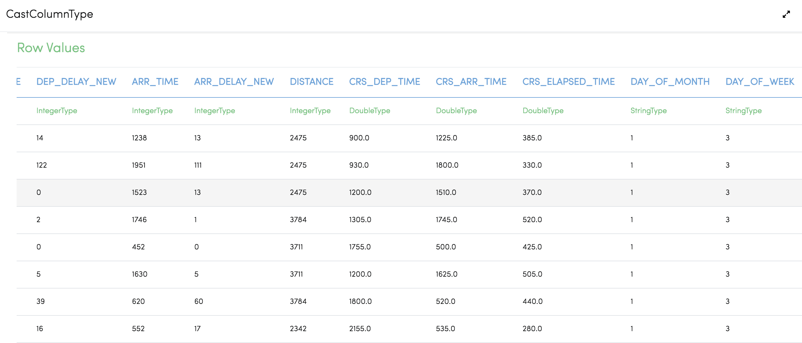
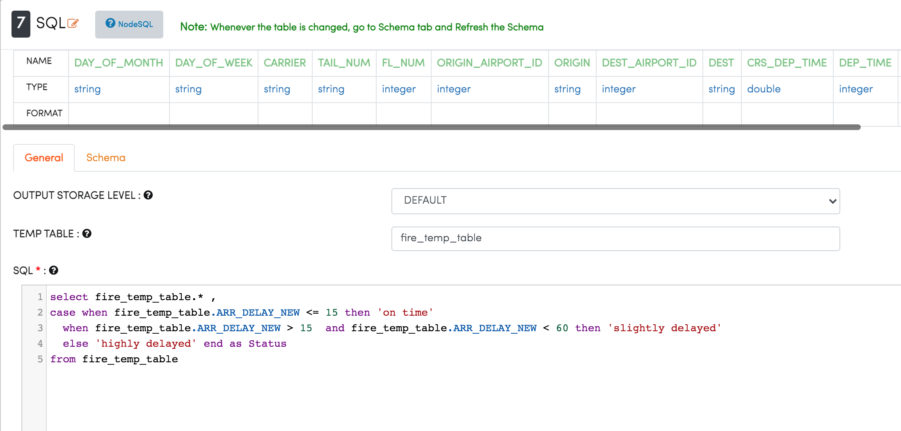
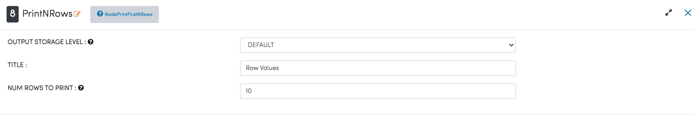
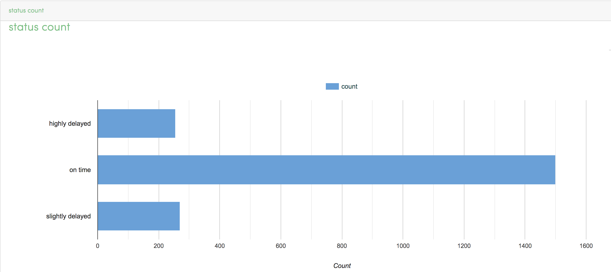

Analyze Flights Delays
=====================

This workflow reads in a flights dataset. It then analyzes the flights delay and prints the result.

Workflow
-------

The below workflow:

* Reads in the input data.
* Prints the sample datasets result.
* Casts required columns to double.
* Casts required columns to string.
* SQL query to get the status.
* Visualize the status count.

   
Reading from Dataset
---------------------

It reads the Dataset Files.

Processor Configuration
^^^^^^^^^^^^^^^^^^

   
Processor Output
^^^^^^

   

Cast Column to Double
---------------------------------

It casts for the new datatype double using the CastColumn Type Node.

Processor Configuration
^^^^^^^^^^^^^^^^^^

   
Processor Output
^^^^^^

Cast Column to String
---------------------------------

It casts for the new Datatype string using the CastColumn Type Node.

Processor Configuration
^^^^^^^^^^^^^^^^^^

   
Processor Output
^^^^^^

 
   
Execute the SQL Queries   
-------------------------

It executes the SQL Queries with the given conditions.

Processor Configuration
^^^^^^^^^^^^^^^^^^

   

Visualize the status count
------------------

Processor Configuration
^^^^^^^^^^^^^^^^^^

   
Processor Output
^^^^^^

