Analyze Flights Delays
=====================

This workflow reads in a dataset. It then analyze flights delay with sample datasets and prints the results.

Worklow
-------

Below is the workflow. It does the following:

* Reads data from a sample dataset.
* Print the sample datasets results.
* column to be cast for new datatype double.
* column to be cast for new datatype string.
* update the column name of datatype string.
* print the result of data updating after stringindexer Node.
* execute the SQL queries with the given conditions.
* prints the results.

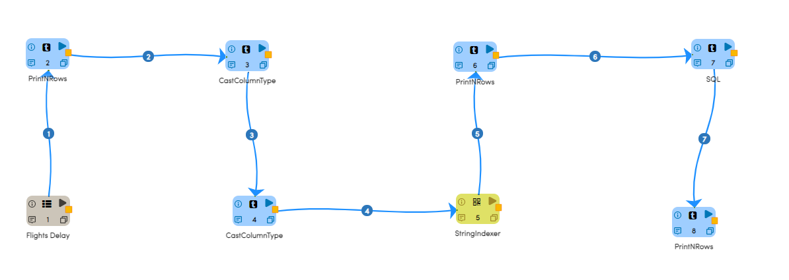
   
Reading from Dataset
---------------------

It reads Dataset file.

Processor Configuration
^^^^^^^^^^^^^^^^^^

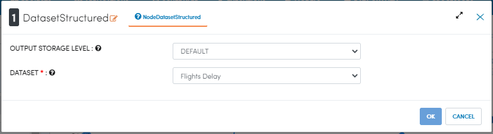
   
Processor Output
^^^^^^

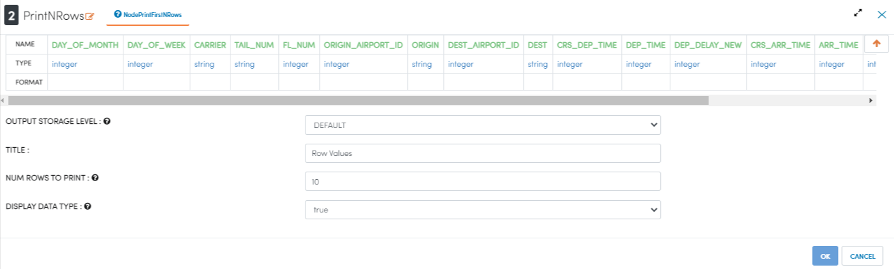
   
Print the sample datasets results
---------------------------------

It Print the sample datasets results.

Processor Configuration
^^^^^^^^^^^^^^^^^^

   
Processor Output
^^^^^^

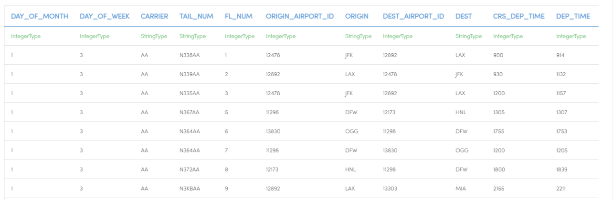

column to be cast for new datatype double
---------------------------------

It cast for new datatype double using castcolumn type Node.

Processor Configuration
^^^^^^^^^^^^^^^^^^

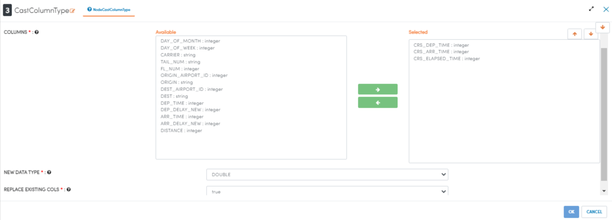
   
Processor Output
^^^^^^

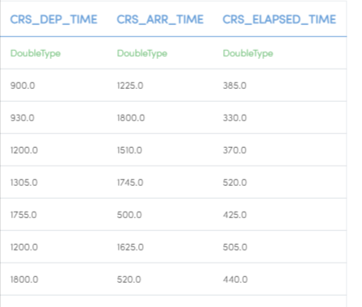

column to be cast for new datatype string
---------------------------------

It cast for new datatype string using castcolumn type Node.

Processor Configuration
^^^^^^^^^^^^^^^^^^

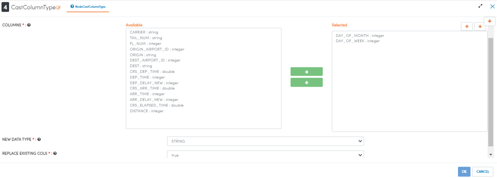
   
Processor Output
^^^^^^

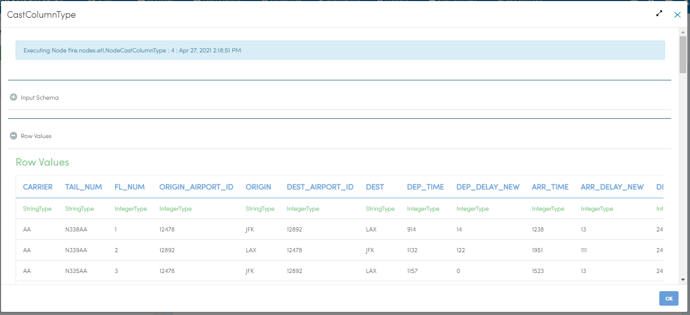

update the column name of datatype string
----------------------------------------

It update the column name of datatype string using stringindexer type Node.

Processor Configuration
^^^^^^^^^^^^^^^^^^

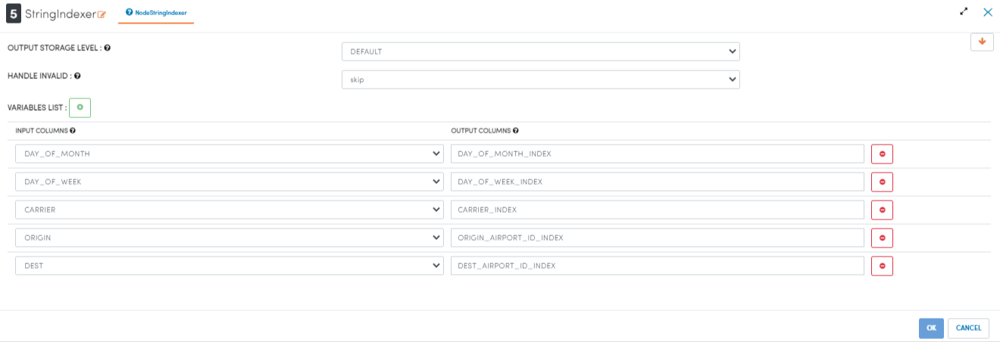
   
Processor Output
^^^^^^

.. figure:: ../../_assets/tutorials/analytics/analyze-flights-delays/6a.PNG
   :alt: Analyze Flights Delays
   :align: center
   :width: 60%
 
 Prints the Results
------------------

It print the result of data updating after stringindexer Node.

Processor Configuration
^^^^^^^^^^^^^^^^^^

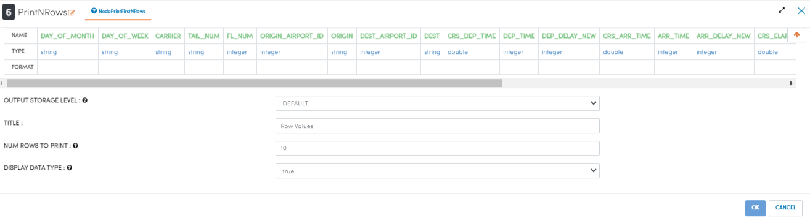
   
Processor Output
^^^^^^

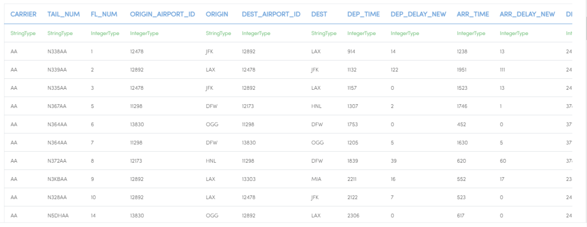
   
   

