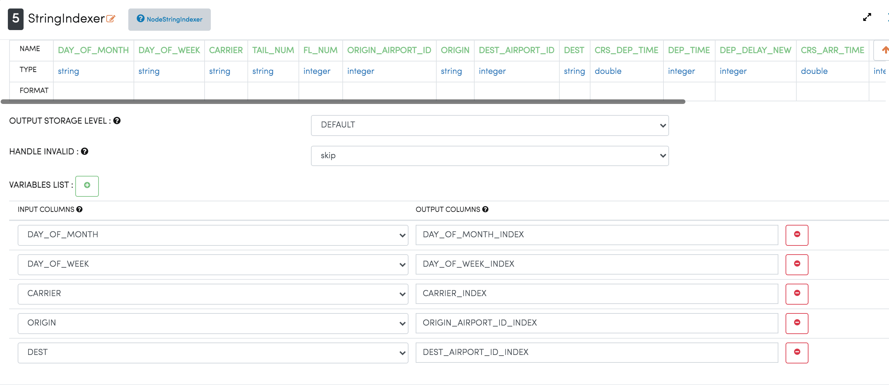
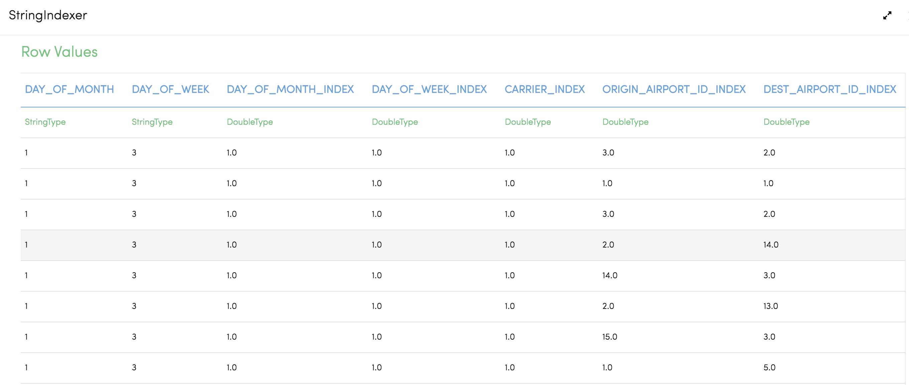
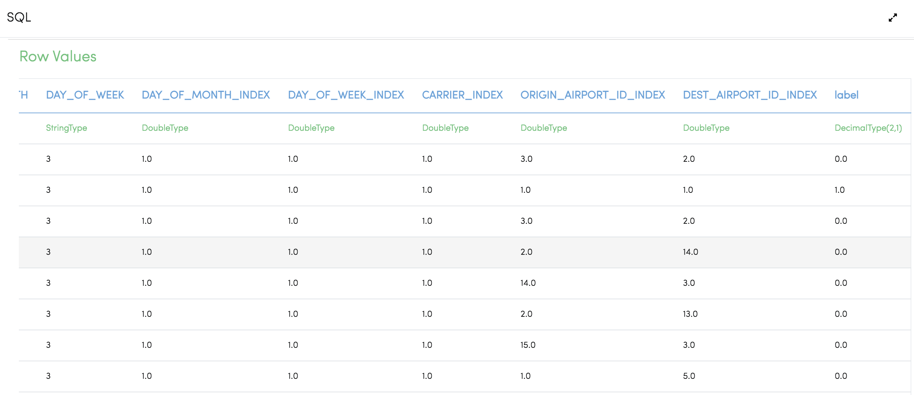

Analyze Flights Delays
=====================

This workflow reads in a flights dataset. It then analyzes flights delay and prints the results.

Workflow
-------

Below is the workflow. It does the following:

* Reads in the input data.
* Prints the sample datasets results.
* Casts required columns to double.
* Casts required columns to string.
* Create index columns
* Executes the SQL query to find the flights which are delayed.
* Prints the results.

.. figure:: ../../_assets/tutorials/analytics/analyze-flights-delays/1.png
   :alt: Analyze Flights Delays
   :width: 90%
   
Reading from Dataset
---------------------

It reads Dataset files.

Processor Configuration
^^^^^^^^^^^^^^^^^^

.. figure:: ../../_assets/tutorials/analytics/analyze-flights-delays/2.png
   :alt: Analyze Flights Delays
   :width: 80%
   
Processor Output
^^^^^^

.. figure:: ../../_assets/tutorials/analytics/analyze-flights-delays/2a.png
   :alt: Analyze Flights Delays
   :width: 80%
   

Cast column to double
---------------------------------

It casts for new datatype double using castcolumn type Node.

Processor Configuration
^^^^^^^^^^^^^^^^^^

.. figure:: ../../_assets/tutorials/analytics/analyze-flights-delays/4.png
   :alt: Analyze Flights Delays
   :width: 80%
   
Processor Output
^^^^^^

.. figure:: ../../_assets/tutorials/analytics/analyze-flights-delays/4a.png
   :alt: Analyze Flights Delays
   :width: 80%

Cast Column to String
---------------------------------

It casts for new datatype string using castcolumn type Node.

Processor Configuration
^^^^^^^^^^^^^^^^^^

.. figure:: ../../_assets/tutorials/analytics/analyze-flights-delays/5.png
   :alt: Analyze Flights Delays
   :width: 80%
   
Processor Output
^^^^^^

.. figure:: ../../_assets/tutorials/analytics/analyze-flights-delays/5a.png
   :alt: Analyze Flights Delays
   :width: 80%

Create Index Columns from String Columns
----------------------------------------

Create new columns with index values from the string columns.

Processor Configuration
^^^^^^^^^^^^^^^^^^

   
Processor Output
^^^^^^

 
   
Execute the SQL Queries   
-------------------------

It executes the SQL queries with the given conditions.

Processor Configuration
^^^^^^^^^^^^^^^^^^

.. figure:: ../../_assets/tutorials/analytics/analyze-flights-delays/8.png
   :alt: Analyze Flights Delays
   :width: 80%
   
Processor Output
^^^^^^

Print the Result
------------------

It prints the final result.

Processor Configuration
^^^^^^^^^^^^^^^^^^

.. figure:: ../../_assets/tutorials/analytics/analyze-flights-delays/9.png
   :alt: Analyze Flights Delays
   :width: 80%
   
Processor Output
^^^^^^

.. figure:: ../../_assets/tutorials/analytics/analyze-flights-delays/9a.png
   :alt: Analyze Flights Delays
   :width: 80%

