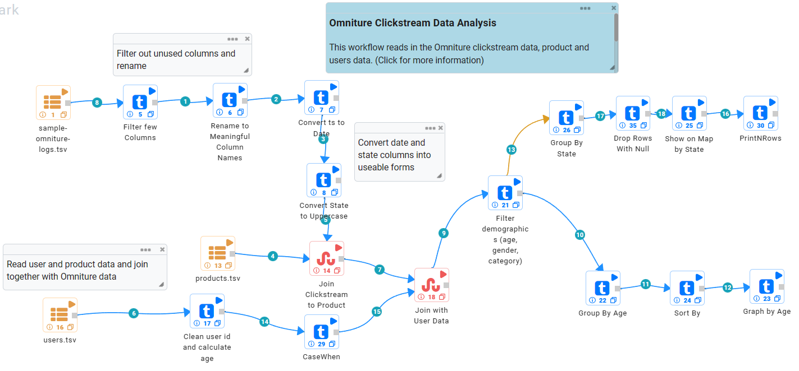
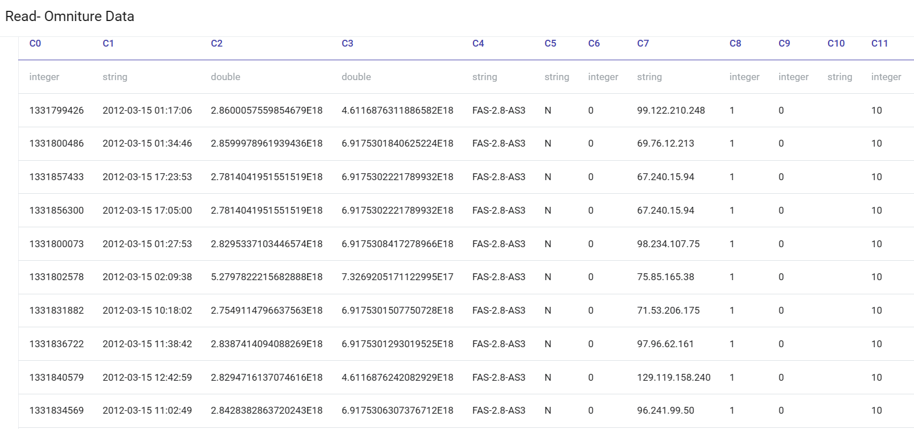
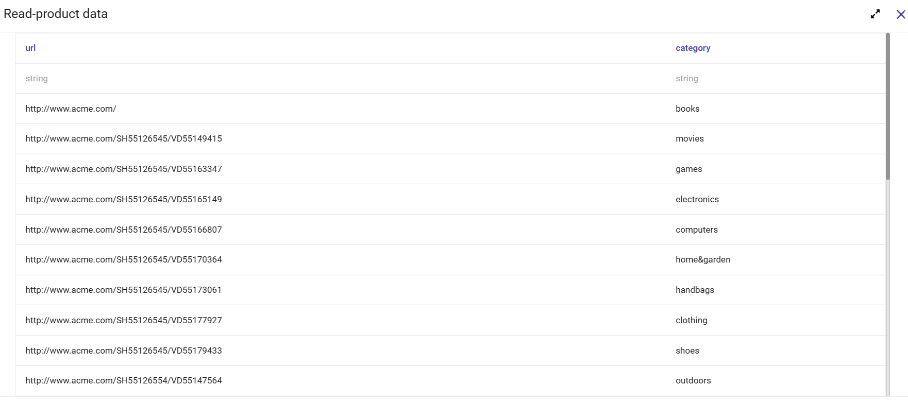
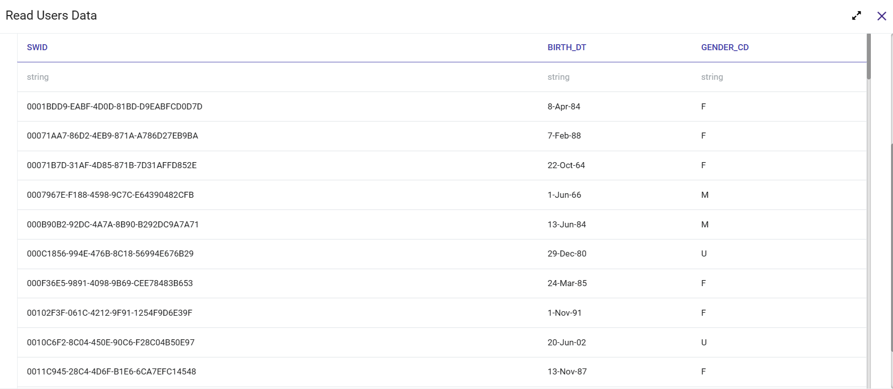
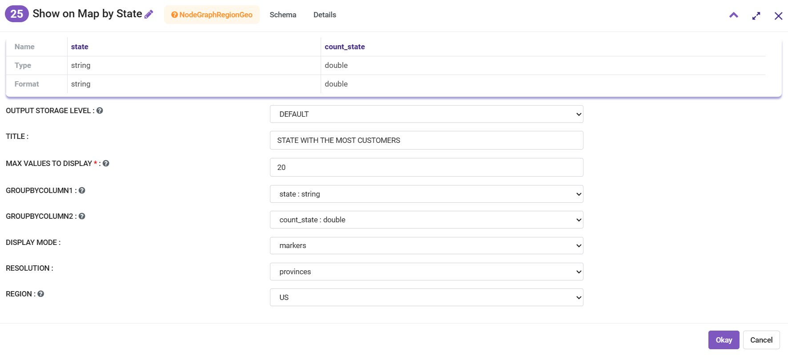
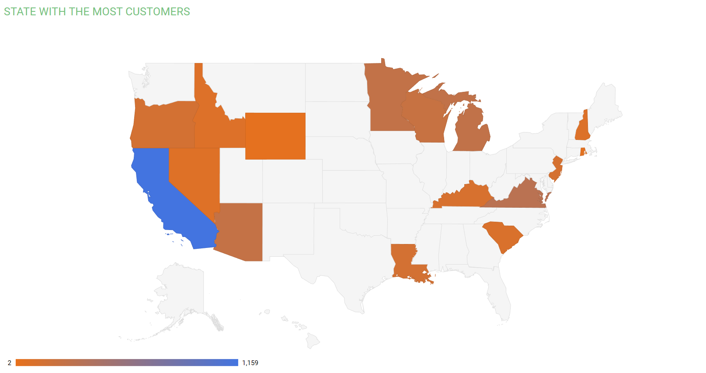
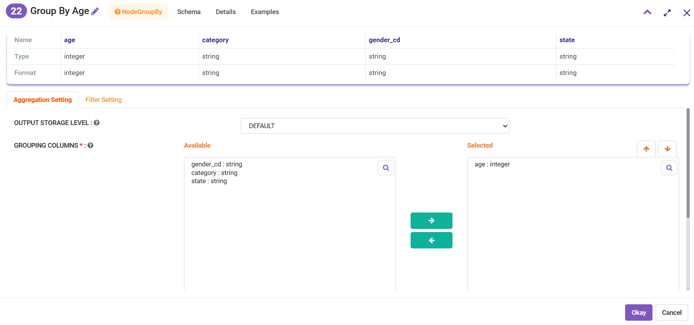
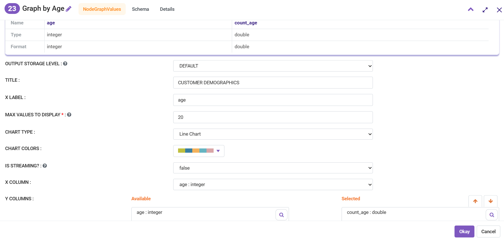
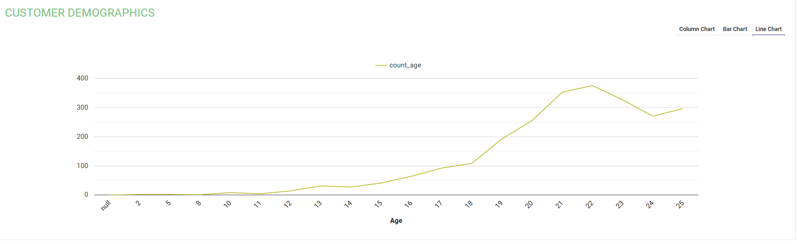

ClickStream Analysis
=====================

This workflow reads in the Omniture clickstream data, product and users data. It cleans and joins them to get the denormalized clean dataset. It then performs the following analysis:

- Finds number of users by state and displays them on a map.
- Finds number of users by age and displays them on a graph.
   
Workflow
-------

The below workflow:

   
Sample Data
---------------------

Omniture Clickstream Data
^^^^^^^^^^^^^^^^^^^^^^^^

   
Product Data
^^^^^^^^^^^^^^^^^^^^^^^^

   
Users Data
^^^^^^^^^^^^^^^^^^^^^^^^

 
 
Count number of users by ``state`` and displays it on map
---------------------------------------------------
Configuration 
^^^^^^^^^^^^^

  
   
Result
^^^^^^^

Count number of users by ``age`` and display it as a line chart
---------------------------------------------------

Caluclation 
^^^^^^^^^^^^^

   
   
Configuration
^^^^^^^^^^^^^

   
Result
^^^^^^^

   
