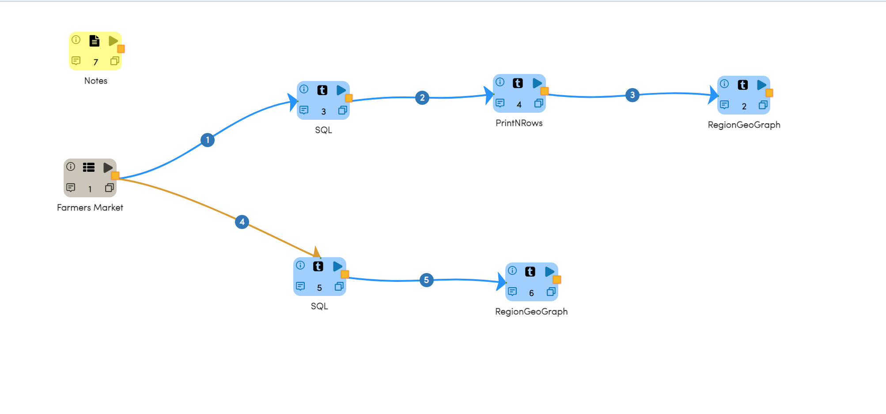
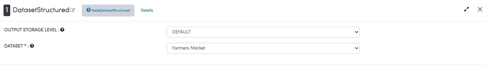
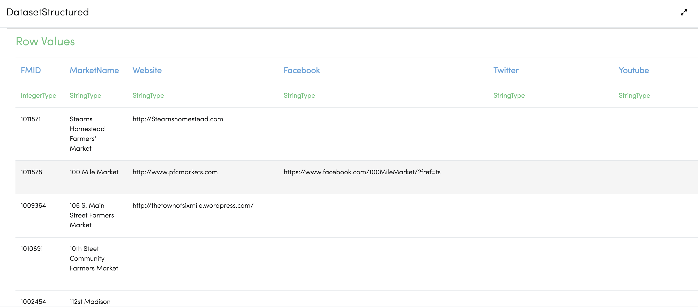
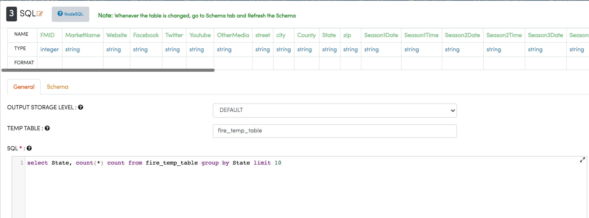
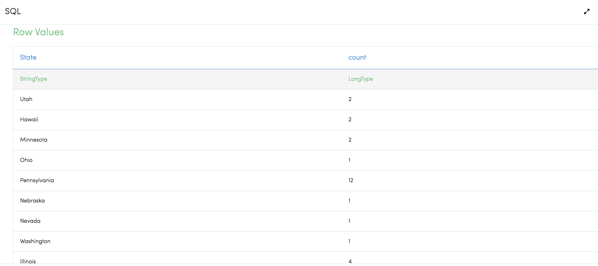
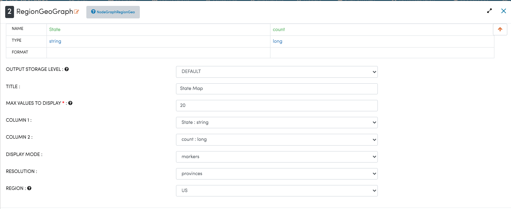
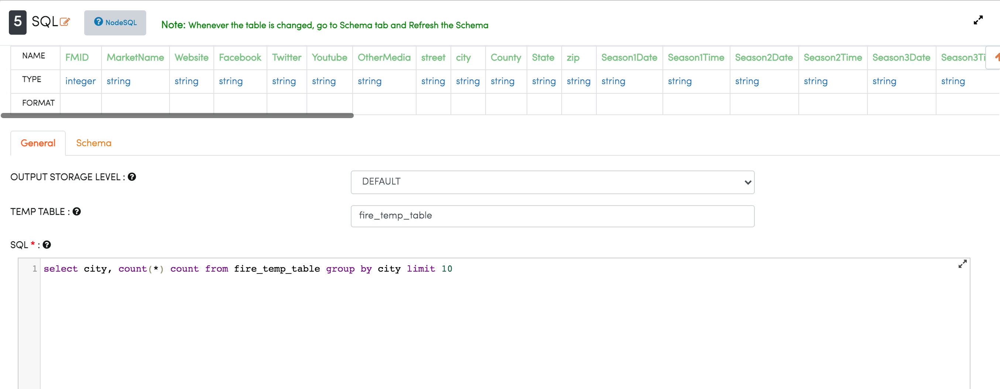
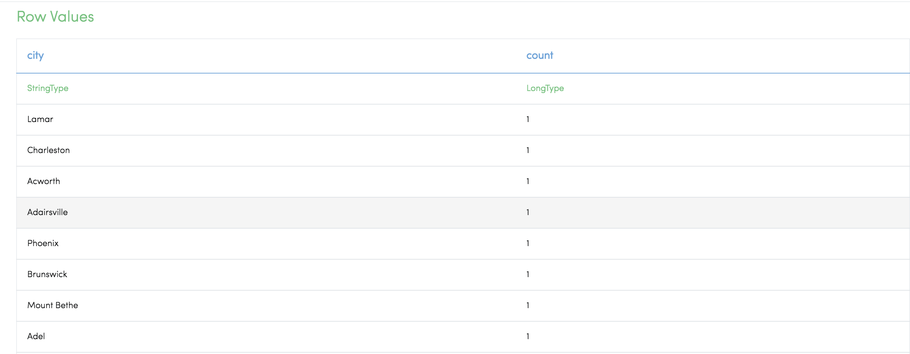
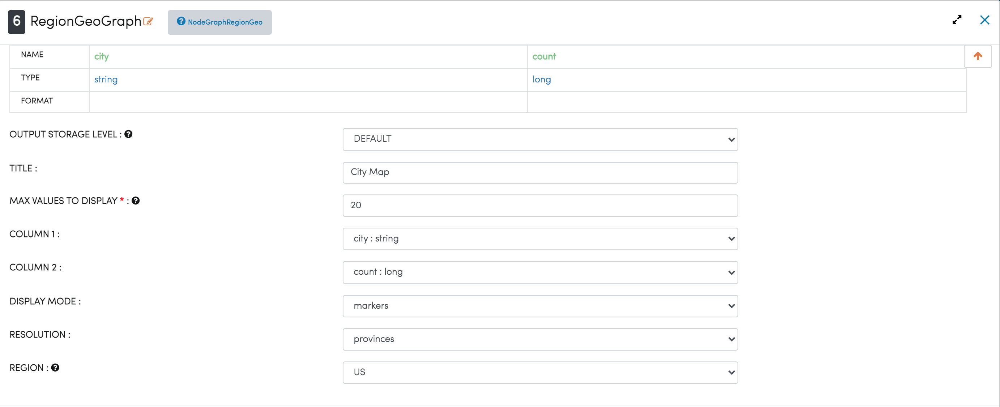
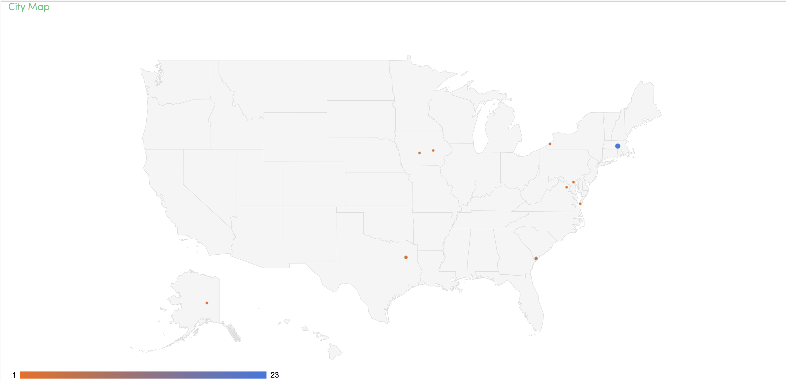

Farmer's Markets On Geo Maps
===========================

This workflow reads in a dataset and then plots the number of the Farmer's Market by City and by State on a graph.

Workflow
-------

The below workflow:

* Reads data from a sample dataset.
* Executes the SQL Query for the state count.
* Prints the result after executing query for the state count.
* Plots the graph for farmers with the state count.
* Executes the SQL Query for the city count.
* Plots the graph for the farmers with the city count.

Reading from Dataset
---------------------

It reads the sample Dataset files.

Processor Configuration
^^^^^^^^^^^^^^^^^^

   
Processor Output
^^^^^^

   
Execute SQL Query
-------------------

It executes the SQL Query for the state count from the SQL node.

Processor Configuration
^^^^^^^^^^^^^^^^^^

   
Processor Output
^^^^^^

   
   
Analyze using Graph
--------------------

It plots the graph for the farmers with the state count using the ``RegionGeoGraph`` Processor.

Processor Configuration
^^^^^^^^^^^^^^^^^^

   
Processor Output
^^^^^^

.. figure:: ../../_assets/tutorials/analytics/farmers-markets-on-geo-maps/5a.png
   :alt: Farmers Markets On Geo Maps
   :width: 70% 

Execute SQL Query
-------------------

It executes the SQL Query for the city count from the SQL node.

Processor Configuration
^^^^^^^^^^^^^^^^^^

   
Processor Output
^^^^^^

Analyze using Graph
--------------------

It plots the graph for the farmers with the city count using the ``RegionGeoGRaph`` Node.

Processor Configuration
^^^^^^^^^^^^^^^^^^

   
Processor Output
^^^^^^

