Farmers Markets On Geo Maps
===========================

This workflow reads in a dataset. It then plots number of Farmers Market by City and by State on a Graph.

Workflow
-------

Below is the workflow. It does the following:

* Reads data from a sample dataset.
* Executes SQL Query for state count.
* Prints the result after executing query for state counts.
* Plots Graph for farmers with state counts.
* Executes SQL Query for city counts.
* Plots Graph for farmers with city counts.

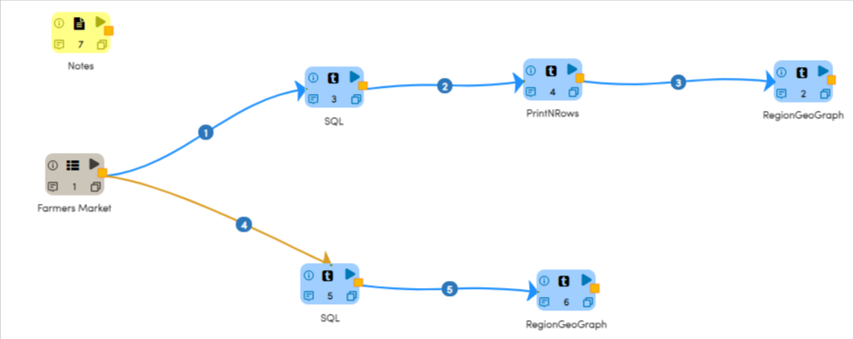

Reading from Dataset
---------------------

It reads sample Dataset files.

Processor Configuration
^^^^^^^^^^^^^^^^^^

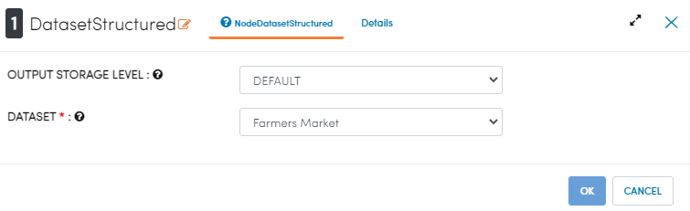
   
Processor Output
^^^^^^

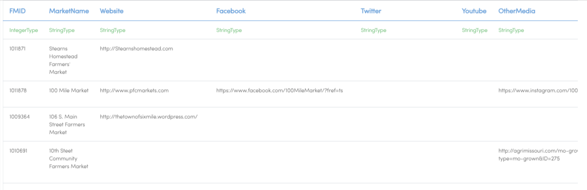
   
Execute SQL Query
-------------------

It Executes SQL Query for state count from the SQL node.

Processor Configuration
^^^^^^^^^^^^^^^^^^

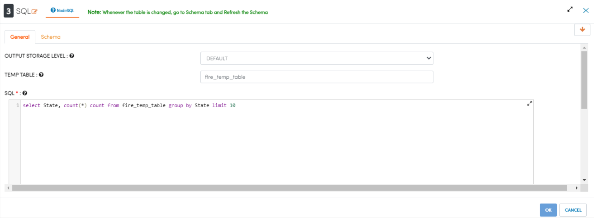
   
Processor Output
^^^^^^

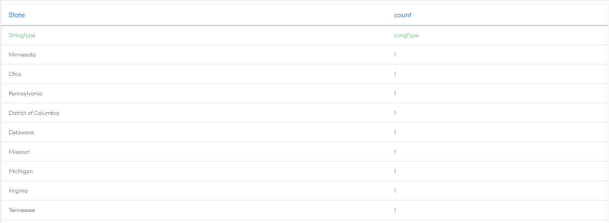
   
Prints the Results
------------------

It prints the results after executing query for state counts by SQL Node.

Processor Configuration
^^^^^^^^^^^^^^^^^^

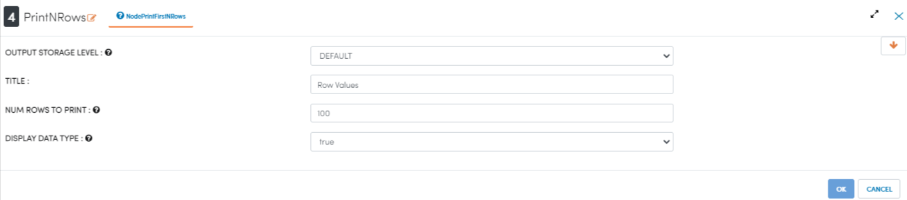
   
Processor Output
^^^^^^

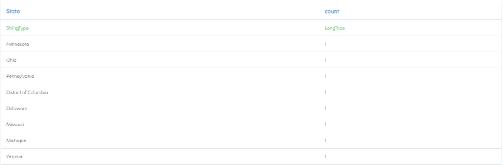
   
Analyze using Graph
--------------------

It plots Graph for farmers with state counts using RegionGeoGraph Processor.

Processor Configuration
^^^^^^^^^^^^^^^^^^

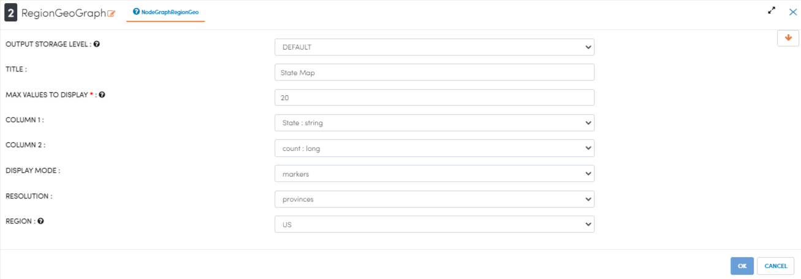
   
Processor Output
^^^^^^

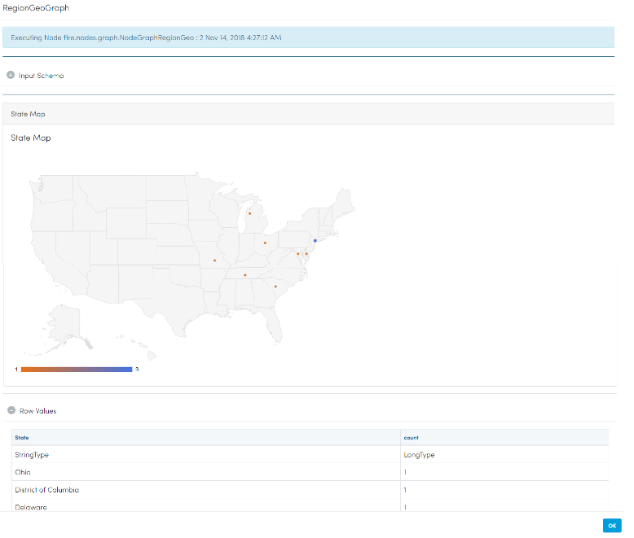

Execute SQL Query
-------------------

It executes SQL Query for City count from the SQL node.

Processor Configuration
^^^^^^^^^^^^^^^^^^

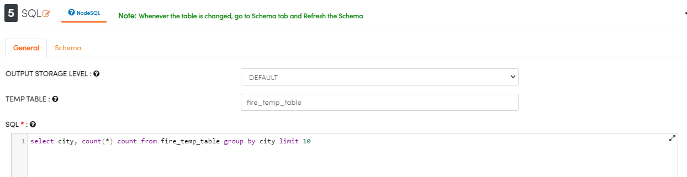
   
Processor Output
^^^^^^

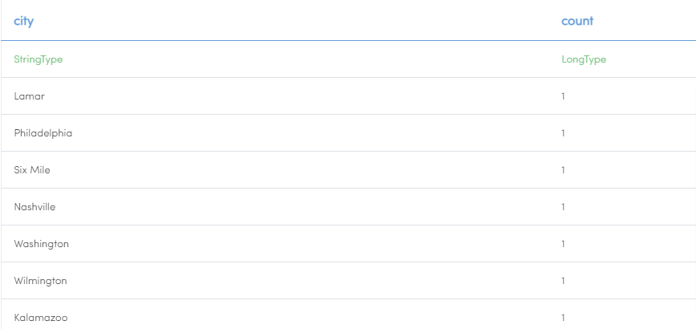

Analyze using Graph
--------------------

It plots Graph for farmers with City counts using RegionGeoGRaph Node.

Processor Configuration
^^^^^^^^^^^^^^^^^^

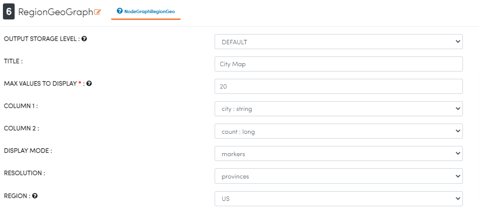
   
Processor Output
^^^^^^

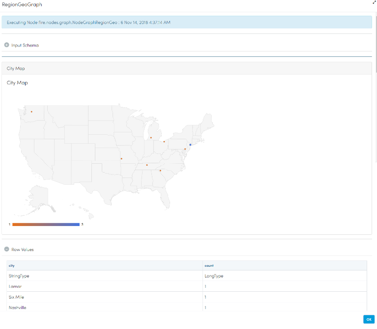

