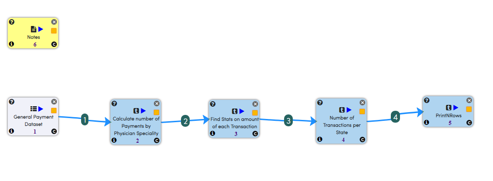
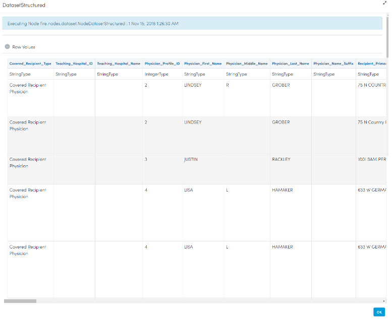
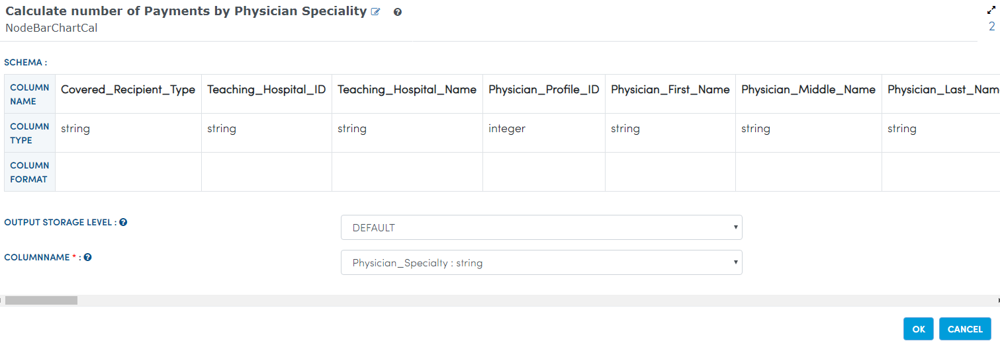
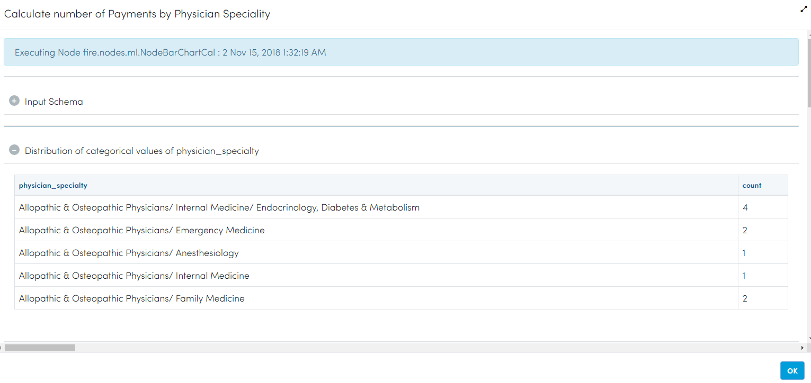

General Payment Data Analysis
=============================

This workflow reads in a dataset. It then perform detailed analytics on general payment dataset.

Worklow
-------

Below is the workflow. It does the following:

* Reads data from a sample dataset.
* Calculate count transactions by speciality.
* Summary of transactions. 
* Number of transaction per state.
* prints the results.

Reading from Dataset
---------------------

It reads from sample Dataset file.

Processor Configuration
^^^^^^^^^^^^^^^^^^

.. figure:: ../../_assets/tutorials/analytics/general-payment-data-analysis/2.PNG
   :alt: General Payment Data Analysis
   :align: center
   :width: 60%
   
Processor Output
^^^^^^

 
Calculate count transactions by speciality
------------------------------------------

It will Calculate count transactions by speciality using BarChartCal Node.

Processor Configuration
^^^^^^^^^^^^^^^^^^

   
Processor Output
^^^^^^

   

