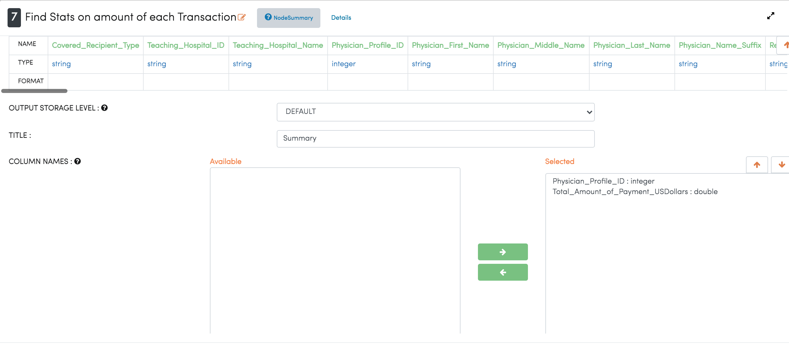
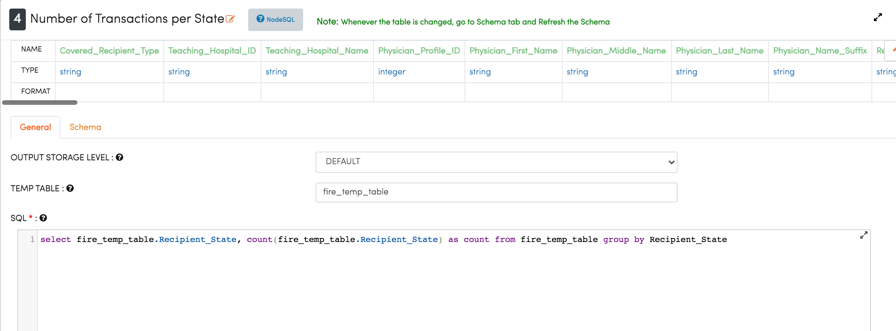
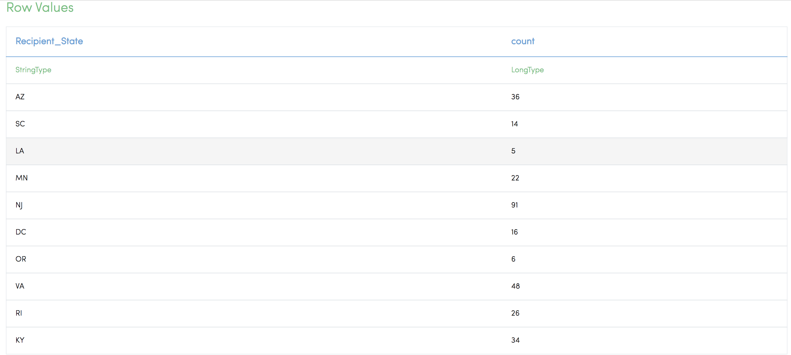
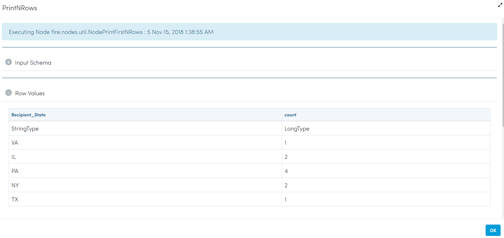

General Payment Data Analysis
=============================

This workflow reads in a dataset and then performs the detailed analytics on the general payment dataset.

Workflow
-------

The below workflow:

* Reads data from a sample dataset.
* Calculates count transactions by speciality.
* Summary of transactions. 
* Number of transactions per state.
* Prints the results.

.. figure:: ../../_assets/tutorials/analytics/general-payment-data-analysis/1.png
   :alt: General Payment Data Analysis
   :width: 90%

Reading from Dataset
---------------------

It reads from sample Dataset file.

Processor Configuration
^^^^^^^^^^^^^^^^^^

.. figure:: ../../_assets/tutorials/analytics/general-payment-data-analysis/2.png
   :alt: General Payment Data Analysis
   :width: 90%
   
Processor Output
^^^^^^

.. figure:: ../../_assets/tutorials/analytics/general-payment-data-analysis/2a.png
   :alt: General Payment Data Analysis
   :width: 90%
 
 
Summary of Transactions
-----------------------

It finds stats on the amount of each transaction using the Summary Node.

Processor Configuration
^^^^^^^^^^^^^^^^^^

   
Processor Output
^^^^^^

.. figure:: ../../_assets/tutorials/analytics/general-payment-data-analysis/4a.png
   :alt: General Payment Data Analysis
   :width: 90%
   
Number of Transaction per State
-------------------------------

It finds the number of transactions per State by using the SQL Node.

Processor Configuration
^^^^^^^^^^^^^^^^^^

   
Processor Output
^^^^^^

   
Prints the Result
------------------
 It will print the result of output getting from SQL Node.
 
Processor Configuration
^^^^^^^^^^^^^^^^^^

.. figure:: ../../_assets/tutorials/analytics/general-payment-data-analysis/6.PNG
   :alt: General Payment Data Analysis
   :width: 90%
   
Processor Output
^^^^^^

