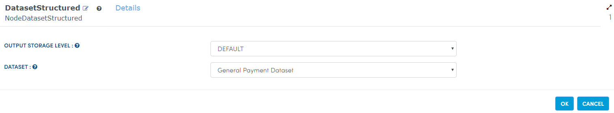
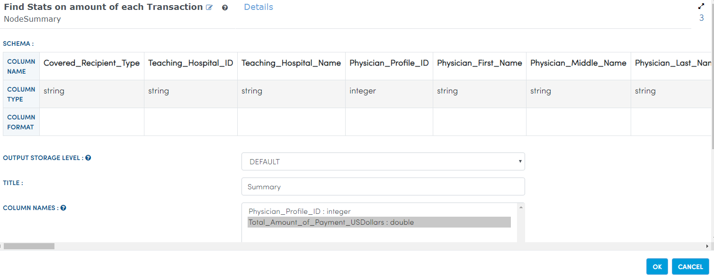
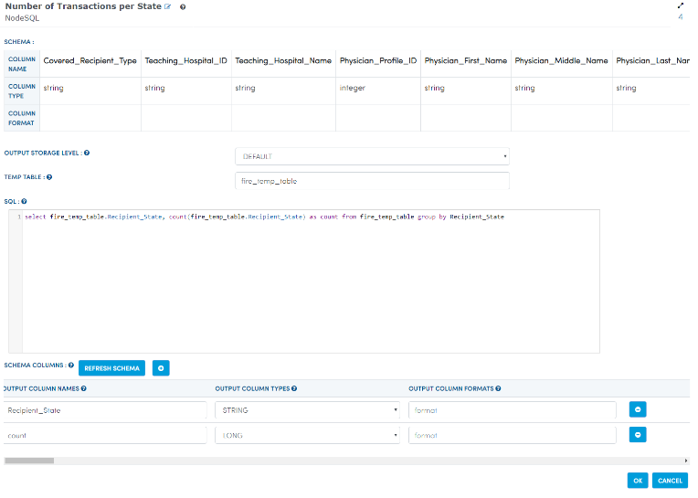
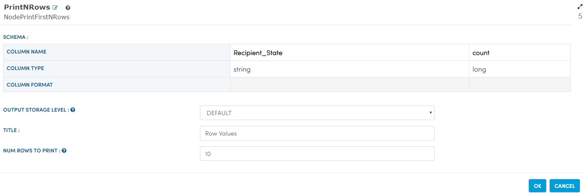

General Payment Data Annalysis
==============================

This workflow reads in a dataset. It then perform detailed analytics on general payment dataset.

Worklow
-------

Below is the workflow. It does the following:

* Reads data from a sample dataset.
* Calculate count transactions by speciality.
* Summary of transactions. 
* Number of transaction per state.
* prints the results.

.. figure:: ../../_assets/tutorials/analytics/general-payment-data-annalysis/1.PNG
   :alt: General Payment Data Annalysis
   :align: center
   :width: 60%
   
Reading from Dataset
---------------------

It reads from sample Dataset file.

Processor Configuration
^^^^^^^^^^^^^^^^^^

   
Processor Output
^^^^^^

.. figure:: ../../_assets/tutorials/analytics/general-payment-data-annalysis/2a.PNG
   :alt: General Payment Data Annalysis
   :align: center
   :width: 60%
   
Calculate count transactions by speciality
------------------------------------------

It will Calculate count transactions by speciality using BarChartCal Node.

Processor Configuration
^^^^^^^^^^^^^^^^^^

.. figure:: ../../_assets/tutorials/analytics/general-payment-data-annalysis/3.PNG
   :alt: General Payment Data Annalysis
   :align: center
   :width: 60%
   
Processor Output
^^^^^^

.. figure:: ../../_assets/tutorials/analytics/general-payment-data-annalysis/3a.PNG
   :alt: General Payment Data Annalysis
   :align: center
   :width: 60%
   
Summary of transactions
-----------------------

It Find stats on amount of each transactions using Summary Node.

Processor Configuration
^^^^^^^^^^^^^^^^^^

   
Processor Output
^^^^^^

.. figure:: ../../_assets/tutorials/analytics/general-payment-data-annalysis/4a.PNG
   :alt: General Payment Data Annalysis
   :align: center
   :width: 60%
   
Number of transaction per state
-------------------------------

It find Number of transaction per state using SQL Node.

Processor Configuration
^^^^^^^^^^^^^^^^^^

   
Processor Output
^^^^^^

.. figure:: ../../_assets/tutorials/analytics/general-payment-data-annalysis/5a.PNG
   :alt: General Payment Data Annalysis
   :align: center
   :width: 60%
   
 prints the results
 ------------------
 It will print the result of output getting from SQL Node.
 
 Processor Configuration
^^^^^^^^^^^^^^^^^^

   
Processor Output
^^^^^^

.. figure:: ../../_assets/tutorials/analytics/general-payment-data-annalysis/6a.PNG
   :alt: General Payment Data Annalysis
   :align: center
   :width: 60%
