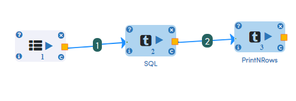
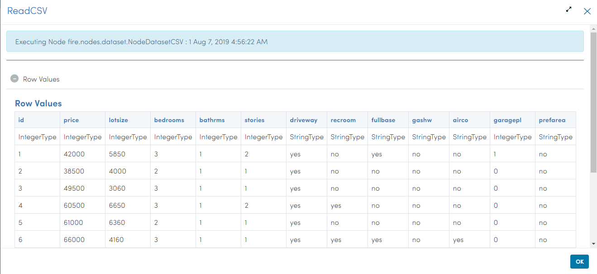
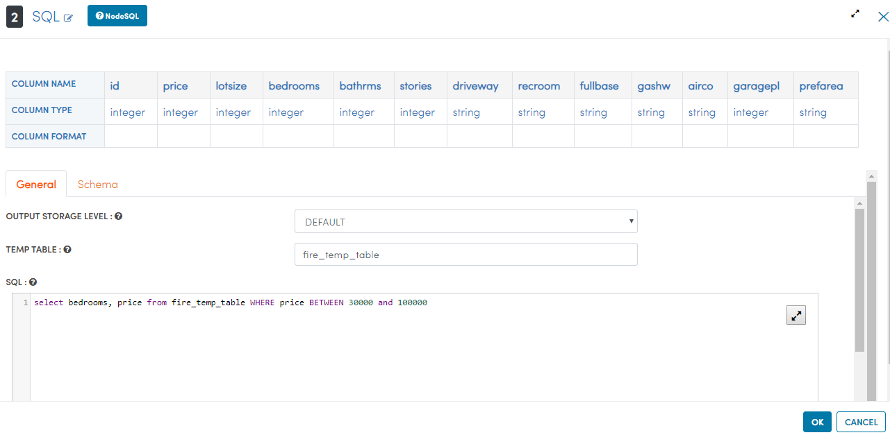
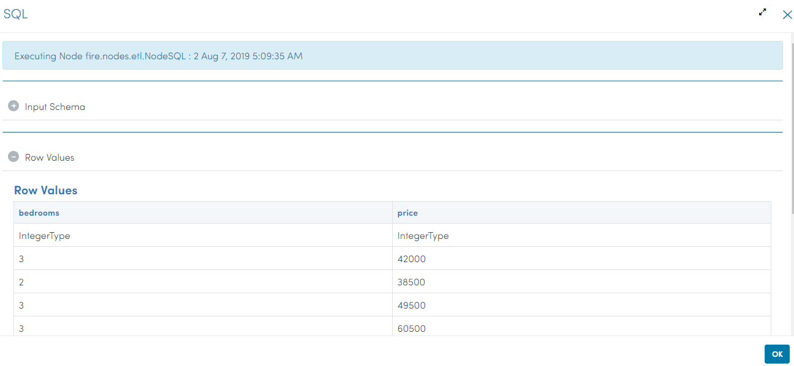
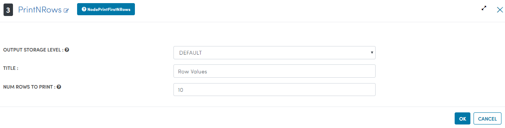

Housing-Analysis
=================

This workflow reads in multiple files available in specific directory, It then filter it to aggregate number of bedrooms with specific prices and then prints the results.

Workflow
-------

Below is the workflow. It does the following:

* Reads multiple csv files available in specific directory.
* Filter it to aggregate number of bedrooms with specific prices.
* Prints the results.

   
Reading from Dataset
---------------------

It reads multiple csv files available in specific directory.

Processor Configuration
^^^^^^^^^^^^^^^^^^

.. figure:: ../../_assets/tutorials/analytics/housing-analysis/8.PNG
   :alt: Housing Analysis
   :align: center
   :width: 60%

Processor Output
^^^^^^

Filter its data
^^^^^^^^^^^^^^^^
It then filter to aggregate number of bedrooms with specific prices using SQL processor.

Processor Configuration
^^^^^^^^^^^^^^^^^^

   
Processor Output
^^^^^^

   
Prints the results
------------------

It will print the result with the output required after filter aggregations.

Processor Configuration
^^^^^^^^^^^^^^^^^^

   
Processor Output
^^^^^^

