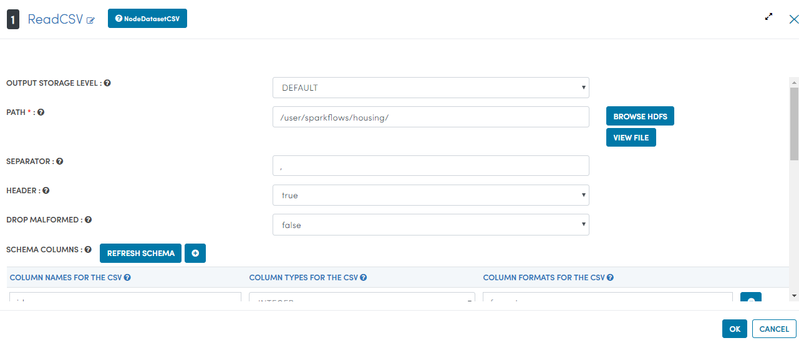

Housing-Analysis
=================

This workflow reads in a multiple file available in a directory, It then filter it to aggregate number of bedrooms with specific price ranges and then prints the results.

Workflow
-------

Below is the workflow. It does the following:

* Reads multiple csv file in a directory.
* Filter it to aggregate number of bedrooms with specific price ranges.
* Prints the results.

.. figure:: ../../_assets/tutorials/analytics/housing-analysis/1.PNG
   :alt: Housing Analysis
   :align: center
   :width: 60%
   
Reading from Dataset
---------------------

It reads multiple csv files available in a directory.

Processor Configuration
^^^^^^^^^^^^^^^^^^

Processor Output
^^^^^^

.. figure:: ../../_assets/tutorials/analytics/housing-analysis/3.PNG
   :alt: Housing Analysis
   :align: center
   :width: 60%

Filter its data
^^^^^^^^^^^^^^^^
It then filter it to aggregate number of bedrooms with specific price ranges

