Jetrail Data Analysis
======================

This workflow reads in a dataset. It then calculates the monthly trend in the JetRail Dataset and performs further analysis using the charts.

Workflow
-------

The below workflow:

* Reads the data from a sample dataset.
* Extracts the Datetime Field.
* Calculates the count per month.
* Executes the query for months.
* Prints the result.
* Makes Graphical analysis.

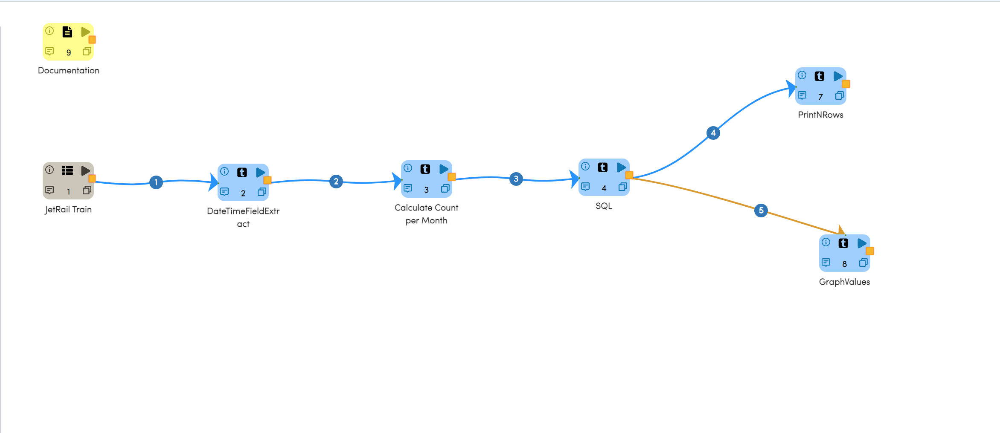

Reading from Dataset
---------------------

It reads from the sample Dataset file.

Processor Configuration
^^^^^^^^^^^^^^^^^^

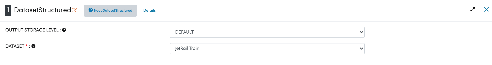
   
Processor Output
^^^^^^

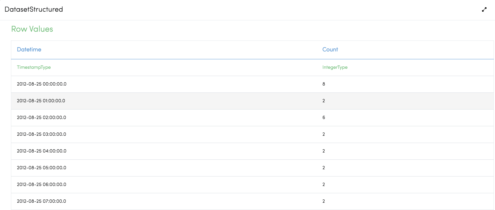

Extract Datetime Field
-----------------------
It extracts the year and the month field from the Datetime Field of timestamp using Datetime Field Extract Node.

Processor Configuration
^^^^^^^^^^^^^^^^^^

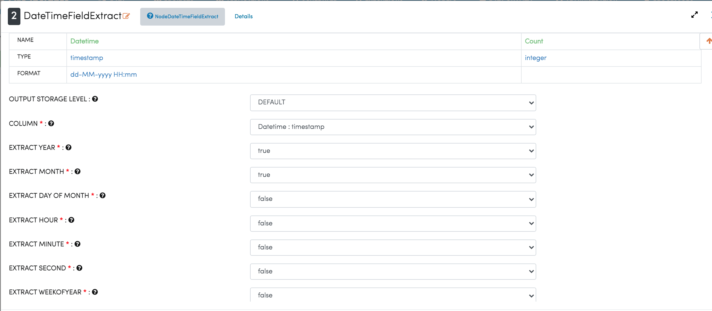
   
Processor Output
^^^^^^

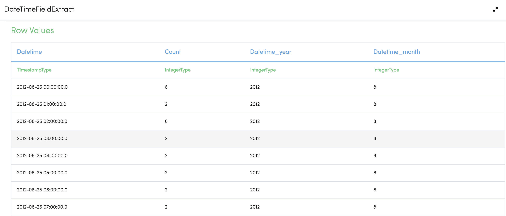
   
Calculate Count per Month
--------------------------
It calculates the count per month using the query by SQL Node.

Processor Configuration
^^^^^^^^^^^^^^^^^^

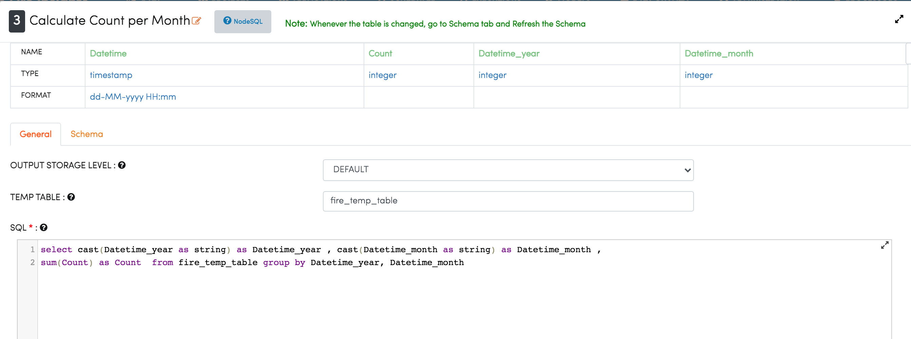
   
Processor Output
^^^^^^

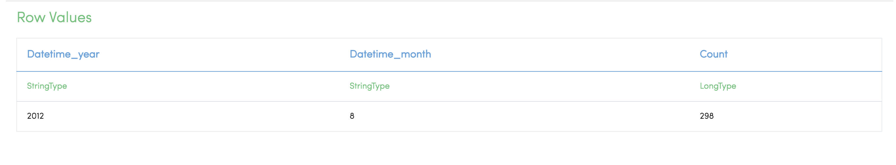
   
Calculate Sum of Counts per Month
------------------------

It executes query for grouping and selecting the required fields, and calculates the sum of counts by SQL Node.

Processor Configuration
^^^^^^^^^^^^^^^^^^

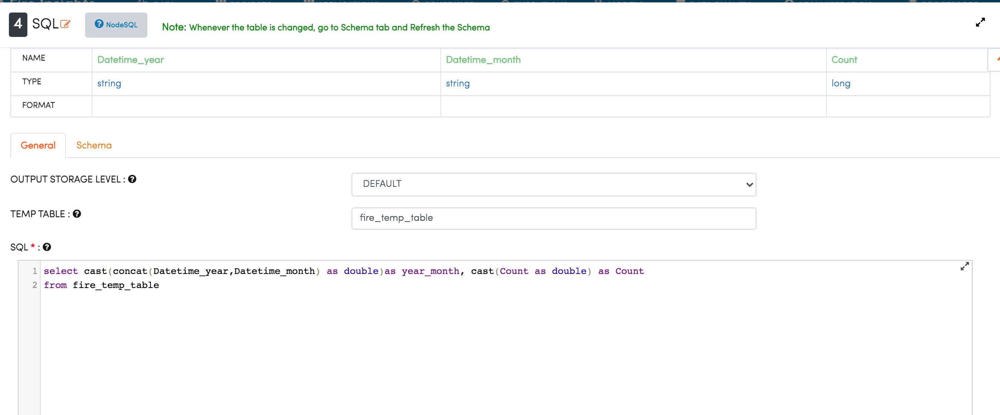
   
Processor Output
^^^^^^

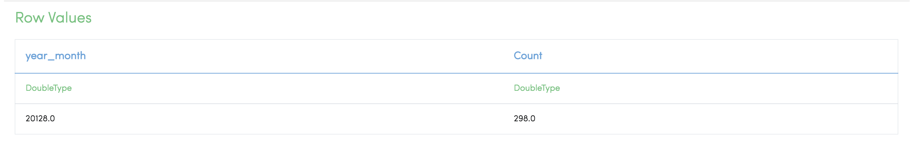
   
Prints the Result
------------------

Prints the result of the previous SQL node.

Processor Configuration
^^^^^^^^^^^^^^^^^^
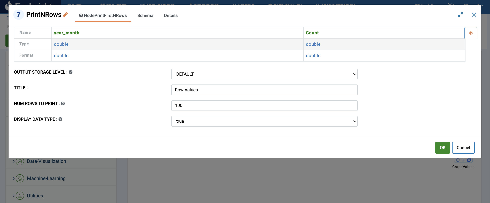

Processor Output
^^^^^^

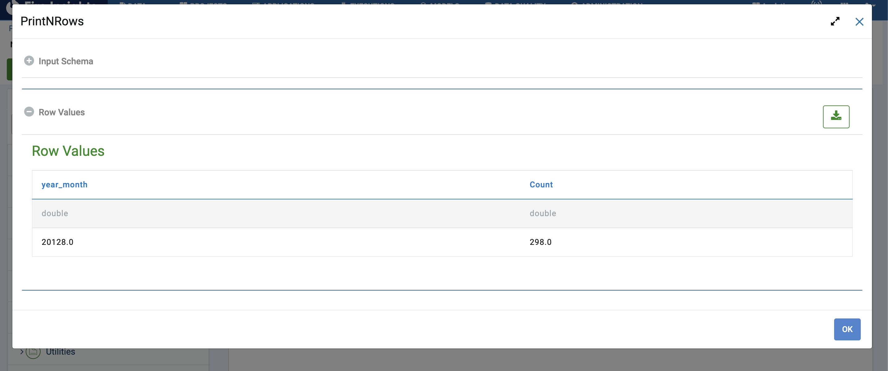
   
Graphical Analysis
---------------------

It will graphically represent the month with the count using the GraphValue Node.

Processor Configuration
^^^^^^^^^^^^^^^^^^

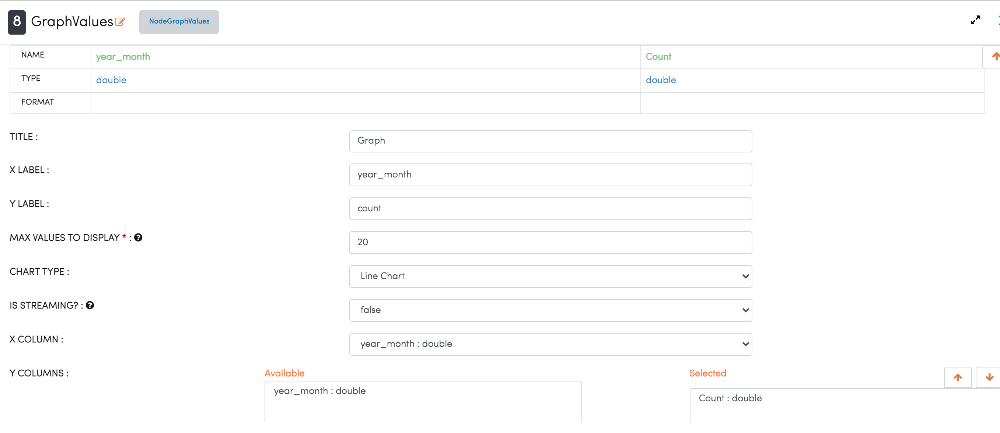
   
Processor Output
^^^^^^

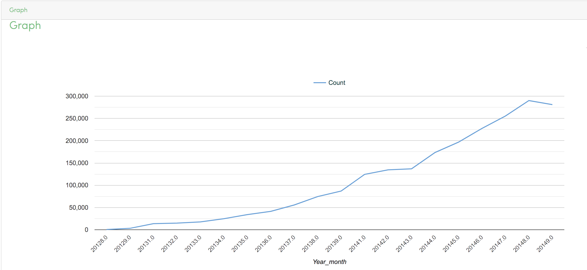
