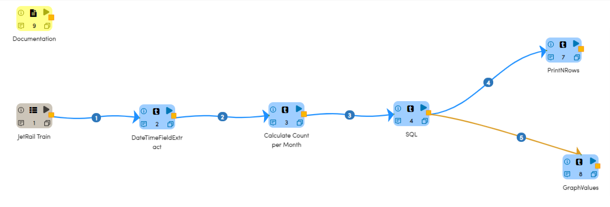

Jetrail Data Annalysis
======================

This workflow reads in a dataset. It then Calculates the monthly trend in JetRail Dataset and annalysing using graph.

Worklow
-------

Below is the workflow. It does the following:

* Reads data from a sample dataset.
* Extract date time field.
* Calculate count per months.
* Execute query for months.
* prints the results.
* Graphically annalysis.

