Jetrail Data Annalysis
======================

This workflow reads in a dataset. It then Calculates the monthly trend in JetRail Dataset and annalysing using graph.

Worklow
-------

Below is the workflow. It does the following:

* Reads data from a sample dataset.
* Extract date time field.
* Calculate count per months.
* Execute query for months.
* prints the results.
* Graphical annalysis.

.. figure:: ../../_assets/tutorials/analytics/jetrail-data-annalysis/1.PNG
   :alt: Jetrail Data Annalysis
   :align: center
   :width: 60%

Reading from Dataset
---------------------

It reads from sample Dataset file.

Processor Configuration
^^^^^^^^^^^^^^^^^^

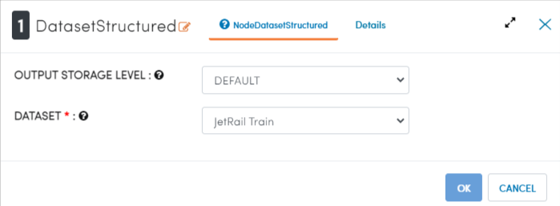
   
Processor Output
^^^^^^

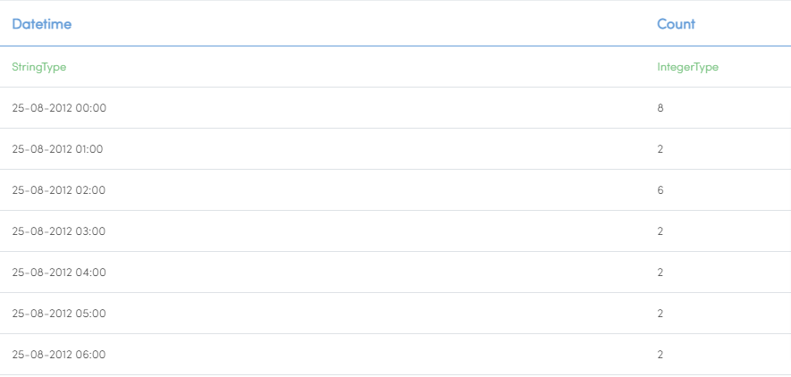

Extract date time field
-----------------------
It extract year and month field from date time field of timestamp using date time field extract Node.

Processor Configuration
^^^^^^^^^^^^^^^^^^

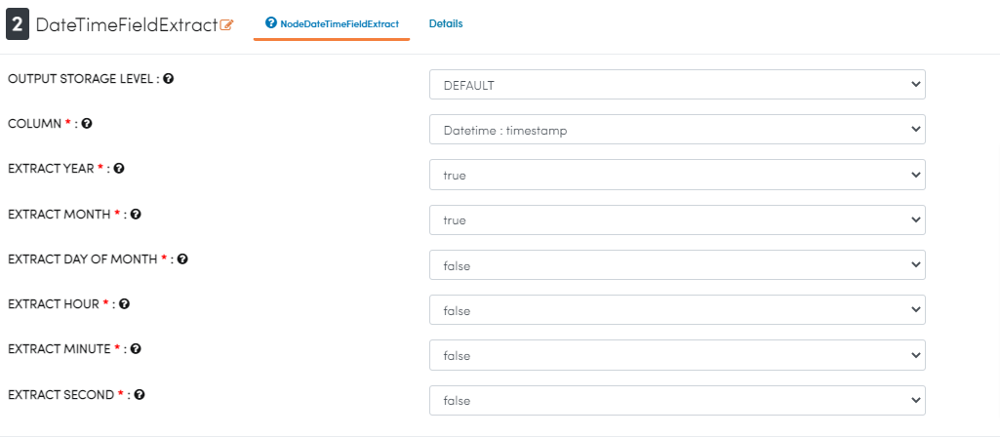
   
Processor Output
^^^^^^

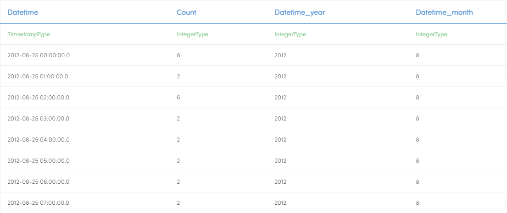
   
Calculate count per months
--------------------------
It calculate count per months using query by SQL Node.

Processor Configuration
^^^^^^^^^^^^^^^^^^

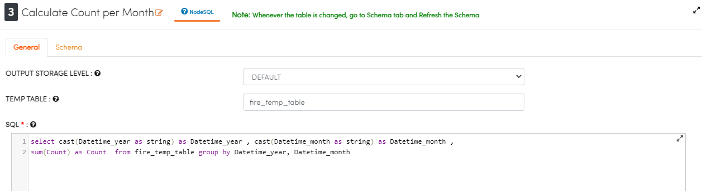
   
Processor Output
^^^^^^

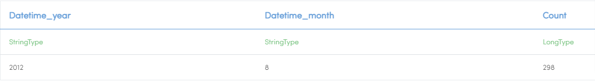
   
Execute query for months
------------------------

It execute query for grouping and selecting required fields calculate sum of counts by SQL Node.

Processor Configuration
^^^^^^^^^^^^^^^^^^

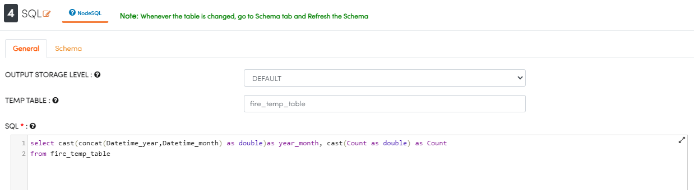
   
Processor Output
^^^^^^

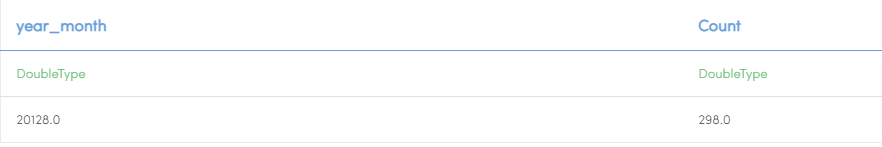
   
Prints the Results
------------------

It prints the results after executing  sql query for months.

Processor Configuration
^^^^^^^^^^^^^^^^^^

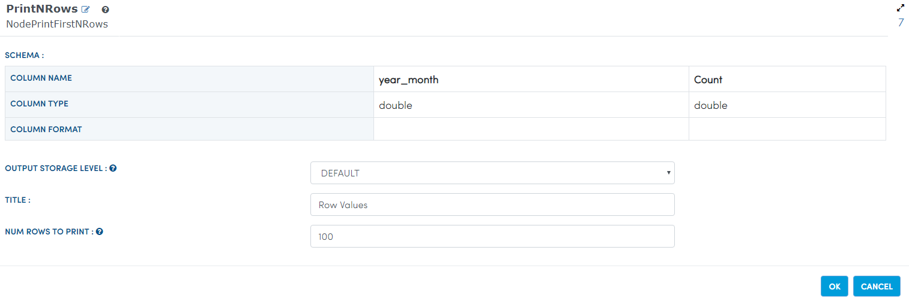
   
Processor Output
^^^^^^

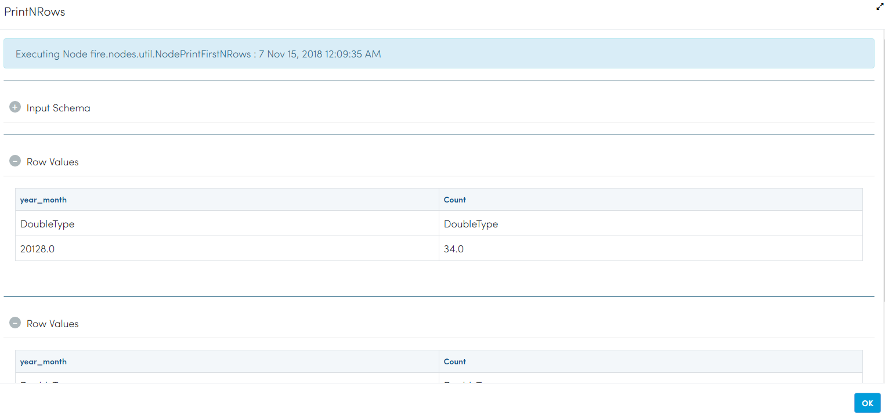
   
Graphical annalysis
---------------------

It will graphically represented month with count using GraphValue Node.

Processor Configuration
^^^^^^^^^^^^^^^^^^

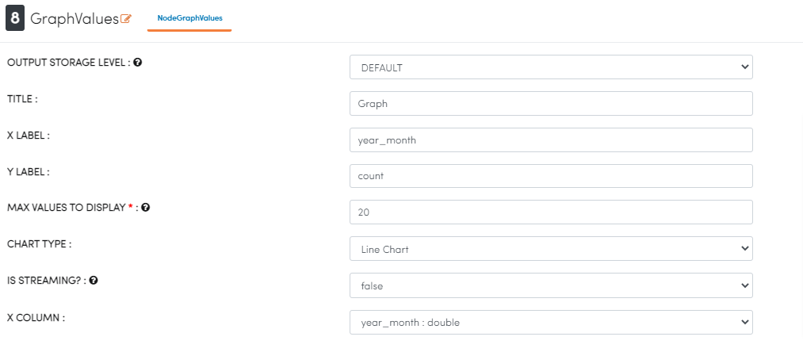
   
Processor Output
^^^^^^

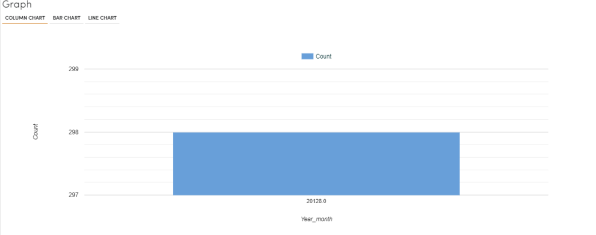
