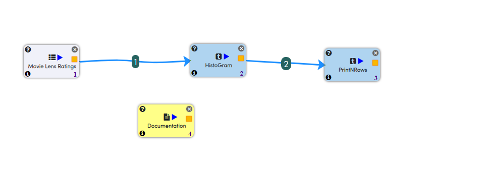

Movie Lens Ratings Distributions
================================

This workflow reads in a dataset. It then Plots Histogram of the distribution of Movie Lens Ratings.

Worklow
-------

Below is the workflow. It does the following:

* Reads data from a dataset.
* Plots Histogram of the distribution of Movie Lens Ratings.
* prints the results.

