NYC Taxidata Analysis
======================

This workflow reads in a sample dataset. It then analyses the average speed of the taxis per hour with the sample data and prints the results.

Workflow
-------

The below workflow:

* Reads data from a dataset.
* Extracts the hour from the pickup time.
* Calculates the speed per hour.
* Calculates the average speed per hour.
* Prints the result.
* Sorts the data by column.
* Displays the average speed per hour on the chart.

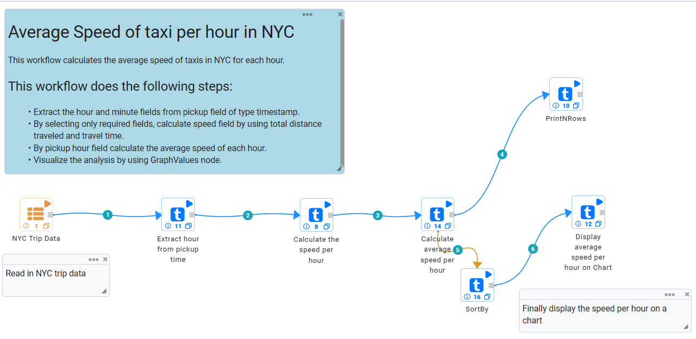

Reading from Dataset
---------------------

It reads the sample Dataset files.

Processor Configuration
^^^^^^^^^^^^^^^^^^

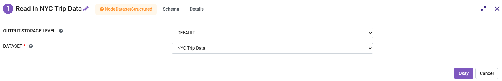
   
Processor Output
^^^^^^

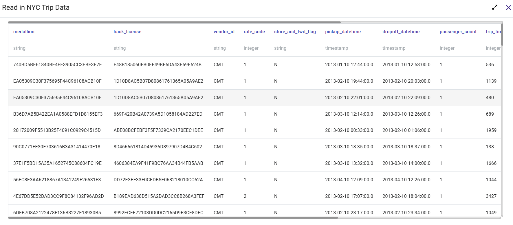
   
Extract Hour from Pickup Time
-----------------------------

It extracts the hour from the pickup time using the Datetime Field Extract Node.

Processor Configuration
^^^^^^^^^^^^^^^^^^

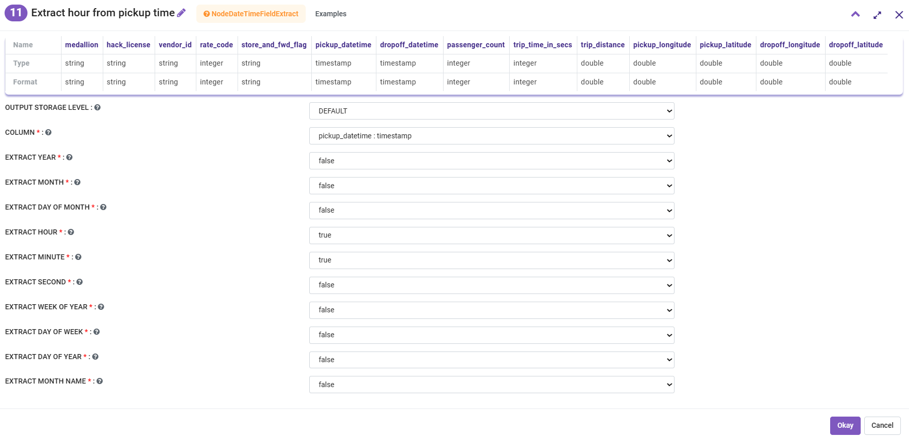
   
Processor Output
^^^^^^

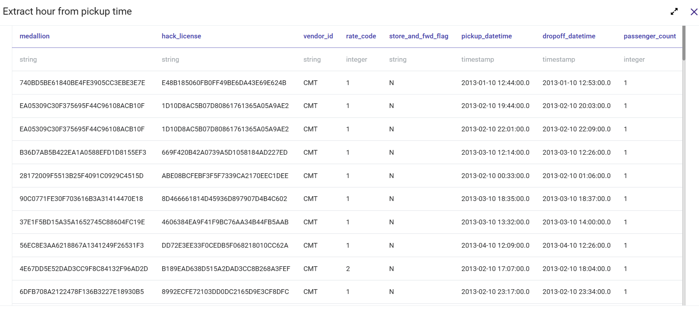

Calculate the Speed per Hour
-----------------------------

It calculates the speed per hour using SQL Node.

Processor Configuration
^^^^^^^^^^^^^^^^^^

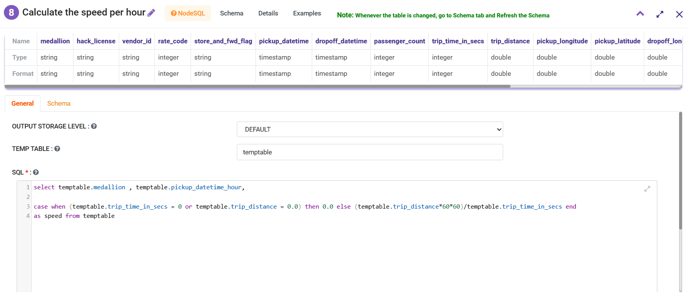
   
Processor Output
^^^^^^

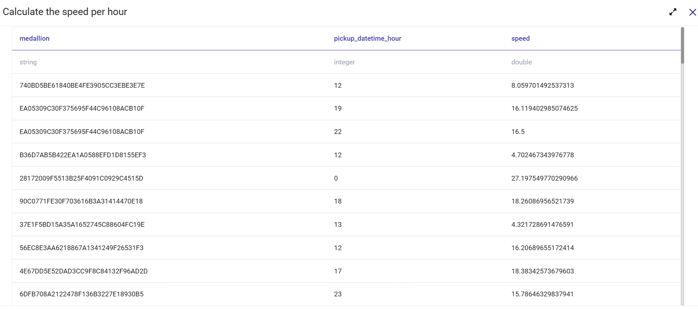

Calculate the Average Speed per Hour
-----------------------------

It calculates the average speed per hour using the GroupBy Node.

Processor Configuration
^^^^^^^^^^^^^^^^^^

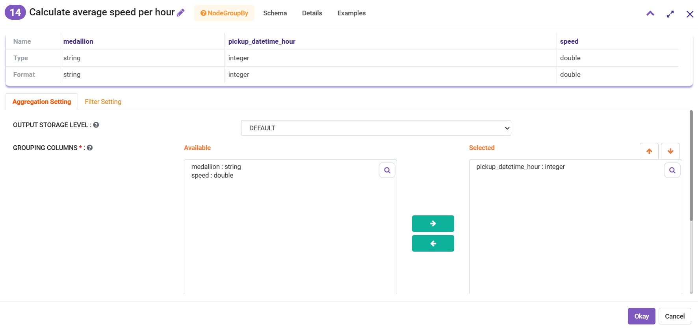
   
Fitler Settings
^^^^^^^^^

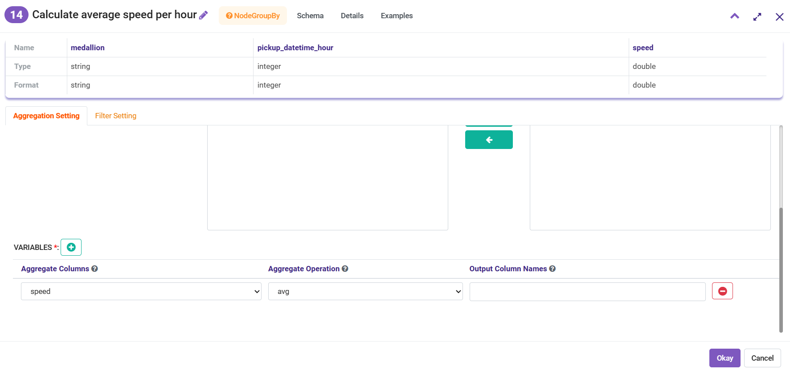
   
Processor Output
^^^^^^

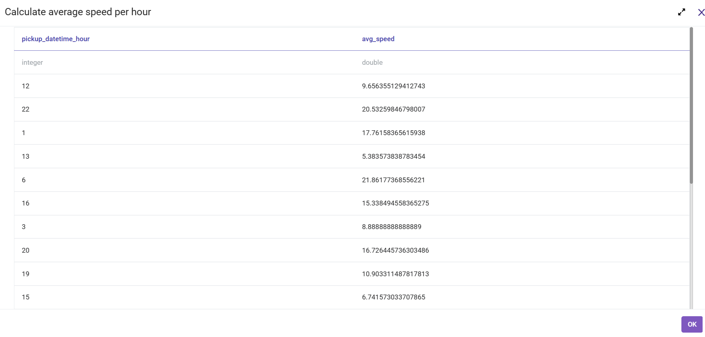

Prints the Result
------------------

It will print the result with the output of the GroupBy Node.

Sort Data by Column
------------------

It will sort the result by the selected column and it's specified order ASC/DESC using the SortBy Node.

Processor Configuration
^^^^^^^^^^^^^^^^^^

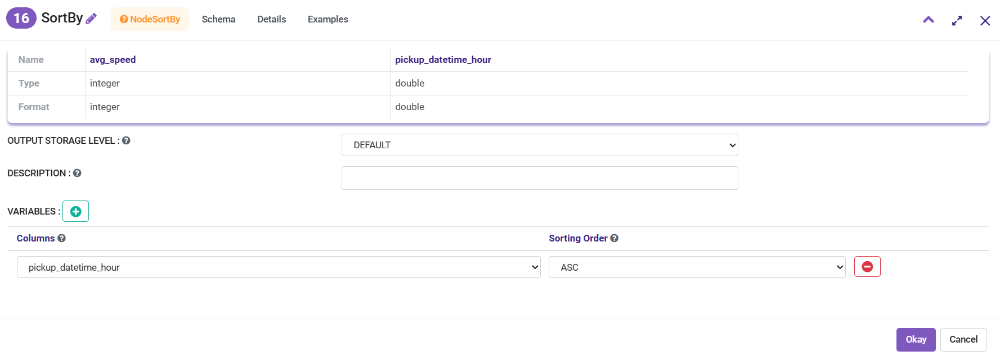
   
Processor Output
^^^^^^

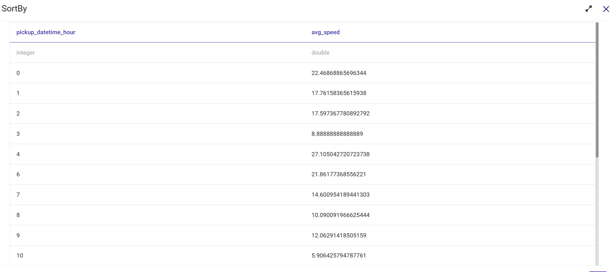

Analyze using Chart Graph
-------------------------

It displays the average speed per hour on the chart using the Graphvalue Node.

Processor Configuration
^^^^^^^^^^^^^^^^^^

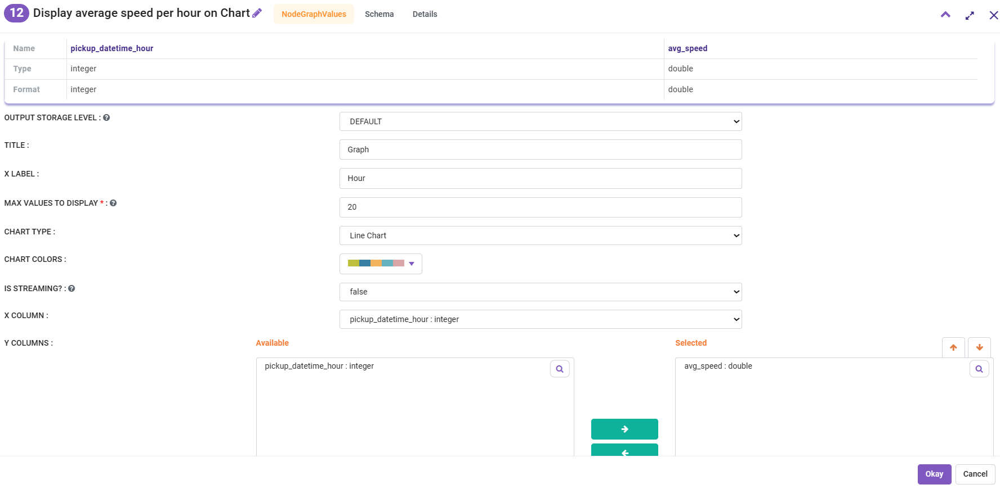
   
Processor Output
^^^^^^

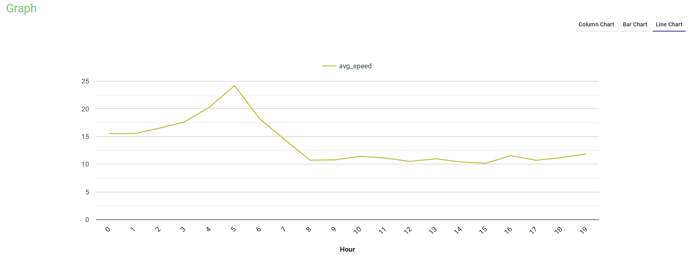
