NYC Taxidata Analysis
======================

This workflow reads in a sample dataset. It then analyses average speed of taxis at each hour with sample data and prints the results.

Workflow
-------

Below is the workflow. It does the following:

* Reads data from a dataset.
* Extracts hour from pickup time.
* Calculates the speed per hour.
* Calculates the average speed per hour.
* Prints the results.
* Displays average speed per hour on chart.

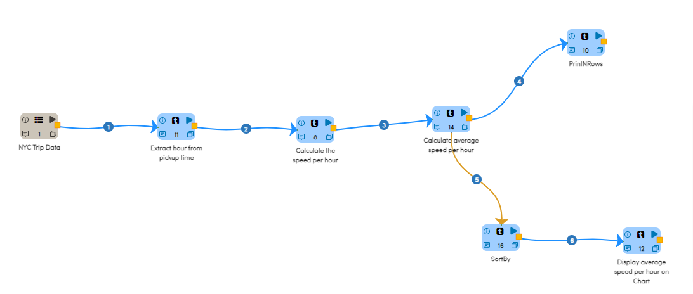

Reading from Dataset
---------------------

It reads sample Dataset files.

Processor Configuration
^^^^^^^^^^^^^^^^^^

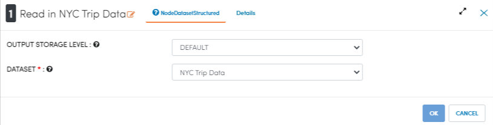
   
Processor Output
^^^^^^

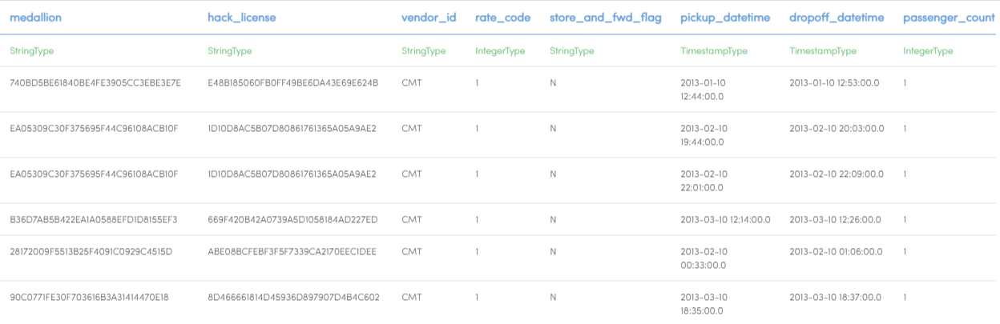
   
Extract hour from pickup time
-----------------------------

It extracts hour from pickup time using datetimefieldextract Node.

Processor Configuration
^^^^^^^^^^^^^^^^^^

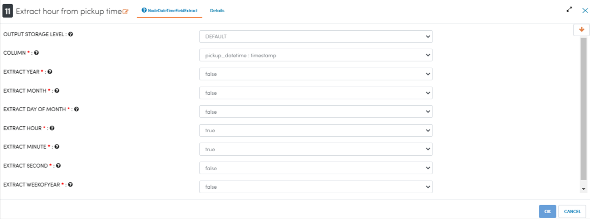
   
Processor Output
^^^^^^

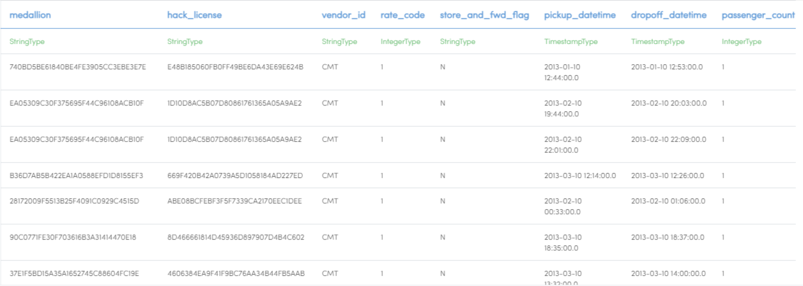

Calculate the speed per hour
-----------------------------

It calculates the speed per hour using SQL Node.

Processor Configuration
^^^^^^^^^^^^^^^^^^

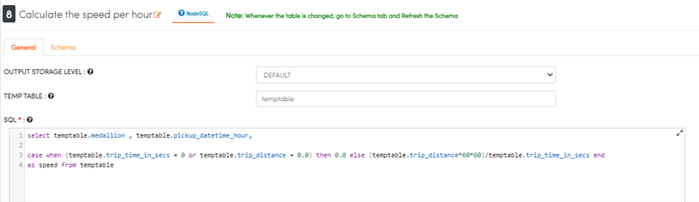
   
Processor Output
^^^^^^

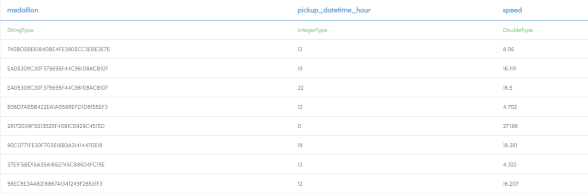

Calculate the average speed per hour
-----------------------------

It calculates the average speed per hour using GroupBy Node.

Processor Configuration
^^^^^^^^^^^^^^^^^^

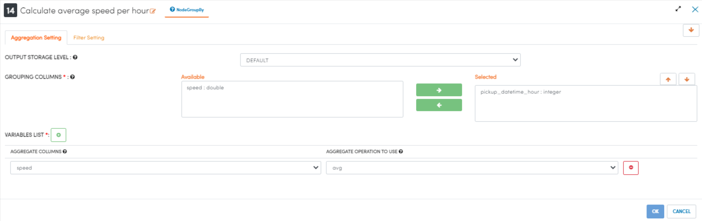
   
Processor Output
^^^^^^

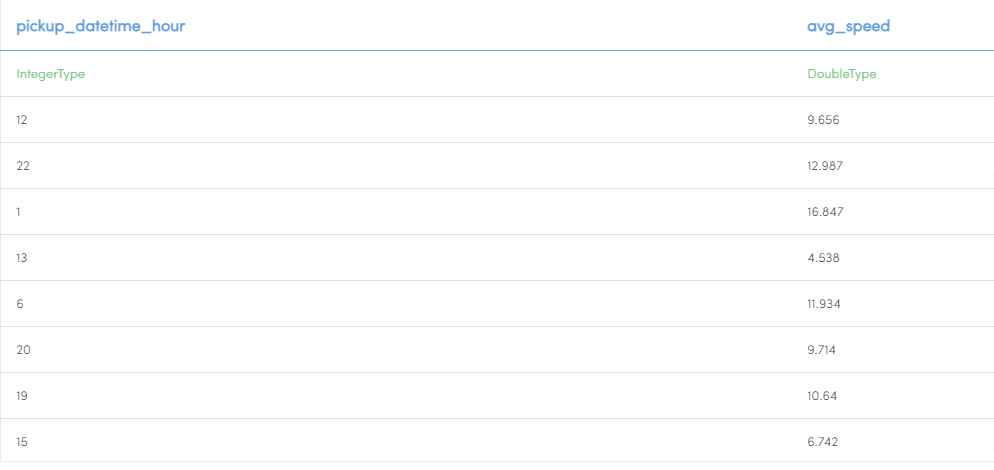
   
Prints the results
------------------

It will print the result with the output of GroupBy Node.

Processor Configuration
^^^^^^^^^^^^^^^^^^

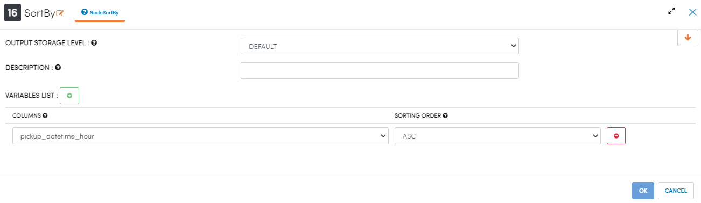
   
Processor Output
^^^^^^

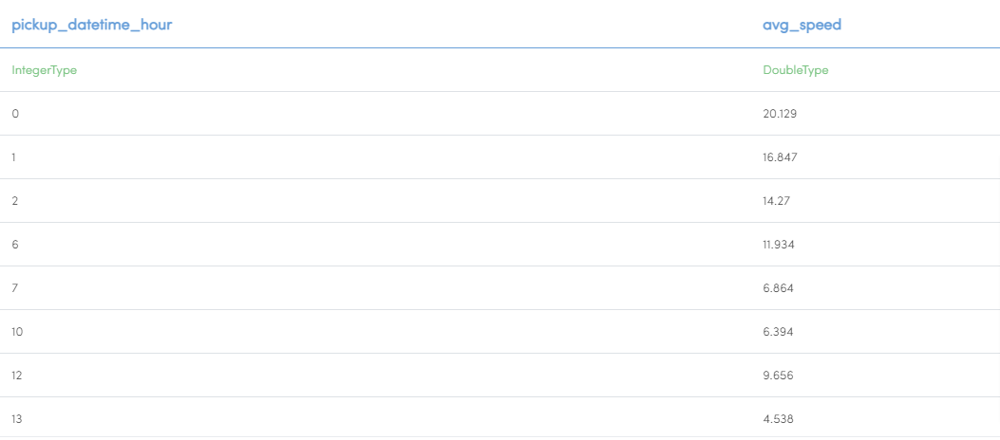

Analyze using Chart Graph
-------------------------

It displays average speed per hour on chart using Graphvalue Node.

Processor Configuration
^^^^^^^^^^^^^^^^^^

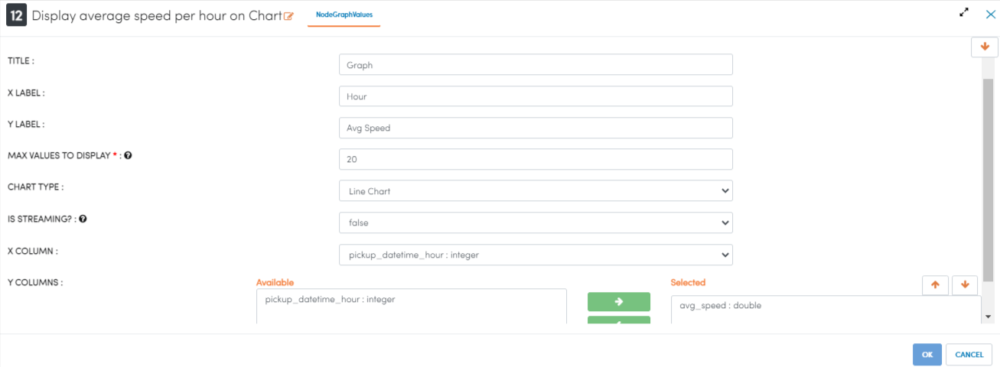
   
Processor Output
^^^^^^

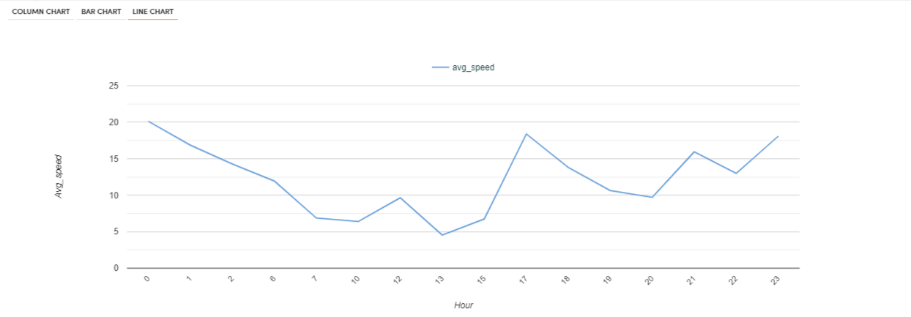
