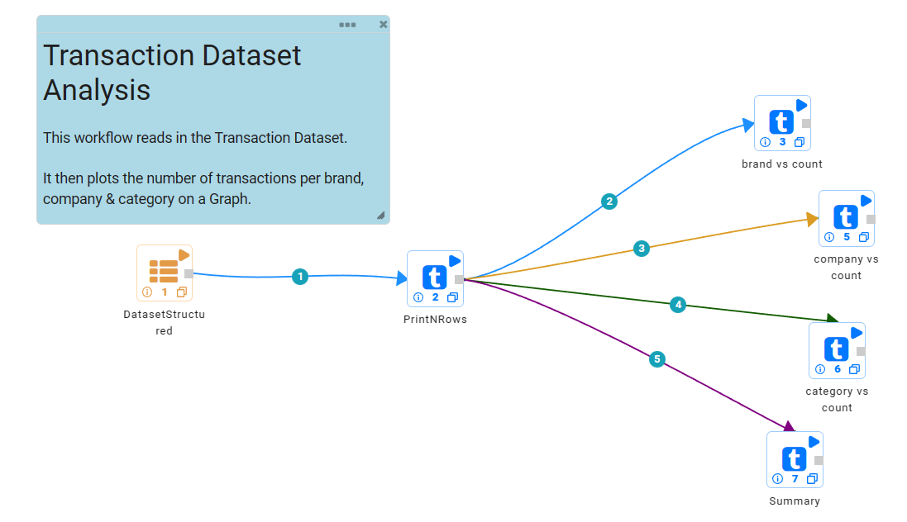
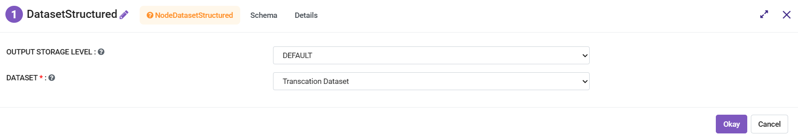
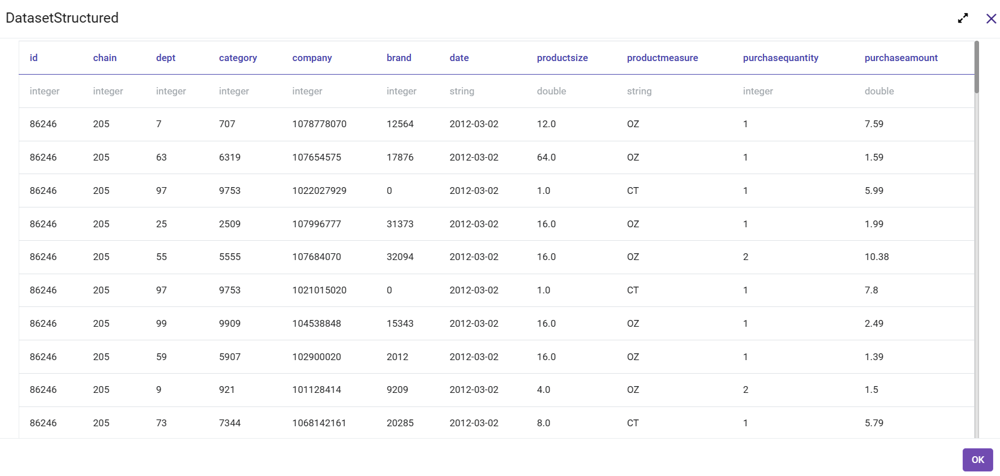
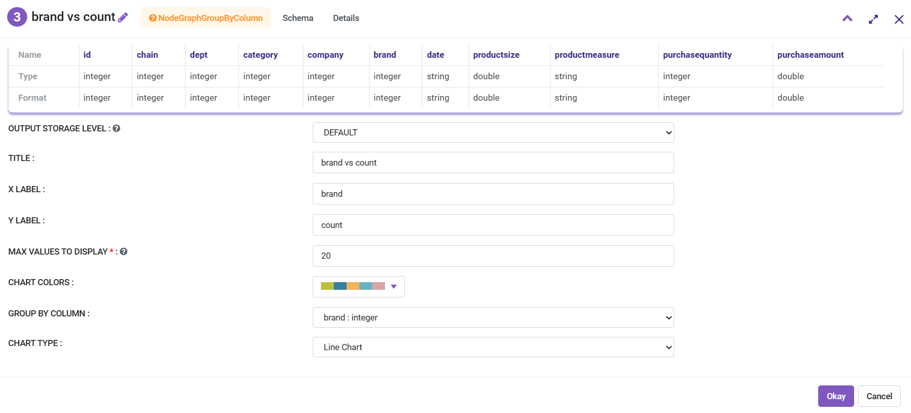
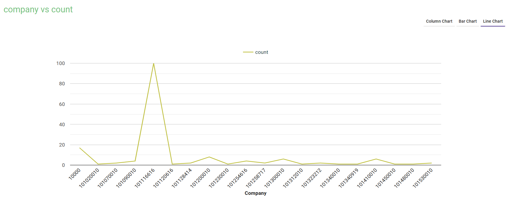

Transaction Data Analysis
==========================

This workflow reads in a dataset. It then prints the result from the sample dataset and analyses using the graphs.

Workflow
-------

The below workflow:

* Reads the data from a sample dataset.
* Prints the result from the sample dataset.
* Analyses using the graphs.

   
Reading from Dataset
---------------------

It reads the Dataset File.

Processor Configuration
^^^^^^^^^^^^^^^^^^

   
Processor Output
^^^^^^

   
Prints the Sample Dataset Result
---------------------------------

It prints the Sample Dataset Result.
   
Analysing using Graph
---------------------

The following configuration shows the configuration and the result for the company vs count graph. It is the same configuration for each of the graph nodes, the only difference is the X-Label, y-Label, and title.

Processor Configuration
^^^^^^^^^^^^^^^^^^

   
Processor Output
^^^^^^

