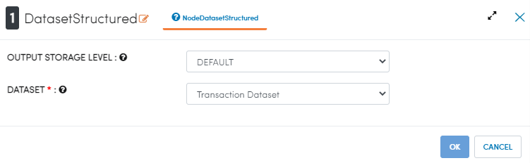
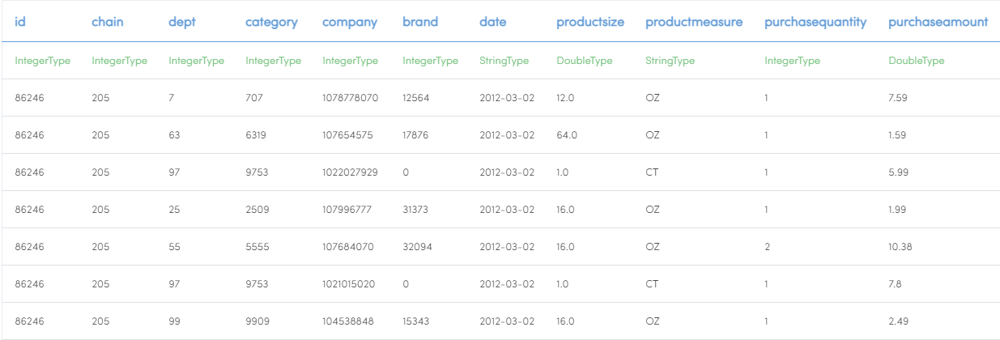
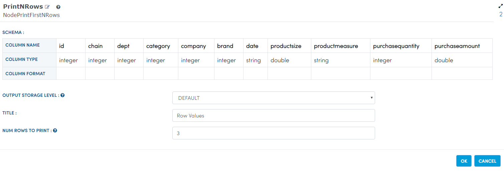
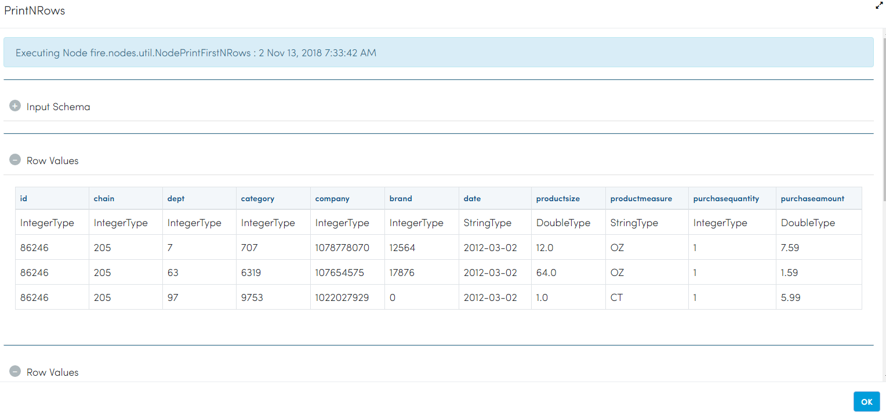

Transaction Data Analytics
==========================

This workflow reads in a dataset.It then print the dataset results from the sample dataset and then annalyse it using graphs.

Worklow
-------

Below is the workflow. It does the following:

* Reads data from a sample dataset.
* It then print the dataset results.
* annalyse it using graphs.

.. figure:: ../../_assets/tutorials/analytics/transaction-data-analytics/1.PNG
   :alt: Transaction Data Analytics
   :align: center
   :width: 60%
   
Reading from Dataset
---------------------

It reads Dataset file.

Processor Configuration
^^^^^^^^^^^^^^^^^^

   
Processor Output
^^^^^^

   
Prints the Dataset Results
------------------

It prints the Dataset Results.

Processor Configuration
^^^^^^^^^^^^^^^^^^

   
Processor Output
^^^^^^

