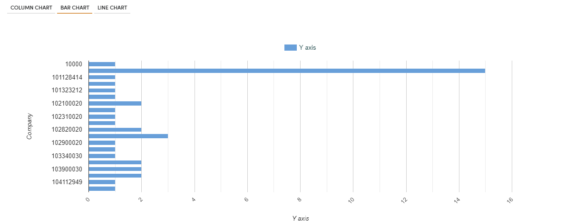

Transaction Data Analytics
==========================

This workflow reads in a dataset. It then prints the results from the sample dataset and analyses using graphs.

Workflow
-------

Below is the workflow. It does the following:

* Reads data from a sample dataset.
* It then prints the results from the sample dataset.
* Analysing using graphs.

.. figure:: ../../_assets/tutorials/analytics/transaction-data-analytics/1.PNG
   :alt: Transaction Data Analytics
   :align: center
   :width: 60%
   
Reading from Dataset
---------------------

It reads Dataset file.

Processor Configuration
^^^^^^^^^^^^^^^^^^

.. figure:: ../../_assets/tutorials/analytics/transaction-data-analytics/2.PNG
   :alt: Transaction Data Analytics
   :align: center
   :width: 60%
   
Processor Output
^^^^^^

.. figure:: ../../_assets/tutorials/analytics/transaction-data-analytics/2a.PNG
   :alt: Transaction Data Analytics
   :align: center
   :width: 60%
   
Prints the sample dataset Results
---------------------------------

It prints sample dataset Results.

Processor Configuration
^^^^^^^^^^^^^^^^^^

.. figure:: ../../_assets/tutorials/analytics/transaction-data-analytics/3.PNG
   :alt: Transaction Data Analytics
   :align: center
   :width: 60%
   
Processor Output
^^^^^^

.. figure:: ../../_assets/tutorials/analytics/transaction-data-analytics/3a.PNG
   :alt: Transaction Data Analytics
   :align: center
   :width: 60%
   
Analysing using Graph
---------------------

It helps to analyse using graph with Graph grouped by column brand and count.

Processor Configuration
^^^^^^^^^^^^^^^^^^

.. figure:: ../../_assets/tutorials/analytics/transaction-data-analytics/4.PNG
   :alt: Transaction Data Analytics
   :align: center
   :width: 60%
   
Processor Output
^^^^^^

