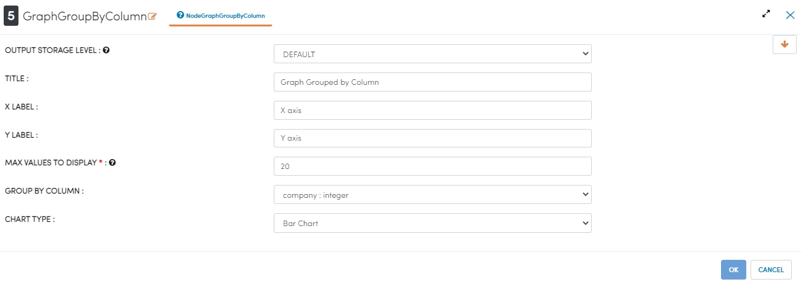

Transaction Data Analytics
==========================

This workflow reads in a dataset. It then prints the result from the sample dataset and analyses using the graphs.

Workflow
-------

The below workflow:

* Reads the data from a sample dataset.
* Prints the result from the sample dataset.
* Analyses using the graphs.

.. figure:: ../../_assets/tutorials/analytics/transaction-data-analytics/1.png
   :alt: Transaction Data Analytics
   :width: 90%
   
Reading from Dataset
---------------------

It reads the Dataset File.

Processor Configuration
^^^^^^^^^^^^^^^^^^

.. figure:: ../../_assets/tutorials/analytics/transaction-data-analytics/2.png
   :alt: Transaction Data Analytics
   :width: 90%
   
Processor Output
^^^^^^

.. figure:: ../../_assets/tutorials/analytics/transaction-data-analytics/2a.png
   :alt: Transaction Data Analytics
   :width: 90%
   
Prints the Sample Dataset Result
---------------------------------

It prints the Sample Dataset Result.
   
Analysing using Graph
---------------------

The following configuration shows 

Processor Configuration
^^^^^^^^^^^^^^^^^^

   
Processor Output
^^^^^^

