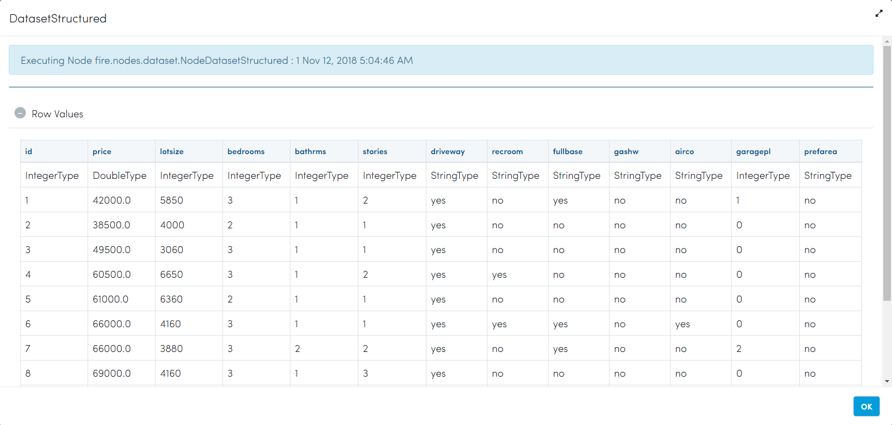
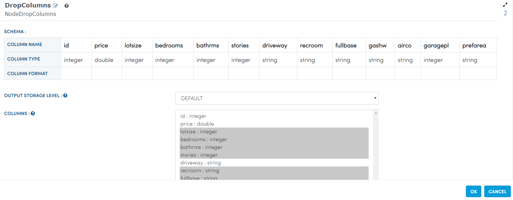
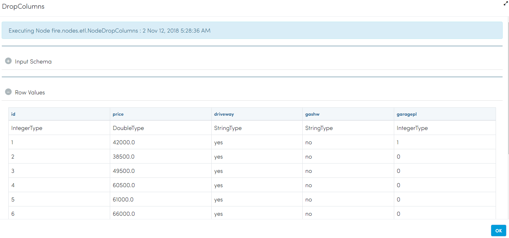
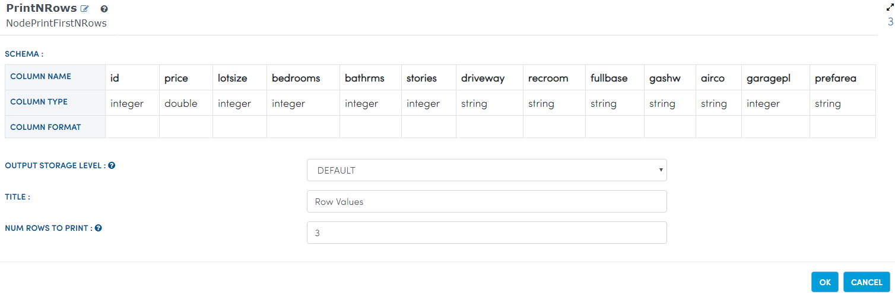
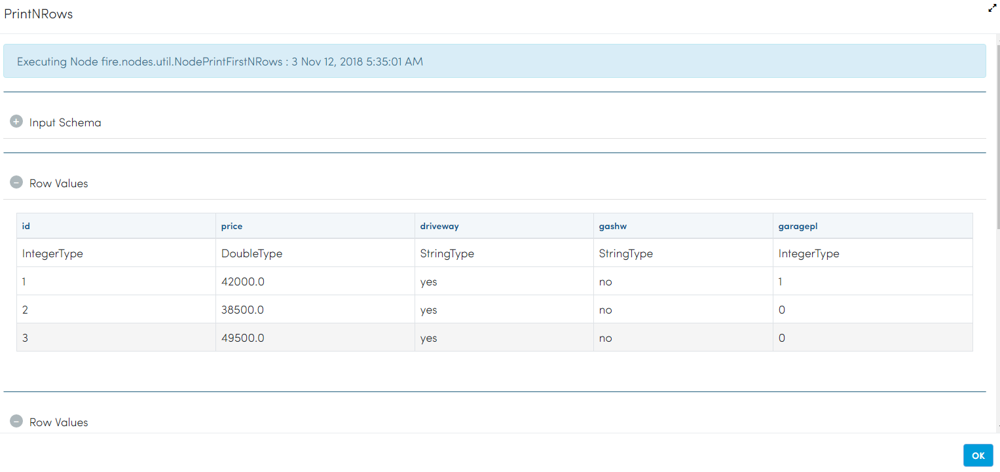

Drop Columns
=============

This workflow reads in a dataset. It then drop some columns from the original dataset and prints the results.

Worklow
-------

Below is the workflow. It does the following:

* Reads data from a dataset.
* It then drop some columns from the original dataset.
* prints the results.

.. figure:: ../../_assets/tutorials/data-cleaning/1.PNG
   :alt: Drop Columns
   :align: center
   :width: 60%
   
Reading from Dataset
---------------------

It reads Dataset file.

Processor Configuration
^^^^^^^^^^^^^^^^^^

.. figure:: ../../_assets/tutorials/data-cleaning/2.PNG
   :alt: Drop Columns
   :align: center
   :width: 60%
   
Processor Output
^^^^^^

   
Drop columns
---------------------

It drops the columns whichever we want.

Processor Configuration
^^^^^^^^^^^^^^^^^^

Processor Output
^^^^^^

  
Prints the Results
---------------------

It prints the results after dropping the columns.

Processor Configuration
^^^^^^^^^^^^^^^^^^

Processor Output
^^^^^^

  
   
