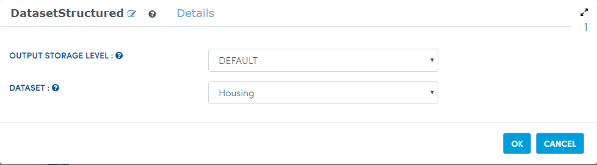

Drop Columns
=============

This workflow reads in a dataset. It then drop some columns from the original dataset and prints the results.

Worklow
-------

Below is the workflow. It does the following:

* Reads data from a dataset.
* It then drop some columns from the original dataset.
* prints the results.

   
   Reading from Dataset
---------------------

It reads Dataset file.

Processor Configuration
^^^^^^^^^^^^^^^^^^

.. figure:: ../../_assets/tutorials/data-cleaning/2.PNG
   :alt: Workflow
   :align: center
   :width: 60%
   
   Processor Output
^^^^^^

.. figure:: ../../_assets/tutorials/data-cleaning/handling-null-values/3.png
   :alt: Handling Null Values
   :align: center
   :width: 60% 
   
   
